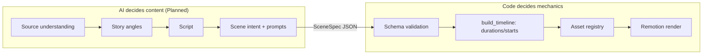

# AI Overview

> How StoryWeaver uses AI models, where the boundary with deterministic code lies, and what exists today.

## Status

**Partially implemented** — provider interfaces and adapters exist (mechanism unit-tested with fakes; only Ollama has an HTTP-level test); no AI-driven product feature (analysis, story, script, storyboard) is implemented.

## Model/provider role

AI decides **content**: source understanding, story angles, narrative structure, script, scene intent, visual and character descriptions, emotional direction. Deterministic code decides **timing, asset management, rendering, validation** (see [ADR-004](../decisions/ADR-004-ai-vs-deterministic-responsibilities.md)). An LLM is never asked to compute timestamps, durations, encode media or mix audio.

## Current implementation

| Capability | State |
| --- | --- |
| `LLMProvider.generate` / `generate_structured`, `EmbeddingProvider.embed` | Implemented (mechanism, unit-tested with fakes) ([`providers/base.py`](../../apps/api/app/intelligence/providers/base.py)); non-`HTTPError` failures are not wrapped ([KI-3](../reference/status.md#known-issues-and-limitations)) |
| Adapters: Ollama, Google, OpenRouter, Grok, Claude-compatible | Implemented as thin HTTP clients; only Ollama's chat request shape has a mocked-HTTP test (all embedding adapters and the other LLM adapters are untested); none exercised against a real service |
| Lazy registry (`get_llm`, `get_embeddings`, `llm_status`) | Implemented |
| Per-task model settings (`analysis/story/script/classification`) | Implemented as configuration ([`config.py`](../../apps/api/app/core/config.py)) |
| Routing, fallback, caching, budgets | Planned — not implemented ([model-routing](model-routing.md)) |
| Prompts, context management, RAG, embedding workflow | Planned — not implemented (`packages/prompts` is a README only) |
| Evaluation harness | Planned — not implemented ([ai-quality-evaluation](ai-quality-evaluation.md)) |

## Input context

Currently none — nothing calls the LLM from the application. Target inputs are described per stage in [story-generation-pipeline](story-generation-pipeline.md) and [context-management](context-management.md).

## Prompt strategy / Structured output / Validation / Retry

Summarised here, detailed in [prompting-strategy](prompting-strategy.md) and [structured-output](structured-output.md): versioned prompt files, Pydantic-validated JSON outputs, one validation-feedback retry (implemented), routing fallback (planned).

## Cost and quality considerations

Local-first, cheapest-adequate model per task, expensive models only for high-value creative decisions: [ai-cost-strategy](ai-cost-strategy.md). Quality gates for generated content: [ai-quality-evaluation](ai-quality-evaluation.md).

## Document map

[llm-strategy](llm-strategy.md) · [provider-selection](provider-selection.md) · [model-routing](model-routing.md) · [prompting-strategy](prompting-strategy.md) · [structured-output](structured-output.md) · [context-management](context-management.md) · [rag-strategy](rag-strategy.md) · [embeddings](embeddings.md) · [story-generation-pipeline](story-generation-pipeline.md) · [visual-prompting](visual-prompting.md) · [consistency-strategy](consistency-strategy.md) · [ai-cost-strategy](ai-cost-strategy.md) · [ai-quality-evaluation](ai-quality-evaluation.md). Architecture view: [ai-architecture](../architecture/ai-architecture.md).

## Current vs future

Today: a provider-independent seam that business logic can call. Future: every pipeline stage calls that seam with versioned prompts and validated schemas, with routing and caching layered on top.
