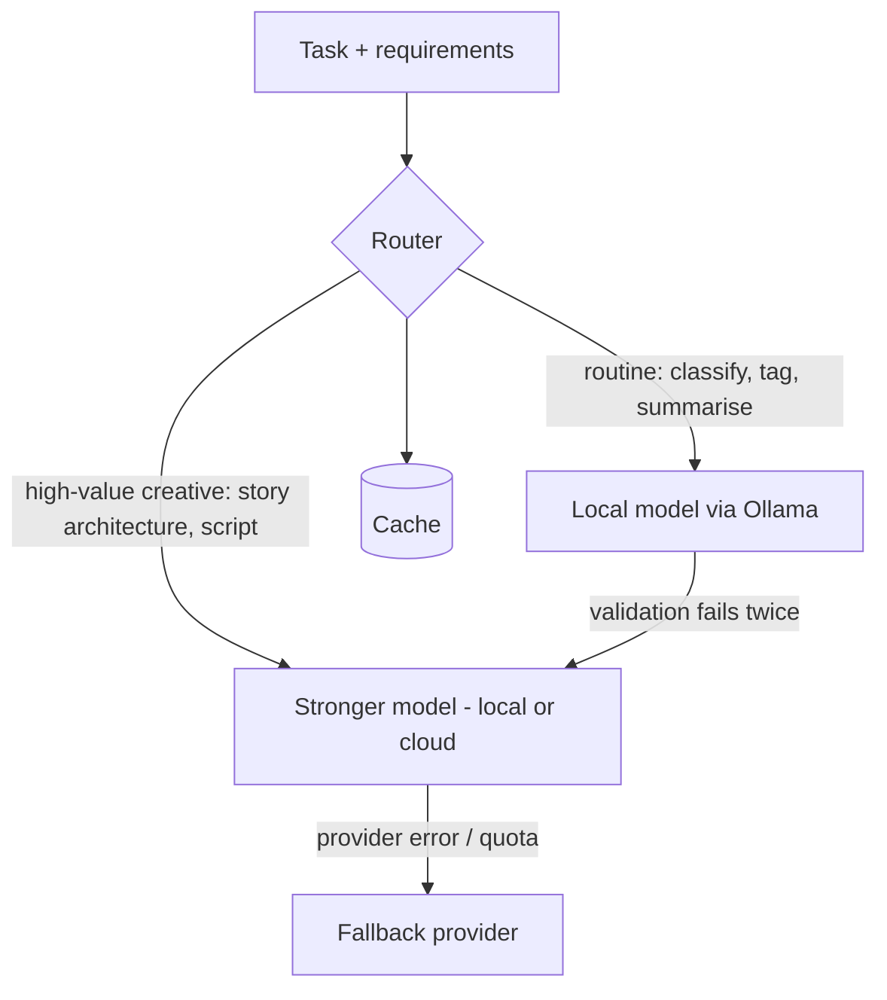

# Model Routing

> How tasks will be mapped to models, with fallbacks and escalation.

## Status

**Planned** — only static per-task model *settings* exist. No routing, fallback or escalation logic is implemented.

## Current implementation

`Settings.model_for(task)` (task ∈ `analysis`, `story`, `script`, `classification`) returns `<TASK>_LLM_MODEL` or `DEFAULT_LLM_MODEL`. The provider is a single global (`DEFAULT_LLM_PROVIDER`); there is no per-task provider setting yet. Embeddings have their own provider/model settings.

## Target Architecture

Routing inputs: task type, required context length, need for strict structured output, privacy flag on the source, remaining budget, provider health. Outputs: `(provider, model, parameters)` plus a recorded reason.

| Task class | Default tier (Target) |
| --- | --- |
| Classification, tagging, topic labels, chunk summaries | Cheap/local |
| Fact and event extraction | Cheap/local, validated |
| Story candidate generation, story architecture, script | Strongest affordable |
| Scene drafting from an approved script | Mid-tier, constrained by schema |
| Image prompt refinement | Cheap/local |

Tiers are classes, not model names; mapping to concrete models is configuration and **Decision pending**.

## Capability-specific providers

Routing is per capability, each with its own interface and provider: **LLM** (`LLMProvider`), **embeddings** (`EmbeddingProvider`, dedicated provider/model settings — implemented as settings), **image** (`ImageGenerator`, [image-pipeline](../media/image-pipeline.md)), **TTS** (`VoiceProvider`, [voice-pipeline](../media/voice-pipeline.md)), **STT** (`Transcriber`, [transcript-pipeline](../domains/transcript-pipeline.md)). Examples of providers (illustrative, not commitments): Ollama/local models, Google (Gemini), OpenRouter, Grok, Claude-compatible APIs, DeepSeek, future providers.

Routing should eventually weigh: **quality, latency, cost, context window, structured-output support, tool/function-calling support, local availability, reliability**. None of these is evaluated today; the router, the capability metadata it needs, and the routing table are **Decision pending**.

Task examples — routine (classification, metadata extraction, cleanup, chunking assistance, tagging) → cheap/local; important (source analysis, story-opportunity discovery, story architecture, high-quality script writing, hard creative reasoning) → stronger model.

## Escalation and fallback (Planned)

1. Try the configured model; validate output ([structured-output](structured-output.md)).
2. On validation failure after the built-in retry, escalate to the next tier once.
3. On `ProviderError` (network, quota), fall back to the next configured provider.
4. Persist every attempt (provider, model, duration, tokens, outcome) for cost and quality analysis — fields already logged by `LLMProvider.generate` (`provider`, `model`, `duration`, `output_tokens`) but not yet stored in the database ([monitoring](../operations/monitoring.md)).

## Provider-call requirements

Provider calls should be **observable** (structured log per call: provider, model, duration, tokens — implemented in `LLMProvider.generate`), **timeout-controlled** (adapters use a fixed 120 s `httpx.Timeout`; no per-task timeout or cancellation — Planned), **retryable where appropriate** (only validation retries exist; no transport retry/backoff — Planned), **validated** ([structured-output](structured-output.md)), **isolated** (only `httpx.HTTPError` — network errors, timeouts, non-2xx via `raise_for_status` — is converted to `ProviderError`; malformed HTTP-200 responses are **not** wrapped, see "Unwrapped failures" below; callers must persist failure on the affected entity and never mutate project state half-way — see [retry-and-recovery](../workflows/retry-and-recovery.md)) and **replaceable** (business code depends only on the interface). Fallback must never couple business logic to a provider API: the router returns a provider instance; callers do not branch on provider names.

## Unwrapped failures (current limitation)

`LLMProvider.generate` catches only `httpx.HTTPError`. Adapters index into the response body directly (`d["choices"][0]["message"]["content"]`, `d["message"]["content"]`, `d["candidates"][0]["content"]["parts"]`, `d["content"]`), so a well-formed HTTP 200 with an unexpected shape raises raw `KeyError`/`IndexError`/`JSONDecodeError` instead of `ProviderError`. Example: Google returns no `candidates` when a prompt is safety-blocked. `generate_structured` retries only `ValidationError`/`ValueError`, so these errors propagate without a retry. Any router or fallback logic must therefore not rely on `ProviderError` alone until response parsing is wrapped. Tracked as [KI-3](../reference/status.md#known-issues-and-limitations).

## Prompt versioning, caching and cost tracking (Planned)

Routing decisions are only reproducible if each call records `prompt_version`, provider, model and parameters, and only affordable if identical calls are cached and spend is visible. None of the three exists today: `prompt_version` is a column on `script_versions` only, there is no response cache, and token/cost usage is logged (with the redaction caveat in [KI-2](../reference/status.md#known-issues-and-limitations)) but not stored. Design lives in [prompting-strategy](prompting-strategy.md) and [ai-cost-strategy](ai-cost-strategy.md); implementation is Planned — not implemented.

## Failure modes

Silent quality degradation from falling back to weaker models; routing loops; hidden cloud spend. Mitigate with a hard attempt cap, recorded reasons, and budgets ([ai-cost-strategy](ai-cost-strategy.md)).

## Cost, quality, input, prompts, validation, retry

Cost: [ai-cost-strategy](ai-cost-strategy.md). Quality: decisions should be driven by [ai-quality-evaluation](ai-quality-evaluation.md). Input context: [context-management](context-management.md). Current retry is within one model only ([structured-output](structured-output.md)).

## Open questions

Per-task provider overrides vs a routing table in the database; whether users pin models per project; how to express privacy constraints.
