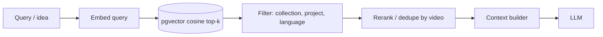

# RAG Strategy

> How stored source knowledge will be retrieved to ground AI generation and answer library questions.

## Status

**Planned** — the storage substrate exists (pgvector column + HNSW cosine index, covered by a nearest-neighbour test). No embedding generation, retrieval service, or RAG endpoint is implemented.

## Current implementation

`transcript_chunks.embedding vector(768)` with index `ix_transcript_chunks_embedding_hnsw` (`vector_cosine_ops`); `embedding_model` column records the model. See [embeddings-and-vector-search](../data/embeddings-and-vector-search.md). Test: `test_embedding_roundtrip_and_cosine_search`.

## Goals (from the product vision)

- Find saved sources related to a topic ("prehistoric human survival").
- Find sources similar to an idea; find unused ideas in a collection.
- "Have I already generated a video around this concept?"
- Find relevant facts across many transcripts to ground a script.

## Target Architecture

- **Retrieval unit:** transcript chunk with timestamps, enabling citations back to `source_video_id` + time range.
- **Hybrid retrieval (Decision pending):** vector plus Postgres full-text for names and exact terms.
- **Scoping:** always filter by explicit source ids when generating for a project, so unrelated library content cannot leak into a story.
- **Facts layer:** retrieval over extracted facts/events (not just raw chunks) is likely better for story work — new schema, Decision pending.
- **"Already generated?" queries** need project/script content embedded as well — Planned, no tables yet.
- **Grounding rule:** generated factual claims in scripts should trace to retrieved evidence or be marked as creative invention.

## Failure modes

Poor recall from bad chunking; embedding model change invalidating old vectors (dimension and semantics); near-duplicate chunks crowding results; retrieved text containing instructions (prompt injection).

## Checklist (per the AI document contract)

| Item | Current | Target |
| --- | --- | --- |
| Model/provider role | Embedding model for retrieval ([embeddings](embeddings.md)); LLM only consumes retrieved context | Same; optional reranker (Decision pending) |
| Input context | n/a | Query/idea text; scope filter (explicit source ids / collection / project) |
| Prompt strategy | n/a | Retrieved chunks inserted as delimited, untrusted data blocks ([prompting-strategy](prompting-strategy.md)) |
| Structured output | n/a | Answers/facts as schema objects with `source_video_id` + time-range citations ([structured-output](structured-output.md)) |
| Validation | n/a | Every cited chunk id must exist in the retrieved set; uncited factual claims flagged |
| Retry/fallback | n/a | Widen k / relax filters once; otherwise report "insufficient evidence" instead of inventing |
| Cost | Vector search is local SQL | Cache query embeddings; scope tightly to bound prompt size ([ai-cost-strategy](ai-cost-strategy.md)) |
| Quality | None measured | Labelled query set with recall@k ([ai-quality-evaluation](ai-quality-evaluation.md)) |

Context assembly details: [context-management](context-management.md).

## Cost and quality

Embedding is one-time per chunk and cheap locally; re-embedding on model change is the main cost. Evaluate with a labelled query set ([ai-quality-evaluation](ai-quality-evaluation.md)).

## Current vs future

Current: schema + index. Future: embed workflow ([transcript-workflow](../workflows/transcript-workflow.md)), search API, [research-and-intelligence](../domains/research-and-intelligence.md) features.
