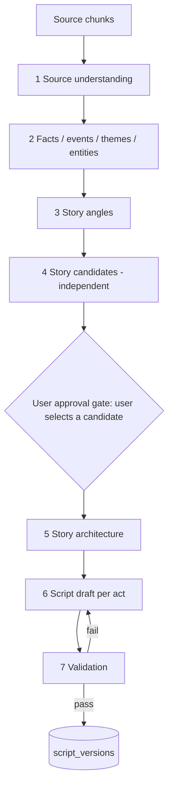

# Story Generation Pipeline (AI view)

> The staged AI pipeline that turns a source into an original script, and what each stage asks of the model.

## Status

**Planned** — no stage is implemented. This document is the AI-side contract; the product-side description is in [story-generation](../domains/story-generation.md) and [script-generation](../domains/script-generation.md).

## Principle

The system must **not paraphrase** the source. It extracts facts, events and themes, then builds an *original* narrative with its own arc. Transcript wording is evidence, not draft text.

## Target Architecture

| Stage | Model role | Input | Output (Pydantic, Planned) | Tier |
| --- | --- | --- | --- | --- |
| 1 Understanding | Summarise, label | transcript chunks | per-chunk notes | cheap/local |
| 2 Extraction | Extract | notes + chunks | `facts[]`, `events[]` with causal links, `themes[]`, `entities[]`, source time refs | cheap/local, validated |
| 3 Angles | Ideate | extracted layer | candidate angles (conflict, protagonist, stakes) | strong |
| 4 Candidates | Select, de-overlap | angles | `StoryCandidate[]` each with logline, hook, evidence refs, est. length | strong |
| 5 Architecture | Plan | one candidate + facts | Hook→Setup→Development→Conflict→Escalation→Climax→Resolution beats | strong |
| 6 Script | Write | architecture + facts per act | narration per beat, target 10–15 min | strong |
| 7 Validation | Check | script + facts | code checks (length, structure present, evidence coverage) + optional LLM critique | code first, cheap LLM second |

Long sources yield several candidates in stage 4 by narrative opportunity, **not** by cutting the transcript into equal time blocks ([long-source handling](../domains/story-generation.md)). Candidates must be independent: each has its own arc and evidence set; overlapping facts are allowed but the same sequence of events is not reused.

Target length uses word count as a *code-computed* check (about 150 words/min narration; 10–15 min ≈ 1,500–2,250 words — a planning estimate, tune with real TTS). Note that the per-scene fallback estimator clamps to 2–7 s and so under-counts long narration ([KI-16](../reference/status.md#known-issues-and-limitations)); do not derive total duration from it. The LLM is told a target; code verifies.

## Intermediate representations

The pipeline is never "write a script from this transcript". Its stages are: `SOURCE → SOURCE UNDERSTANDING → FACTS / EVENTS / ENTITIES → THEMES / TOPICS → NARRATIVE OPPORTUNITIES → STORY CANDIDATES → STORY ARCHITECTURE → SCRIPT → SCRIPT VALIDATION → STORYBOARD`. Each intermediate output is stored as structured data so it is **debuggable, regeneratable, testable, editable by the user, provider-independent, reusable across projects and evaluable** ([ai-quality-evaluation](ai-quality-evaluation.md)).

**Story candidate fields (Target schema, not implemented):** title, premise, hook, central question, protagonist/subject, conflict, stakes, major beats, climax, resolution, source grounding (fact/event ids + time ranges), estimated duration, target audience, tone, originality/similarity signals. **The user picks a candidate before any expensive generation** — selection is a user approval gate by default; an automatic heuristic pick may exist only as an explicit, opt-in shortcut ([cost gating](ai-cost-strategy.md#stage-gating-spend-late-after-human-approval)).

**Grounding vs originality.** Facts and events must trace to the source (or be marked as creative invention); structure, framing, ordering, emphasis and narration are original. A future similarity analysis can compare candidates/scripts against the source, previous projects and previously used ideas using embeddings and pgvector ([rag-strategy](rag-strategy.md)). This is an engineering and product quality goal; no storage for used ideas or similarity results exists yet ([KI-22](../reference/status.md#known-issues-and-limitations); direction in [embeddings-and-vector-search](../data/embeddings-and-vector-search.md)); it offers **no legal or copyright guarantee** ([content policy](../product/content-policy-and-source-usage.md)).

## Persistence (Target)

Candidates and scripts become rows/versions (`scripts`, `script_versions` exist; candidate/analysis storage tables are Decision pending). Each version records `prompt_version`, provider, model.

## Retry/fallback, validation

Per-stage schema validation with one feedback retry (mechanism implemented, [structured-output](structured-output.md)); escalate tier on repeated failure ([model-routing](model-routing.md)); stages are idempotent and resumable ([story-generation-workflow](../workflows/story-generation-workflow.md)).

## Cost and quality

Stage 1–2 run once per source and are reused by every candidate and project. Expensive models are reserved for stages 3–6. Evaluate originality, structure, factual grounding and pacing: [ai-quality-evaluation](ai-quality-evaluation.md). Cost: [ai-cost-strategy](ai-cost-strategy.md).

## Current vs future

Current: nothing beyond provider seam. Future: all stages. Open questions: how many candidates by default, whether an opt-in auto-select shortcut is offered at all, how source-use guidance is surfaced ([content policy](../product/content-policy-and-source-usage.md)).
