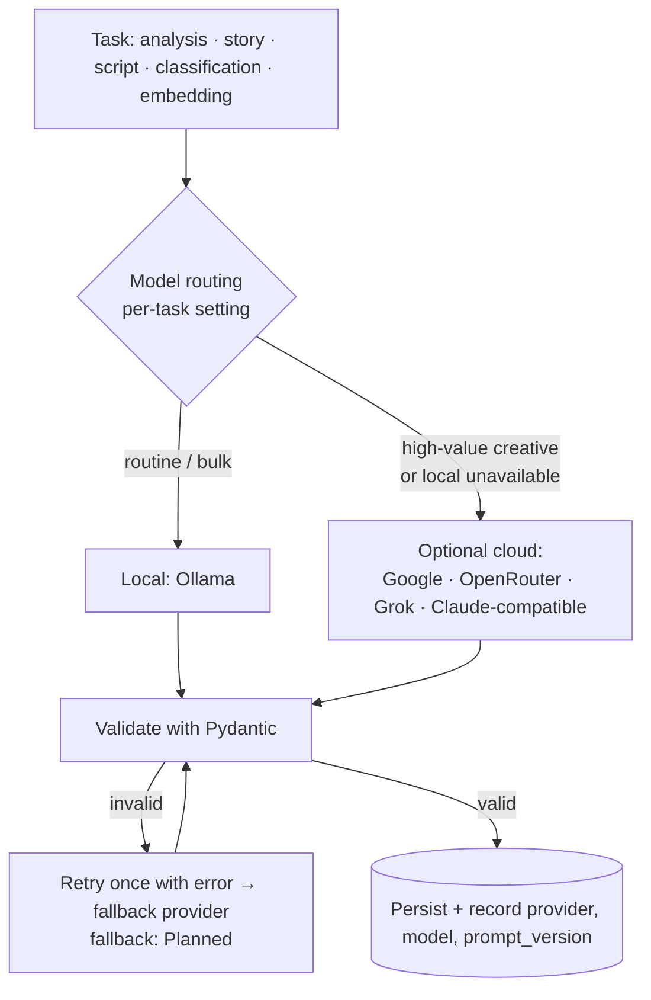

# AI Architecture

> Where AI is used in StoryWeaver, how it is called, and the rules that keep it replaceable, validated and cheap.

## Status

**Partially implemented.** The provider interfaces, structured-output helper and registry exist. No AI-driven feature (understanding, story, script, storyboard, prompts) is implemented — **Planned — not implemented**.

## Purpose

Fix the boundary between *AI decisions* and *deterministic code*, and describe the local-first / cloud-optional call flow. Strategy documents: [ai/ai-overview](../ai/ai-overview.md), [ai/llm-strategy](../ai/llm-strategy.md), [ai/model-routing](../ai/model-routing.md), [ai/ai-cost-strategy](../ai/ai-cost-strategy.md).

## Current implementation

`apps/api/app/intelligence/`:

- `providers/base.py`: `LLMProvider.generate()` (checks configuration, requires an explicit model, times the call, logs provider/model/duration/tokens, wraps every failure — transport, HTTP status, timeout, empty or malformed reply — into the `ProviderError` family via `provider_errors()`) and `generate_structured(prompt, PydanticModel, retries=1)` (appends the JSON Schema to the prompt, extracts JSON from fences/prose, validates with Pydantic, retries once with the error on an unusable or invalid reply, then raises `ProviderResponseError`). `EmbeddingProvider.embed()` checks configuration and model, wraps errors and verifies the vector count (adapters implement `_embed`).
- Adapters: `ollama` (LLM + embeddings), `google` (LLM + embeddings), `openai_compatible` → `openrouter`, `grok`, `claude_compatible` (Anthropic Messages API shape, configurable base URL).
- `registry.py`: `get_llm(name?)`, `get_embeddings(name?)`, `llm_status()` — providers are instantiated lazily per call.
- Settings: `default_llm_provider` (default `ollama`), `default_llm_model` (empty), per-task models `analysis|story|script|classification`, `embedding_provider`, `embedding_model`.

Test coverage is limited to: JSON extraction, structured-output retry/give-up (fake provider), unconfigured-provider error, and the Ollama HTTP request shape (mocked transport). **No adapter has been run against a real service.**

## Target architecture

### The responsibility split

| AI decides (content) | Code decides (determinism) |
| --- | --- |
| What a source means; facts, themes, angles | Fetching, chunking, hashing, deduplicating sources |
| Story candidates, arcs, script text | Validating structure (Pydantic), versioning, storing |
| Scene intent, visual description, emotion, camera *intent* | Durations, start times, motion parameters, transitions |
| Image/negative prompts (text) | Image sizes, seeds, file naming, checksums |
| Narration wording | TTS execution, measured audio length, loudness |
| (Optionally) QA judgements | Subtitle timing, mixing, encoding, QA metrics (file/size/audio) |

Rule: **never ask an LLM to perform a deterministic media operation** ([ADR-004](../decisions/ADR-004-ai-vs-deterministic-responsibilities.md)). LLM output is always parsed into a Pydantic model before it is used.

### Local vs. cloud flow

Implemented: per-task model *settings* and the single-provider call path with one validation retry. **Planned — not implemented:** automatic routing, provider fallback chains, caching, cost tracking. Whether the chosen provider per task is configuration or code policy is **Decision pending** ([ai/model-routing](../ai/model-routing.md)).

### Routing, cost gating and similarity (Target Architecture — pointers only)

Goal: **maximum content quality at minimum monetary cost**, local-first but not local-only. The routing criteria, per-task tiers and fallback design are canonical in [ai/model-routing](../ai/model-routing.md); the staged "approve before expensive generation" pipeline and the cacheable-artifact list are canonical in [ai/ai-cost-strategy](../ai/ai-cost-strategy.md). **None of routing, fallback, caching or cost tracking is implemented** — only per-task model settings exist. Originality/similarity checks (generated script vs. source, previous projects, used ideas) need embeddings of scripts/ideas and a place to store them; the data-model direction (Decision pending, no legal claims) is in [data/embeddings-and-vector-search](../data/embeddings-and-vector-search.md#originality-and-similarity-data-direction). Contributor orientation: [development/ai-agent-guide](../development/ai-agent-guide.md).

## Components and responsibilities

`LLMProvider` (transport + logging + error normalisation) · `generate_structured` (contract enforcement) · registry (lazy lookup) · future prompt library `packages/prompts` (versioned; currently a README only) · future evaluation harness ([ai/ai-quality-evaluation](../ai/ai-quality-evaluation.md)).

## Data flow

Prompt (template + context) → provider → text → JSON extraction → Pydantic validation → domain entity (with `provider`, `model`, `prompt_version` where the table has them: `script_versions` today).

## Failure modes

Provider unconfigured/no model → `ProviderNotConfiguredError`; timeout → `ProviderTimeoutError`; HTTP error (including 429/5xx, with `.status_code`) or transport failure → `ProviderError`; empty, blocked or malformed reply (e.g. Google returning no `candidates`/`parts`) → `ProviderResponseError`; unusable structured output twice → `ProviderResponseError`; truncated output (token cap) surfaces as invalid JSON. Rate limits are not specially handled beyond the status code (**Planned — not implemented**: backoff, fallback).

## Extension points

Add an adapter implementing `_complete` (and `embed` if applicable) and register it: [development/adding-a-provider](../development/adding-a-provider.md). Details: [provider-architecture](provider-architecture.md).

## Current limitations

- No streaming, no tool/function calling, no token budgeting, no response caching.
- Embedding vector size is fixed at 768 in the schema; `Settings.embedding_dimensions` is an independent, unchecked value, so a mismatched model fails at insert time and other-sized models need a migration ([data/embeddings-and-vector-search](../data/embeddings-and-vector-search.md), [KI-6](../reference/status.md#known-issues-and-limitations)).
- Token counts are reported only if the provider returns them.
- `generate_structured` embeds the schema in the prompt rather than using provider-native JSON modes.

## Future evolution

Context management and RAG over transcript chunks ([ai/context-management](../ai/context-management.md), [ai/rag-strategy](../ai/rag-strategy.md)); consistency prompting ([ai/consistency-strategy](../ai/consistency-strategy.md)); evaluation sets and regression checks.
