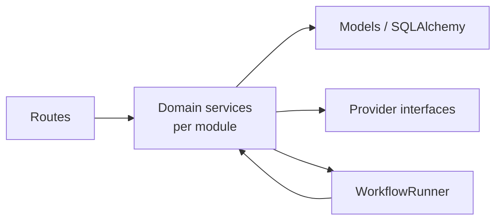

# Backend Architecture

> Structure and conventions of the FastAPI application in `apps/api`.

## Status

**Implemented** for the foundation (CRUD, config, DB, logging, storage helper). Domain workflows are **Planned — not implemented**.

## Purpose

Describe how the API is organised so contributors can find and extend things consistently.

## Current implementation

```text
apps/api/
├── pyproject.toml          # uv project; optional extras: ingestion (yt-dlp), transcription (faster-whisper)
├── alembic/ + alembic.ini  # migrations; env.py reads DATABASE_URL from Settings
├── app/
│   ├── main.py             # create_app(): CORS, router include, logging
│   ├── core/               # config.py, logging.py, errors.py, storage.py
│   ├── db/                 # base.py (Base, IdMixin, TimestampMixin), session.py (lazy engine)
│   ├── models/             # domain.py (all tables), enums.py
│   ├── schemas/            # resources.py (API models), scene.py, source.py
│   ├── api/                # crud.py (router factory), v1/router.py, v1/health.py
│   ├── ingestion/ intelligence/ visual/ voice/ video/ workflows/ story/ quality/
└── tests/                  # pytest
```

Key facts (verified in code):

- **Framework**: FastAPI, Pydantic v2, SQLAlchemy 2 **synchronous** with psycopg 3. Sync endpoints run in FastAPI's threadpool ([ADR-001](../decisions/ADR-001-stack.md)).
- **Settings** (`core/config.py`): `pydantic-settings`, reads `<repo>/.env`, unknown vars ignored. Model selection via `model_for(task)` falling back to `default_llm_model`. See [operations/environment-variables](../operations/environment-variables.md).
- **DB session** (`db/session.py`): `get_engine()` / `get_sessionmaker()` are `lru_cache`d, so importing the app opens no connection. `get_db()` is the FastAPI dependency (one session per request, `expire_on_commit=False`).
- **Models**: UUID primary keys (`uuid4` default), `created_at`/`updated_at` timestamps, enums stored as VARCHAR (`native_enum=False`), JSONB for extensible attributes. The Python attribute `meta` maps to the column `metadata`.
- **CRUD factory** (`api/crud.py`): `crud_router(model, create, update, read, prefix, tag)` generates list (limit 1–200, default 50, offset; newest first), get, create, patch (`exclude_unset`), delete. Failures raise `ApiError` with a stable `code`: missing id → 404 `not_found`; `IntegrityError` → 409 (`duplicate` / `invalid_reference` / `missing_value` / `conflict`, from the PostgreSQL SQLSTATE); `DataError` → 422 `invalid_value`. Domain errors are mapped by `api/errors.py` (`install_exception_handlers`). The factory needs a single UUID `id` and a `created_at` column. Used for 10 resource groups registered in `api/v1/router.py`. See [api/API-conventions](../api/API-conventions.md) and [errors](../api/errors.md).
- **Health** (`api/v1/health.py`): `/health` (no dependencies), `/health/ready` (SELECT 1 + pgvector check, 503 if not ready), `/health/providers` (configuration booleans only). See [api/health-and-readiness](../api/health-and-readiness.md).
- **Logging** (`core/logging.py`): structlog JSON; a key is masked as `***` only if its final word is a secret word (`api_key`, `password`, `authorization`, `token`/`access_token`, …), so `output_tokens` is kept; string values, including nested dicts/lists and exception text, are scrubbed for secret-shaped substrings (best-effort). See [operations/logging](../operations/logging.md).
- **Errors** (`core/errors.py`): `StoryWeaverError` → `ProviderNotConfiguredError`, `ProviderError` (`ProviderTimeoutError`, `ProviderResponseError`), `UnsafePathError`, `InvalidSourceError` (`UnsupportedSourceKindError`), `SourceUnavailableError`, `NoCaptionsError`, `TranscriptParseError`, `FileTooLargeError`. `api/errors.py` maps them to HTTP with a uniform `{detail, code}` body; the Source Library routes raise several of them ([errors](../api/errors.md)).

## Target architecture

The same layering with domain services between routes and models:



Custom (non-CRUD) routes get their own router modules registered **before** the CRUD loop (route order matters): implemented today are `api/v1/sources.py`, `runs.py` and `project_sources.py` (Source Library; logic in `ingestion/service.py` and `ingestion/queries.py`, routes stay thin). Planned: channel scan, "generate script for project". Exception handlers map `StoryWeaverError` subclasses to HTTP statuses (implemented, `api/errors.py`); the generic CRUD factory no longer serves `/sources` and serves `/transcripts` read-only.

## Components and responsibilities

- Routes: validate input, call services, shape output. No provider calls inline.
- Services (target): idempotent functions keyed by entity id that read state, do work, write `status`/`error`.
- Models: schema and constraints only.
- Providers: network/IO to external systems behind interfaces ([provider-architecture](provider-architecture.md)).

## Data flow

Request → Pydantic validation → `get_db` session → model → commit → Pydantic response model (`from_attributes`). Async jobs: route → create a queued `workflow_runs` row and commit → `get_runner().submit(kind, fn, run_id)` → thread pool, where the worker opens its own session and updates the run (implemented for `POST /sources/from-url` and `POST /sources/{id}/retry`).

## Failure modes

- Constraint violation → 409 (generic message; no detail leaked).
- Invalid enum/body → 422 (FastAPI default).
- Unhandled provider/IO exception inside a `LocalRunner` job → logged (`workflow.failed`), future retrieved; the app stays up.

## Extension points

[adding-an-api-resource](../development/adding-an-api-resource.md) · [adding-a-domain](../development/adding-a-domain.md) · [adding-a-provider](../development/adding-a-provider.md).

## Current limitations

- Sync SQLAlchemy only; long requests occupy a threadpool thread.
- CRUD patch/create schemas are intentionally thin: e.g. a Project's `status` can be patched freely (no state machine), and no endpoint enforces cross-entity rules.
- No list filtering, search or total counts ([api/pagination](../api/pagination.md)).
- `Settings.embedding_dimensions` exists, but the DB column is fixed at 768 by the `EMBEDDING_DIM` constant; the two are independent and unchecked ([KI-6](../reference/status.md#known-issues-and-limitations)).
- Remaining limitations: no endpoint serves files from `data/` and there is no image/audio upload ([KI-9](../reference/status.md#known-issues-and-limitations), partly resolved in P1 — `LocalStorage` and `LocalRunner` are used by the Source Library ingestion); no CI exists ([KI-10](../reference/status.md#known-issues-and-limitations)). Previously listed and resolved in P0: PATCH validation (KI-4), exception mapping (KI-8), readiness logging and connect timeout (KI-5).

## Future evolution

Service layer, status state machines, filtered list endpoints, optional async DB access if concurrency demands it (**Decision pending**).
