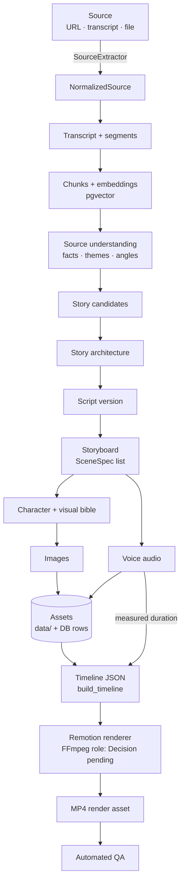

# Data Flow

> How data moves through StoryWeaver, from a source to a final MP4, and which hops exist today.

## Status

**Partially implemented.** The timeline → Remotion → MP4 hop works for a sample; the upstream hops are interfaces, tables or **Planned — not implemented**.

## Purpose

Be the single place that maps every pipeline stage to its data, owner module and implementation state. Stage-level detail lives in [domains/](../domains/) and [workflows/](../workflows/).

## Current implementation

Only these flows run today:

1. **CRUD**: browser → `/api/v1/<resource>` → Postgres (10 resource groups).
2. **Health**: `/health`, `/health/ready` (DB + pgvector), `/health/providers`.
3. **Timeline build**: `video.timeline.build_timeline(list[SceneSpec]) → Timeline` (pure function, unit-tested).
4. **Render of the sample**: `packages/video/sample/timeline.json` → Remotion `Basic` composition → `out/sample.mp4` (`make render-sample`); live preview in `/studio`.

## Target architecture

### Stage status

| Stage | Owner module | Persists to | State |
| --- | --- | --- | --- |
| Source → `NormalizedSource` | `ingestion` | `source_videos`, `channels` | Implemented (P1): `identify` → extractor `extract` (metadata) → service writes `source_videos` and an upserted `channels` row; channel/playlist ingestion Planned |
| Transcript | `ingestion` | `transcripts` (cleaned `text` + `segments` JSONB, versioned, one `is_current`; raw file via `LocalStorage`) | Implemented (P1): captions or upload → parse → normalize → raw file + new version; speech-to-text Planned |
| Chunks / embeddings | `ingestion`, `intelligence` | `transcript_chunks` (`search_vector` for keyword search; `embedding vector(768)` unused) | Chunks + keyword search Implemented (P1); embedding generation and semantic search Planned |
| Understanding → story → script | `story`, `intelligence` | `scripts`, `script_versions` | Tables only; **Planned — not implemented** |
| Storyboard | `story` | `scenes`, `scene_versions.data` | `SceneSpec` schema + tables; generation Planned |
| Bibles | `story`/`visual` | `characters`, `locations` | Tables only; no endpoints; `CharacterVersion` deferred |
| Images | `visual` | `assets` + `data/images` | Interface; mock only; ComfyUI stub |
| Voice | `voice` | `assets` + `data/audio` | Interface; no working provider |
| Timeline | `video` | `renders.timeline` snapshot | `build_timeline` implemented; not yet called by any workflow |
| Render | `packages/video` | `assets` (type `render`), `renders` | CLI on sample only; render workflow Planned |
| QA | `quality` | Planned — Decision pending | **Planned — not implemented** |

### Source pipeline naming

The provider-independent chain (`Source → Source Provider → Normalized Source → Transcript → Chunks → Intelligence → Search/Knowledge`) is defined canonically in [domains/source-library](../domains/source-library.md). In this document: "Source Provider" is a `SourceExtractor` implementation (YouTube is the only one). A source record's `status=imported` means *metadata stored*; "searchable" is derived from a `ready` transcript plus chunks/embeddings, not from that status.

### Artifact versioning and invalidation (Target Architecture — Decision pending)

Semantics (stale vs. preserve, the dependency graph): [workflows/workflow-overview](../workflows/workflow-overview.md). Data direction (columns vs. join table): [data/asset-data-model](../data/asset-data-model.md#artifact-versions-and-dependencies-target). Today only `script_versions` and `scene_versions` exist, with no dependency links and no invalidation logic; caching of metadata, transcripts, chunks, embeddings, analysis, story candidates and visual descriptions is **Planned — not implemented**.

## Components

[system-architecture](system-architecture.md) · [media-pipeline](media-pipeline.md) · [workflow-architecture](workflow-architecture.md).

## Responsibilities

AI-owned transformations (understanding, story, script, storyboard text, prompts) vs. code-owned transformations (chunking, timing, asset naming/hashing, rendering, validation): [ai-architecture](ai-architecture.md), [ADR-004](../decisions/ADR-004-ai-vs-deterministic-responsibilities.md).

## The timeline contract

`app.schemas.scene.Timeline` (Python, source of truth) ⇄ `packages/video/src/types.ts` (zod mirror, hand-maintained) ⇄ `packages/schemas/timeline.schema.json` (generated by `make schemas`, together with canonical sample documents in `packages/schemas/samples/`). Tests in both languages parse the same samples, so a one-sided change fails `make test` ([KI-7](../reference/status.md#known-issues-and-limitations), mitigated in P0; remaining gaps listed there). Specification: [media/timeline-specification](../media/timeline-specification.md).

Durations come from code, never from the LLM. Target: measured audio length when known. Today: `SceneSpec.duration` if set, otherwise `estimate_duration` (≈2.5 words/s, clamped to 2–7 s as a *default*, not a rule — the clamp truncates long narration to 7 s, [KI-16](../reference/status.md#known-issues-and-limitations); see [domains/timeline-system](../domains/timeline-system.md)). Nothing measures audio yet.

## Failure modes

A stage failure is recorded on its entity (`status=failed`, `error` text) and must not cascade; downstream stages simply have nothing to consume until retried. Retry design: [workflows/retry-and-recovery](../workflows/retry-and-recovery.md). **Intent only** — no stage workflow exists yet.

## Extension points

Add a stage by adding a module under `apps/api/app/`, tables/migration if needed, and a workflow function submitted through `WorkflowRunner` ([development/adding-a-domain](../development/adding-a-domain.md)).

## Current limitations

No stage is connected to another by code; the hops in the diagram are the design, not a running pipeline.

## Future evolution

Semantic search/RAG over chunks ([ai/rag-strategy](../ai/rag-strategy.md)); regeneration of single scenes using `SceneVersion` and per-asset status ([domains/storyboard-system](../domains/storyboard-system.md)).
