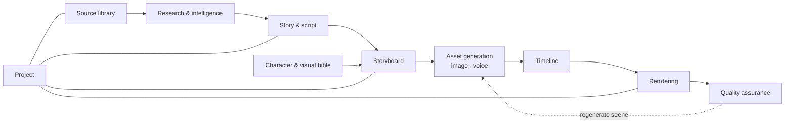

# Domain Architecture

> The conceptual domains of StoryWeaver, their entities, boundaries and dependencies.

## Status

**Partially implemented.** Entities and tables exist for most domains; domain *behaviour* (workflows, generation) is **Planned — not implemented** except timeline building.

## Purpose

Define bounded areas so each can be built and changed independently, and show which entities belong where. Entity-level detail: [data/data-model](../data/data-model.md); relationships: [data/entity-relationships](../data/entity-relationships.md).

## Current implementation

Domains map to Python packages under `apps/api/app/` and to SQLAlchemy models in `models/domain.py` (one file, grouped by comments: source library, projects).

| Domain | Package | Tables | Domain doc |
| --- | --- | --- | --- |
| Source library | `ingestion` | `channels`, `source_videos`, `transcripts`, `transcript_chunks`, `topics`, `collections`, `collection_videos` | [source-library](../domains/source-library.md) |
| Projects | (none yet) | `projects`, `project_sources` | [project-system](../domains/project-system.md) |
| Story / script | `story` (empty) | `scripts`, `script_versions` | [story-generation](../domains/story-generation.md), [script-generation](../domains/script-generation.md) |
| Storyboard / scenes | `story` (empty); schema in `schemas/scene.py` | `scenes`, `scene_versions` | [storyboard-system](../domains/storyboard-system.md) |
| Bibles | — | `characters`, `locations` | [character-system](../domains/character-system.md), [visual-system](../domains/visual-system.md) |
| Assets | `visual`, `voice`, `core.storage` | `assets` | [data/asset-data-model](../data/asset-data-model.md) |
| Timeline / render | `video`, `packages/video` | `renders` | [timeline-system](../domains/timeline-system.md), [video-rendering](../domains/video-rendering.md) |
| Quality | `quality` (empty) | none | [quality-assurance](../domains/quality-assurance.md) |

## Target architecture

A **Project** is the aggregate root for everything derived for one video: scripts, scenes, characters, locations, assets, renders. The **source library** is project-independent: one `SourceVideo` row may feed many projects (`project_sources`) and many collections (`collection_videos`).

## Components and responsibilities

- **Source library** owns raw/normalized source data and its status; it never knows about stories.
- **Research & intelligence** reads library data and produces understanding (facts, themes, angles); owns embeddings. See [domains/research-and-intelligence](../domains/research-and-intelligence.md).
- **Story & script** turns understanding into an original script; versioned (`script_versions`).
- **Storyboard** turns a script into `SceneSpec` objects; versioned (`scene_versions`).
- **Bibles** hold per-project characters/locations (plus a future global style) that every scene prompt must consult.
- **Asset generation** produces files + `assets` rows per scene.
- **Timeline/rendering** are deterministic and read only structured data.

## Dependency rules (target)

Dependencies point downstream in the diagram only. Generation domains may read the bibles and library but must not write to the source library. Rendering reads timeline + assets and never calls an LLM.

## Concept separation and artifact dependencies

Scene intent, image prompt, generated asset and timeline shot are four different things (canonical definition: [domains/storyboard-system](../domains/storyboard-system.md)); each domain owns only its own: the storyboard owns intent, the visual domain owns prompts and assets, the timeline domain owns shots. Artifact-to-artifact dependency tracking (so upstream edits can invalidate or preserve downstream artifacts) is **Target Architecture — Decision pending**; the data direction is in [data/asset-data-model](../data/asset-data-model.md) and the semantics in [workflows/workflow-overview](../workflows/workflow-overview.md).

## Data flow

[data-flow](data-flow.md).

## Failure modes

Domain boundaries limit blast radius: a failed `Asset` leaves its `Scene` intact; a failed `Render` leaves the timeline intact. Each failing entity carries `status` and `error`.

## Extension points

New domain: [development/adding-a-domain](../development/adding-a-domain.md).

## Current limitations

- `characters`/`locations` have **no API endpoints**; `CharacterVersion`, visual-style, era and object entities are **Deferred until required by the production workflow**.
- `story/` and `quality/` packages contain only a docstring.
- `ScriptVersion`/`SceneVersion` have no endpoints; versions are only creatable through the database layer.
- No storage exists for source usage / used ideas, story candidates, analysis results, similarity records or artifact dependencies ([KI-22](../reference/status.md#known-issues-and-limitations); options in [data/story-data-model](../data/story-data-model.md)).
- `Scene` has no `UNIQUE(project_id, sequence)` (index only) to permit reordering; ordering integrity is a future application rule.

## Future evolution

Possible additions when needed: `CharacterVersion`, visual style/era/object tables, tags, a QA results table (**Decision pending**).
