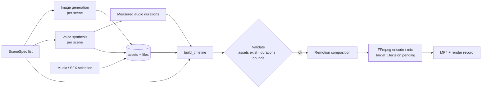

# Media Pipeline Architecture

> The target pipeline that turns a storyboard into audio-visual assets and a timeline, and what exists of it.

## Status

**Partially implemented.** Timeline contract, deterministic timeline builder, one Remotion composition and a CLI render exist. Image generation, voice, music/SFX, subtitle alignment and the orchestration are **Planned — not implemented**.

## Purpose

Describe how generated illustrations plus camera motion, narration, subtitles, music and SFX become a rendered video — *without* per-scene AI video generation. Media-level docs: [media/media-overview](../media/media-overview.md).

## Current implementation

- `schemas/scene.py`: `SceneSpec` (AI-owned *content*: narration, visual intent, prompts, camera choice; its `duration` field is **nullable and assigned by code** — never by the LLM — from measured audio when available, otherwise from `estimate_duration`), `CameraSpec` (shot, movement), `TimelineScene`, `Timeline`.
- `video/timeline.py`: `build_timeline()` sorts by `sequence`, assigns `start`/`duration` (uses `SceneSpec.duration` if set, else `estimate_duration`), copies narration/subtitle/camera. Pure and unit-tested.
- `packages/video`: `BasicComposition` (gradient background, image or placeholder, camera transform from `camera.ts`, subtitle, optional `<Audio>`), `Root.tsx`, sample timeline; CLI render verified (6.5 s H.264, 1280×720).
- `visual/` mock image generator; `voice/` unconfigured provider; `core/storage.py` local storage.

Not present: asset resolution (timeline `image_src`/`audio_src` are plain strings supplied by hand), transitions, music/SFX, audio mixing, subtitle alignment from word timestamps, FFmpeg post-processing.

## Target architecture

Principles: one still image can serve several shots; camera motion is parametric (zoom/pan) and computed from timeline data; the narration drives scene length (typical 2–7 s is a *default band*, not a rule — see [domains/timeline-system](../domains/timeline-system.md)); regenerating a scene replaces its assets and re-runs timeline + render only.

> **Concept separation.** Scene intent ≠ image prompt ≠ generated asset ≠ timeline shot. Canonical definition and identifier mapping: [domains/storyboard-system](../domains/storyboard-system.md). Here it matters in one way: regenerating a scene's asset must not alter its intent or the timeline's timing rules. There is no `Shot` entity today — **Decision pending**.

## Components and responsibilities

| Component | Responsibility | State |
| --- | --- | --- |
| Image generation | Prompt → image file (+ asset row) | Interface/mock |
| Voice | Text → audio file + measured duration | Interface only |
| Timeline builder | Deterministic timing | Implemented |
| Remotion composition | Pixel output from timeline | Implemented (basic) |
| FFmpeg | Encode, mix, loudness | Remotion encodes today; standalone FFmpeg steps Planned |
| Subtitle aligner | Word/segment timing | Planned |

## Data flow

Detailed per area: [media/image-pipeline](../media/image-pipeline.md) · [media/voice-pipeline](../media/voice-pipeline.md) · [media/subtitle-pipeline](../media/subtitle-pipeline.md) · [media/timeline-specification](../media/timeline-specification.md) · [media/rendering](../media/rendering.md).

## Failure modes

Missing/failed asset → scene flagged, render blocked or placeholder per policy (**Decision pending**); audio shorter/longer than estimate → timeline recomputed from measured value; render crash → `Render.status=failed` with `error`, timeline untouched.

## Extension points

New composition ([development/adding-a-remotion-composition](../development/adding-a-remotion-composition.md)); new camera movement (extend `CameraMovement` literal in Python, zod enum and `cameraTransform`, together); new provider ([provider-architecture](provider-architecture.md)).

## Current limitations

- The Python `Timeline` and the zod schema are mirrored by hand but checked against shared sample documents by tests in both languages ([KI-7](../reference/status.md#known-issues-and-limitations), mitigated in P0).
- `estimate_duration` is a word-count heuristic clamped to 2–7 s: narration needing longer is truncated to 7 s, so it must not drive a final render — [KI-16](../reference/status.md#known-issues-and-limitations). `build_timeline` leaves `image_src`/`audio_src` empty.
- Nothing serves `data/` files to the Player or renderer — [KI-17](../reference/status.md#known-issues-and-limitations).
- No audio is rendered in the sample; system FFmpeg is **not** required for rendering (Remotion bundles its own encoder), and no StoryWeaver code invokes FFmpeg directly.

## Future evolution

Transitions, ducked music, loudness normalisation, QA hooks ([quality-architecture](quality-architecture.md)), render caching by timeline hash.
