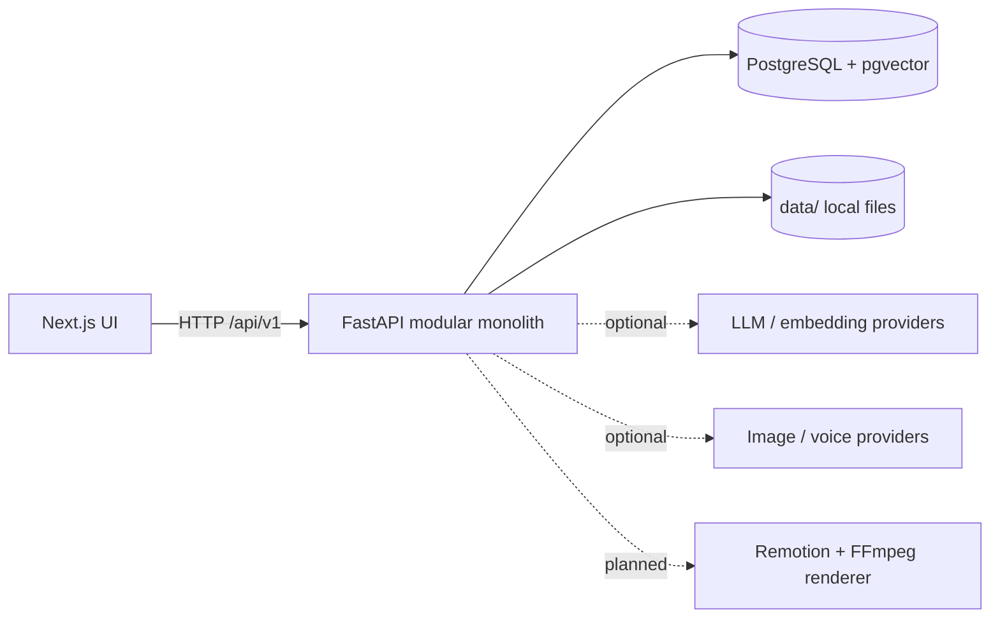

# Architecture Overview

> Entry point for StoryWeaver's architecture: what the system is, how it is divided, and where each concern is documented in depth.

## Status

**Partially implemented.** The foundation (API, database schema, provider interfaces, app shell, one Remotion composition) exists. Most of the production pipeline is **Planned — not implemented**. The canonical per-subsystem matrix is [reference/status](../reference/status.md).

## Purpose

StoryWeaver is a local-first, AI-assisted story-to-video engine ("From source to story to video"). The architecture exists to keep three things true as the product grows:

1. **AI decides content; deterministic code decides timing, asset management and rendering** ([ADR-004](../decisions/ADR-004-ai-vs-deterministic-responsibilities.md)).
2. **No business logic depends on one AI provider** ([ADR-003](../decisions/ADR-003-provider-abstraction.md)).
3. **Any scene or asset can be regenerated without rebuilding the project** (independent identity, status and version per scene/asset).

## Guiding principles

**AI decides CONTENT** — source understanding, topic extraction, story-opportunity discovery, story architecture, script, scene intent, visual descriptions, emotional beats, visual prompts, creative choices.
**Deterministic software decides EXECUTION** — validation, schemas, persistence, IDs, asset relationships, timestamps, durations, subtitle timing, audio sync, timeline construction, rendering, encoding, retries, file management, reproducibility.

**Optimisation goal: maximum content quality at minimum monetary cost** — not minimum cost at any cost. The system is *local-first, not local-only*: routine work runs on local models, high-value creative work may use stronger (cloud) models, and dedicated providers serve embeddings, images, TTS and STT. See [ai-architecture](ai-architecture.md) and [ai/ai-cost-strategy](../ai/ai-cost-strategy.md). Per-task routing is **Planned — not implemented**; only per-task model *settings* exist.

**Staged pipeline with approval gates (Target Architecture).** Expensive generation happens only after the user approves the creative direction; the canonical description and rationale are in [ai/ai-cost-strategy](../ai/ai-cost-strategy.md). Nothing in this chain is automated yet.

**Four concepts must not be conflated** — scene intent, image prompt, generated asset, timeline shot. The canonical definition and the identifier mapping live in [domains/storyboard-system](../domains/storyboard-system.md); this overview does not repeat the table. Terminology note: in code today `CameraSpec.shot` means the *framing type* (`wide`, `close_up`, …) and there is **no Shot entity**; the "timeline shot" used above is a future concept (*Decision pending*) — see [reference/glossary](../reference/glossary.md).

## Current implementation

A **modular monolith** ([ADR-006](../decisions/ADR-006-modular-monolith.md)): one FastAPI application, one PostgreSQL database (with pgvector), one Next.js UI, and one Remotion package.

| Module (`apps/api/app/…`) | Responsibility | State |
| --- | --- | --- |
| `core/` | Settings, structured logging with key-name redaction, local storage with path-traversal protection, error types | Implemented |
| `db/`, `models/` | Lazy sync SQLAlchemy engine/session; 17 tables; status enums | Implemented |
| `schemas/` | Pydantic API models (`resources.py`), scene/timeline contract (`scene.py`), `NormalizedSource` (`source.py`) | Implemented |
| `api/` | `/api/v1` router; generic CRUD factory; health endpoints | Implemented |
| `ingestion/` | `SourceExtractor` interface, YouTube URL classification + optional yt-dlp extractor, `Transcriber` interface + lazy faster-whisper, transcript chunking | Partially implemented (extractor/transcriber never run against real services) |
| `intelligence/` | `LLMProvider`/`EmbeddingProvider` interfaces, five LLM adapters, two embedding adapters, lazy registry | Partially implemented (only Ollama's chat request shape is test-covered; embedding adapters are untested) |
| `visual/` | `ImageGenerator` interface, mock generator, ComfyUI **stub** | Partially implemented |
| `voice/` | `VoiceProvider` interface; default provider always raises "not configured" | Partially implemented |
| `video/` | Deterministic `build_timeline` | Implemented |
| `workflows/` | `WorkflowRunner` protocol + in-process `LocalRunner` | Partially implemented (runner exists and is unit-testable; no workflow function exists and no route calls it) |
| `story/`, `quality/` | Docstring-only packages | Planned — not implemented |

Outside the API: `apps/web` (Next.js app shell), `packages/video` (Remotion `Basic` composition + sample timeline), `packages/schemas` (generated JSON Schema), `data/` (local file storage skeleton).

## Target architecture

The same monolith, with the planned domain modules filled in and a durable workflow backend (Temporal) available as an alternative to `LocalRunner`. Splitting a module into its own process (for example a GPU image worker) is allowed only when it needs independent scaling or a different runtime — **Decision pending**, see [scalability](scalability.md).

The full diagram is in [system-architecture](system-architecture.md).

## Components and responsibilities

See [system-architecture](system-architecture.md) (component map), [backend-architecture](backend-architecture.md), [frontend-architecture](frontend-architecture.md), [domain-architecture](domain-architecture.md), [provider-architecture](provider-architecture.md), [media-pipeline](media-pipeline.md).

## Architectural rules the code follows today

- **Lazy everything.** Importing the app opens no database connection and loads no model; engines and providers are created on first use (`db/session.py`, `intelligence/registry.py`).
- **Optional providers.** A missing key makes a provider "not configured"; it never prevents startup (no provider credential is required; `Settings` still has non-empty defaults for the database URL, Ollama URL and CORS origins — see [reference/environment-reference](../reference/environment-reference.md)).
- **Structured data over text.** Scene, timeline and source contracts are Pydantic models; free-form JSON is confined to `JSONB` columns.
- **Granular identity.** `Scene`, `SceneVersion`, `Asset` and `Render` have their own ids and statuses; `error` is persisted on the entity.
- **Binary data is not in Postgres.** `Asset.storage_key` is designed to point into `data/` (see [storage-architecture](storage-architecture.md)).

## Data flow

End-to-end target pipeline and what is implemented: [data-flow](data-flow.md).

## Failure modes

Per-subsystem failure modes live in each architecture document. Cross-cutting policy: a failure is recorded on the failing entity (`status`, `error`) and must not fail the project — see [workflow-architecture](workflow-architecture.md) and [workflows/retry-and-recovery](../workflows/retry-and-recovery.md).

## Extension points

New LLM provider ([development/adding-a-provider](../development/adding-a-provider.md)); new domain module ([development/adding-a-domain](../development/adding-a-domain.md)); new API resource ([development/adding-an-api-resource](../development/adding-an-api-resource.md)); new Remotion composition ([development/adding-a-remotion-composition](../development/adding-a-remotion-composition.md)).

## Current limitations

- No authentication — localhost only ([security-architecture](security-architecture.md)).
- No workflow is implemented end to end; the API has CRUD only.
- No real image or voice generation; no render workflow (rendering today is a manual CLI command on a sample timeline).
- Provider adapters have not been exercised against real services; only Ollama's chat request has an (HTTP-mocked) test; embedding adapters and the other LLM adapters have none.
- Further code-level limitations are tracked once in [reference/status → Known issues](../reference/status.md#known-issues-and-limitations) (for example unwired `LocalStorage`/`LocalRunner` [KI-9](../reference/status.md#known-issues-and-limitations), residual timeline-contract gaps [KI-7](../reference/status.md#known-issues-and-limitations), no asset serving [KI-17](../reference/status.md#known-issues-and-limitations)). Defects fixed in P0 are kept there as history.

## Future evolution

Pipeline implementation order is in [product/feature-roadmap](../product/feature-roadmap.md). Rationale for the stack: [ADR-001](../decisions/ADR-001-stack.md).
