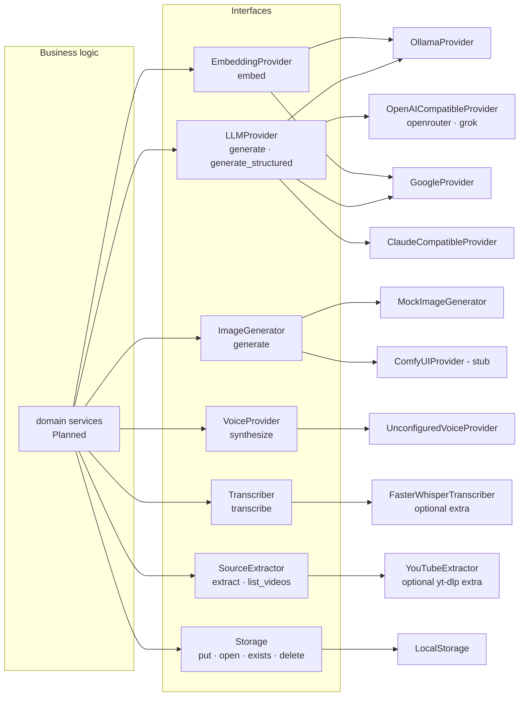

# Provider Architecture

> How StoryWeaver talks to external AI/media systems through replaceable interfaces.

## Status

**Partially implemented.** Interfaces exist for LLM, embeddings, images, voice, transcription, source extraction and storage. Real HTTP adapters exist for LLMs (5) and embeddings (Ollama, Google); ComfyUI has only a reachability probe; none has been exercised against a live service, and only the Ollama chat request shape has an (HTTP-mocked) test.

## Purpose

Guarantee that business logic depends on interfaces, never on a vendor ([ADR-003](../decisions/ADR-003-provider-abstraction.md)). Provider choices are configuration and may change; none is a permanent decision.

## Current implementation

| Interface | File | Implementations | Reality |
| --- | --- | --- | --- |
| `LLMProvider` | `intelligence/providers/base.py` | ollama, google, openrouter, grok, claude (Messages API shape) | HTTP written; Ollama request shape unit-tested via mock transport; others untested |
| `EmbeddingProvider` | same | ollama, google | untested live |
| `ImageGenerator` | `visual/base.py` | `MockImageGenerator` (64×36 placeholder PNG, `metadata.mock=True`), `ComfyUIProvider` | ComfyUI `generate()` raises `ProviderError("… not implemented yet")`; `get_image_generator()` returns ComfyUI only if `COMFYUI_BASE_URL` is set |
| `VoiceProvider` | `voice/base.py` | `UnconfiguredVoiceProvider` | always raises `ProviderNotConfiguredError` |
| `Transcriber` | `ingestion/transcription.py` | `FasterWhisperTranscriber` | lazy import; extra `transcription`; never run |
| `SourceExtractor` | `ingestion/base.py` (+ `registry.py`) | `YouTubeExtractor` | `identify`/URL validation, metadata and caption fetch tested with recorded fixtures; run live once (one public video) on 2026-10-01 |
| `Storage` | `core/storage.py` | `LocalStorage` | tested; used by the Source Library for raw transcripts |

Configuration: `*_API_KEY`, `*_BASE_URL`, model names — all in `Settings`; keys are read server-side only; `/health/providers` exposes booleans (never values).

## Target architecture

Same interfaces; concrete additions chosen later: Piper/Kokoro/XTTS-class TTS, cloud image providers, an S3-compatible `Storage`, a Temporal-backed `WorkflowRunner`. Which concrete model/provider serves which task is **Decision pending** and must stay configuration.

### Required properties of every provider call (Target)

Observable (logged with provider/model/duration/status), retryable, timeout-controlled, output-validated, isolated and replaceable. A provider failure **must not corrupt project state**: results are written only after validation, and failures are recorded on the failing entity. Fallback between providers must happen *behind* the interface so business logic never couples to a provider API. Implemented today: logging, a configurable timeout (`LLM_TIMEOUT_SECONDS`), output validation (structured generation), and normalisation of every failure into the `ProviderError` family without URLs, headers or bodies (previously KI-3, resolved in P0). Retry/backoff, fallback and persisted failure state are **Planned — not implemented**.

## Components and responsibilities

Each adapter: translate the interface call to one vendor protocol, normalise transport errors (`ProviderError`), never leak secrets into logs, hold no business logic. The registry (`intelligence/registry.py`) maps names to lazy factories.

## Data flow

Service → `get_llm()` → provider instance → `generate()` → vendor HTTP → `LLMResult(text, provider, model, duration_seconds, tokens)`.

## Failure modes

Not configured or no model → `ProviderNotConfiguredError`; timeout → `ProviderTimeoutError`; HTTP-status or transport failure → `ProviderError` (with `.status_code`); empty, blocked or malformed reply → `ProviderResponseError`, which `generate_structured` retries once; unknown name → `ProviderNotConfiguredError`. Providers are cheap to construct; a failing provider never affects startup.

## Extension points

[development/adding-a-provider](../development/adding-a-provider.md). Security expectations: [security/provider-security](../security/provider-security.md).

## Current limitations

- Each call builds a fresh `httpx.Client` (no pooling).
- `is_configured()` for Ollama is true whenever its base URL is non-empty (default `http://localhost:11434`), which does **not** mean the server is reachable — use `/health/providers.ollama_reachable`.
- No provider registry for image/voice/transcription (single factory functions).
- Timeout is fixed (120 s); no retry/backoff on transient errors.
- Domain errors are mapped to HTTP statuses with stable codes by `api/errors.py` (previously KI-8, resolved in P0); setting `COMFYUI_BASE_URL` swaps the working mock for the raising stub ([KI-18](../reference/status.md#known-issues-and-limitations)).

## Future evolution

Provider fallback chains, per-provider rate limiting, cost accounting, capability flags (JSON mode, vision) — all **Planned — not implemented**.
