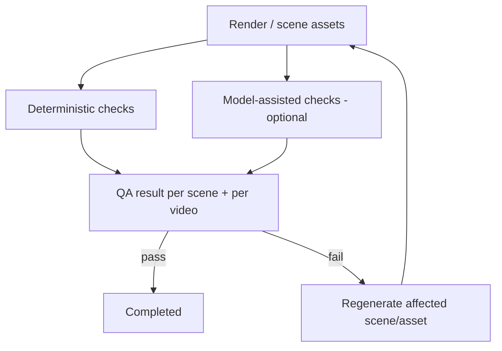

# Quality Architecture

> How StoryWeaver will detect and fix bad output — and the (small) amount of quality machinery that exists today.

## Status

**Planned.** `apps/api/app/quality/__init__.py` is a docstring only. No QA check, table or endpoint exists. What does exist is engineering quality tooling for the code itself (below).

## Purpose

Catch problems per scene before a final render ships, and route them to targeted regeneration rather than a full rebuild. Domain detail: [domains/quality-assurance](../domains/quality-assurance.md), [workflows/qa-workflow](../workflows/qa-workflow.md), [testing/quality-gates](../testing/quality-gates.md).

## Current implementation

Not product QA, but relevant guards:

- Structured-output validation of LLM replies (`generate_structured`).
- Pydantic validation of API input and of the `Timeline`/`SceneSpec` contracts (e.g. positive durations, `sequence ≥ 1`).
- Code quality gates: ruff, pyright strict, pytest, ESLint, `tsc --noEmit`, Vitest, Prettier, Playwright (`make lint`, `make test`, `make e2e`).
- `AssetStatus` / `SceneStatus` / `RenderStatus` enums and `error` columns provide the *places* QA results will update.

## Target architecture

**Deterministic checks (cheap, run first):** missing/zero-byte assets, checksum mismatch, image dimensions, duration vs. audio length, subtitle overlap/ordering/length, audio clipping and loudness, silence gaps, black frames, render exit status.
**Model-assisted checks (costly, optional, routed per [ai/model-routing](../ai/model-routing.md)):** wrong character/object/action versus scene intent, style drift versus the visual bible, visual artifacts, narration–visual mismatch. Reliability of these is unproven; they should produce *flags for review*, not silent rewrites.

Result storage (table vs. JSON on existing rows) is **Decision pending**.

## Components and responsibilities

Check runners (pure functions returning structured findings) · aggregator (severity, scene linkage) · regeneration trigger (marks a scene/asset for retry, bounded attempts) · UI surface (scene status, reasons).

## Data flow

Render + timeline + assets → checks → findings → status updates → optional regeneration job → re-check.

## Failure modes

False positives loop regeneration (cap attempts); model-judge disagreement (require deterministic failure or human confirmation for destructive actions); QA crash must not mark a project failed.

## Extension points

New check = function `(context) -> list[Finding]` registered in a check list (shape **Decision pending**).

## Current limitations

Everything product-facing: no checks, no results, no UI, no tests. Engineering checks run locally only — there is no CI ([KI-10](../reference/status.md#known-issues-and-limitations)). See [ai/ai-quality-evaluation](../ai/ai-quality-evaluation.md) for evaluating the AI stages themselves.

## Future evolution

Golden-sample regression renders ([testing/media-testing](../testing/media-testing.md)), human review queue, per-style thresholds.
