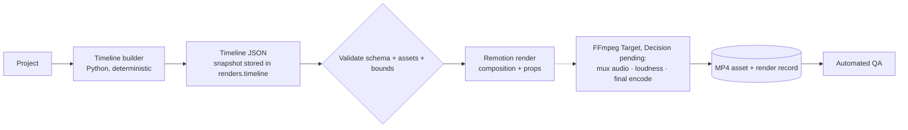

# Rendering Architecture

> How a Timeline JSON becomes an MP4, and the current boundary of that capability.

## Status

**Partially implemented.** The Remotion `Basic` composition renders the sample timeline to MP4 via CLI. Project-level rendering, asset resolution, audio, transitions and FFmpeg post-processing are **Planned — not implemented**.

## Purpose

Target: deterministic output — same timeline + same assets ⇒ same video. Only the *timeline JSON* determinism is tested today (`build_timeline`); frame-level or byte-level render reproducibility has not been verified. Rendering never calls an LLM. Media-level docs: [media/rendering](../media/rendering.md), [media/remotion](../media/remotion.md), [media/ffmpeg](../media/ffmpeg.md), [domains/video-rendering](../domains/video-rendering.md).

## Current implementation

- `packages/video/src/types.ts`: zod `timelineSchema` (defaults: 30 fps, 1920×1080) and `TimelineScene`.
- `BasicComposition`: one `<Sequence>` per scene at `round(start*fps)` for `round(duration*fps)` frames; each scene renders a hue-shifted gradient, `` if `image_src` else a dashed "Image placeholder" box, a camera transform from `cameraTransform(movement, progress)`, optional `<Audio src>`, and a subtitle box if `subtitle` is set.
- `Root.tsx`: registers composition `Basic` with `calculateMetadata` deriving duration/fps/size from props.
- Entry points: `pnpm --filter @storyweaver/video render` (→ `out/sample.mp4`, git-ignored; `make render-sample`), `studio`, and the Player in `/studio`.
- Verified: 195 frames, 30 fps, 1280×720, H.264, 6.5 s. Render uses Remotion's own headless Chrome; Encoding is done by Remotion's own bundled encoder; the system FFmpeg is not invoked by any StoryWeaver code today.

## Target architecture

Who runs the renderer (API subprocess vs. a separate Node worker) is **Decision pending**; any subprocess invocation must use argument lists, never shell strings ([security/input-validation](../security/input-validation.md)).

## Components and responsibilities

Timeline builder (timing) · validator (fail fast before rendering) · Remotion composition (visuals, motion, subtitle layout) · FFmpeg (audio mux/mix, normalisation, final encoding where Remotion alone is insufficient) · `renders` table (status, timeline snapshot, output asset, start/finish, error).

## Data flow

[data-flow](data-flow.md) and [media-pipeline](media-pipeline.md). The timeline snapshot is stored with the render so a render is reproducible even if scenes later change.

## Failure modes

Invalid timeline → rejected before render; missing media file → composition error (Remotion fails the frame) → `Render.status=failed`; Chrome missing/OOM on long videos → job failure (render memory on a 16 GB laptop for 10–15 min videos is **untested**); partial output → must not be registered as an asset.

## Extension points

Add compositions in `Root.tsx` ([development/adding-a-remotion-composition](../development/adding-a-remotion-composition.md)); add camera movements (Python literal + zod enum + `cameraTransform`); add transitions as timeline fields ([media/transitions](../media/transitions.md)).

## Current limitations

- Camera motion is a fixed 12 % scale / ±3 % translate path per movement, not parameterised by intensity (the target scene design has `intensity`; the schema does not).
- Image `src` must be a URL/static file reachable by the Remotion bundler; no resolver from `assets` rows, and nothing serves `data/` files — how a render receives asset URLs is **Decision pending** ([KI-17](../reference/status.md#known-issues-and-limitations)).
- The zod timeline schema and the Python model differ (`camera` required vs default; `shot` free string vs fixed set) and are not checked against each other ([KI-7](../reference/status.md#known-issues-and-limitations)); `estimate_duration` truncates long narration to 7 s ([KI-16](../reference/status.md#known-issues-and-limitations)).
- No transitions, no audio mixing, no word-level subtitles; the scene's whole subtitle line is shown for the entire scene.
- Sample render defaults are 1280×720 (the zod default is 1920×1080).
- Remotion licensing for company use is the owner's responsibility.

## Future evolution

Render caching by timeline hash, scene-level preview renders for regeneration review, 1080p default, GPU-optional encoding.
