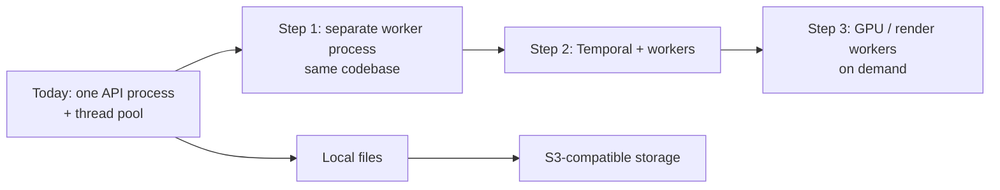

# Scalability

> What load StoryWeaver is designed for, where it will hit limits first, and the planned escape hatches.

## Status

**Future.** The system is deliberately single-machine and single-user; scaling work is **Deferred until required by the production workflow**.

## Purpose

Prevent premature distribution while recording which seams make later scaling cheap.

## Current implementation

Design target: one developer laptop (≈16 GB RAM, 6 cores, no GPU assumed). Concretely:

- One uvicorn process; sync endpoints in FastAPI's threadpool (default ~40 threads).
- `LocalRunner` thread pool of 2 for background jobs (unused today).
- SQLAlchemy default pool per process; `pool_pre_ping` on.
- No model preloading; providers and engines are lazy.
- Files streamed in 1 MiB chunks; no whole-video reads into RAM.
- Embedding index: HNSW (m=16, ef_construction=64) on `transcript_chunks.embedding`.

## Target architecture

Order of likely bottlenecks (predicted, not measured): (1) local image generation time; (2) Remotion render time/memory for 10–15 min videos; (3) LLM latency on CPU-only Ollama; (4) storage growth from images/audio/renders.

## Components and responsibilities

The seams that allow scaling without rewrites: `WorkflowRunner`, `Storage`, provider interfaces, idempotent entity-keyed jobs, assets referenced by key (not path).

## Data flow

Same logical flow at any scale; only the executor and storage backend change.

## Failure modes

Memory pressure when Ollama, ComfyUI, Chrome (render) and Postgres run together on 16 GB; thread-pool exhaustion if long jobs are run in request threads; disk filling with intermediate frames.

## Extension points

Swap runner/storage implementations; run image/voice generators remotely behind the existing interfaces; shard nothing (single Postgres is sufficient for the foreseeable library size).

## Current limitations

No load testing, no measured render or generation timings, no queue, no concurrency limits per resource type, no backpressure.

## Future evolution

Whether to split a worker (and what it owns) is **Decision pending**; criteria: independent scaling need or different runtime (GPU, Node renderer). See [ADR-006](../decisions/ADR-006-modular-monolith.md) and [workflow-architecture](workflow-architecture.md).
