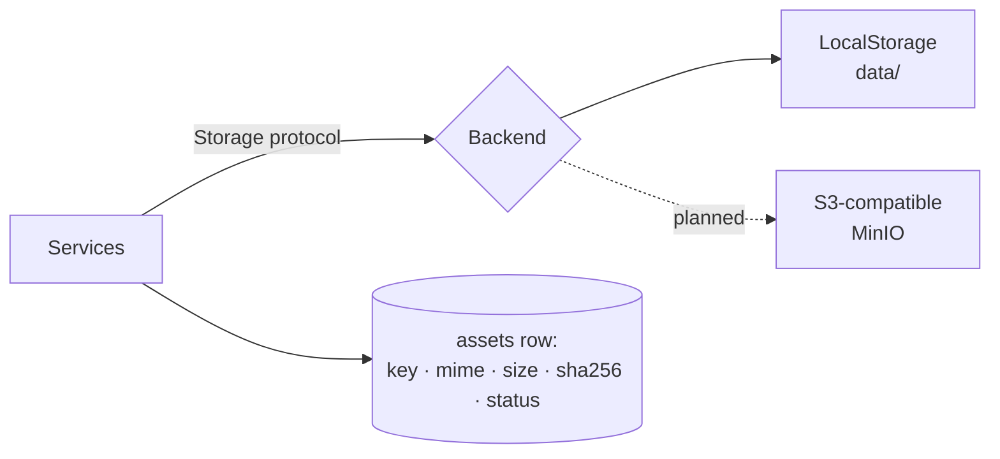

# Storage Architecture

> Where StoryWeaver keeps data: PostgreSQL for metadata, the filesystem for media, with an abstraction for future object storage.

## Status

**Partially implemented.** `LocalStorage` and the directory skeleton exist and are tested; no API route or workflow writes files yet. S3/MinIO is **Planned — not implemented**.

## Purpose

Separate metadata (queryable, transactional) from binary media (large, streamed), and make the file side safe and swappable. Layout details: [data/storage-layout](../data/storage-layout.md); security: [security/file-security](../security/file-security.md), [security/local-storage-security](../security/local-storage-security.md); decision: [ADR-008](../decisions/ADR-008-storage-strategy.md).

## Current implementation

- **Root**: `Settings.storage_root` (default `<repo>/data` **when `STORAGE_ROOT` is unset**; env `STORAGE_ROOT`). Caution: `.env.example` ships `STORAGE_ROOT=` empty, which parses to `.` and so resolves relative to the process working directory — [KI-1](../reference/status.md#known-issues-and-limitations). Directory skeleton tracked via `.gitkeep`: `sources transcripts embeddings images audio music sfx projects renders temporary`. Contents are git-ignored.
- **`core/storage.py`**:
  - `Storage` protocol: `put(key, BinaryIO) -> (size, sha256)`, `open`, `exists`, `delete`.
  - `LocalStorage`: `path_for(key)` rejects empty keys, leading `/` or `\`, NUL bytes, and any resolved path outside the root (`UnsafePathError`). `put` streams in 1 MiB chunks, hashes while writing, enforces `max_upload_bytes` (default 512 MiB), writes to `<name>.part` then atomically renames.
  - `sanitize_filename()`: strips directories, replaces unsafe characters, caps at 200 chars, rejects empty results.
  - `get_storage()` returns a `LocalStorage`.
- **Database side**: `assets.storage_key`, `mime_type`, `size_bytes`, `checksum` (sha256), `status`; no binary columns anywhere. The only large DB payloads are JSONB (`transcripts.segments`, `scene_versions.data`, `renders.timeline`) and `vector(768)` embeddings.
- Tests: traversal rejection, streaming put + checksum, filename sanitising (`tests/test_units.py`).

## Target architecture

Keys are relative and namespaced (e.g. `images/<project_id>/<scene_id>/<asset_id>.png`) — **proposed, not implemented; Decision pending**. The asset row, not the filename, is the source of truth for existence and integrity.

## Components and responsibilities

`Storage` implementation: byte movement and path safety only. `Asset` rows: identity, type, status, checksum, links to project/scene. Services: create the row (`pending`), write the file, update row (`ready`/`failed`) — so a crash leaves a visible `pending`/`failed` row rather than an orphan.

## Data flow

Generate → stream to `.part` → hash → rename → update asset row. Reads stream via `open()`. The renderer reads files by resolved path or URL (how Remotion receives asset URLs is **Decision pending**; the sample uses no assets).

## Failure modes

Disk full / write error → `.part` removed in `finally`, no partial file visible; oversize upload → a plain `ValueError` (not a typed `StoryWeaverError`, and not mapped to HTTP; an endpoint must map it to 413 — [KI-9](../reference/status.md#known-issues-and-limitations)); traversal attempt → `UnsafePathError`; row without file or file without row → reconcile job **Planned — not implemented** ([operations/recovery](../operations/recovery.md)).

## Extension points

Implement the `Storage` protocol for S3/MinIO; add a bucket name to the key scheme. MinIO is available as an opt-in compose profile but nothing uses it.

## Current limitations

- No deduplication by checksum, no garbage collection, no quota handling.
- `delete()` removes the file but nothing keeps DB rows consistent.
- Symlink handling relies on `resolve()` containment only.
- No upload endpoint exists and no route uses `LocalStorage`; `max_upload_bytes` is enforced inside `put()` only ([KI-9](../reference/status.md#known-issues-and-limitations)). Nothing serves files from `data/` over HTTP, so neither the Studio Player nor the renderer can fetch a stored asset today ([KI-17](../reference/status.md#known-issues-and-limitations)).

## Future evolution

Content-addressed dedup, cache directories with eviction (`temporary/`), S3 backend, backups ([operations/backups](../operations/backups.md)).
