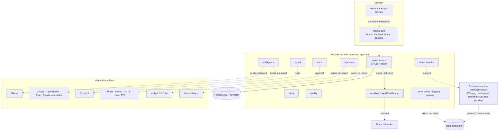

# System Architecture

> The component map of StoryWeaver: processes, data stores, and how they talk.

## Status

**Partially implemented.** In the diagram below only the **solid** edges are runtime relationships that work today (`UI → ROUTES → DB`). **Dashed** edges are either *exists, not wired* (code exists but nothing calls it) or *planned / stub* (not functional). Nothing dashed should be read as an implemented runtime dependency.

## Purpose

Show every runtime component, which are mandatory for development, and which are optional integrations.

## Current implementation

Runtime processes during development (all on the host; Docker only supplies Postgres — see [operations/docker](../operations/docker.md)):

| Process | Port | Mandatory | Notes |
| --- | --- | --- | --- |
| FastAPI (`uvicorn app.main:app`) | 8000 | yes | `make dev-api` |
| Next.js dev server | 3100 | for UI | 3000 is commonly taken |
| PostgreSQL 16 + pgvector | 5433 (compose, TCP) | yes | `make db-up`. With `make db-up-nodocker` the server listens on a **unix socket** inside `data/temporary/pgdata` (no TCP port); the printed `DATABASE_URL` uses `?host=<socket dir>` |
| Ollama | 11434 | no | Only probed by `/health/providers` |
| ComfyUI | configurable | no | Stub client only |
| Temporal / MinIO | 7233 / 9000 | no | Compose profiles; **not wired into code** |

## Target architecture

Legend. **Solid** (works today): `UI → ROUTES` (fetch) and `ROUTES → DB` (generic CRUD). **Dashed "exists, not wired"**: the code is present and unit-tested in isolation, but no route, workflow or job calls it — `ROUTES → WF` (no route submits to the runner), `CORE → FS` (`LocalStorage` is used by no route), `INTEL → providers` (adapters never called by a workflow; only the Ollama HTTP shape is test-covered), `ING → yt-dlp / faster-whisper` (lazy optional imports; never run against real services). **Dashed "stub"/"planned"**: not functional. The Remotion Player on `/studio` renders only the bundled sample timeline; the `PLAYER` node is not driven by project data.

## Components

Detailed in: [backend-architecture](backend-architecture.md) · [frontend-architecture](frontend-architecture.md) · [provider-architecture](provider-architecture.md) · [storage-architecture](storage-architecture.md) · [workflow-architecture](workflow-architecture.md) · [rendering-architecture](rendering-architecture.md).

## Responsibilities

- **UI**: presentation and CRUD interaction only. Holds no keys; talks only to the API (`NEXT_PUBLIC_API_URL`).
- **API**: validation, persistence, orchestration of provider calls, workflow submission.
- **Database**: metadata, status, versions, embeddings. Never binary media.
- **Filesystem (`data/`)**: media and intermediate files.
- **Renderer**: turns a Timeline JSON plus asset files into MP4. Today only the CLI render of the sample exists.

## Data flow

See [data-flow](data-flow.md). Request path today: browser → `fetch` → `/api/v1/<resource>` → generic CRUD → SQLAlchemy → Postgres.

## Failure modes

| Failure | Behaviour today |
| --- | --- |
| Postgres down | `/health` still 200 (liveness); `/health/ready` returns 503; CRUD endpoints error; UI shows "API not ready" |
| Provider not configured | `ProviderNotConfiguredError` when called; startup unaffected |
| Ollama unreachable | `/health/providers` reports `ollama_reachable: false` |
| API unreachable from UI | `ApiError(0, "Cannot reach the API … Is it running?")` rendered by `ErrorState` |

## Extension points

Provider registries ([provider-architecture](provider-architecture.md)), `WorkflowRunner` protocol ([workflow-architecture](workflow-architecture.md)), `Storage` protocol ([storage-architecture](storage-architecture.md)), Remotion `Root.tsx` compositions ([rendering-architecture](rendering-architecture.md)).

## Current limitations

Single user, single machine, no authentication, no background worker process (jobs would run in API threads), no reverse proxy or TLS.

## Known limitations referenced here

Defects and gaps relevant to this component map are tracked once in [reference/status → Known issues](../reference/status.md#known-issues-and-limitations): unwired storage and runner ([KI-9](../reference/status.md#known-issues-and-limitations)), unmapped domain errors ([KI-8](../reference/status.md#known-issues-and-limitations)), the hand-maintained zod/Python timeline mirror ([KI-7](../reference/status.md#known-issues-and-limitations)), and no route to serve files from `data/` to the Player or renderer ([KI-17](../reference/status.md#known-issues-and-limitations)). The dev web server also binds beyond localhost ([KI-20](../reference/status.md#known-issues-and-limitations)).

## Future evolution

Optional separate worker process for long jobs and GPU work; Temporal as durable backend; S3-compatible storage; containerised deployment. All **Decision pending** — see [scalability](scalability.md) and [operations/deployment](../operations/deployment.md).
