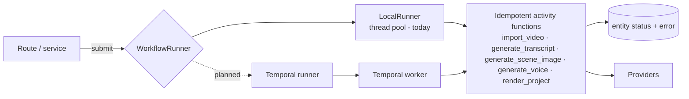

# Workflow Architecture

> How long-running work is (to be) executed, observed and retried.

## Status

**Partially implemented.** The `WorkflowRunner` abstraction, an in-process `LocalRunner` (and an `InlineRunner` for tests) exist; since P1 the Source Library ingestion (`source.add`, `source.fetch_transcript`) submits to the runner and records each run in the persisted `workflow_runs` table. Temporal is **Planned — not implemented** (compose profile only).

## Purpose

Keep job execution behind an interface so first boot needs no extra service while durable orchestration can be added later. Workflow-level docs: [workflows/workflow-overview](../workflows/workflow-overview.md), [workflows/retry-and-recovery](../workflows/retry-and-recovery.md).

## Current implementation

`workflows/runner.py`:

- `WorkflowRunner` protocol: `submit(name, fn, *args, **kwargs) -> workflow_id`.
- `LocalRunner(max_workers=2)`: `ThreadPoolExecutor`; id = `<name>-<12 hex>`; logs `workflow.started`, `workflow.finished` (`status=ok`) or `workflow.failed` (`status=failed`, `error`) via structlog; swallows the future's exception after logging so the app keeps running.
- `get_runner()`: lazily created module singleton.

Present since P1: persisted run state (`queued/running/succeeded/failed/interrupted`), a minimal `progress` document, a single-active-run guarantee per `(kind, subject)` (partial unique index), startup reconciliation, and callers (`POST /sources/from-url`, `POST /sources/{id}/retry`). Not present: automatic retry/backoff, cancellation, result retrieval, scheduling, a generic retry endpoint.

## Target architecture

Design intent (from the product spec):

- Activities are keyed by entity id and **idempotent**: read current state, skip completed work, write result then `status`.
- Workflow-level orchestration (ordering, fan-out over scenes, approval gates) is separate from activity bodies, so the same activities run under either runner.
- Progress, provider latency, token usage and durations are recorded in logs and database records first; no external observability stack ([operations/monitoring](../operations/monitoring.md)).
- Durable workflows eventually cover: channel import, transcript extraction/processing, embedding, source analysis, script and storyboard generation, image and voice generation, rendering, QA.

## Components and responsibilities

Runner (start/identify/log) · activities (do one retryable step) · entities (`status`/`error` are the durable job state in the LocalRunner world) · Temporal (durability, retries, timers — future).

## Data flow

Submit → thread → activity → provider/DB/FS → status update. With LocalRunner a process restart loses in-flight jobs; the entity is then left in a transitional status (`importing`, `processing`, `generating`) with no live job — a **reaper/recovery step is Planned — not implemented**.

## Failure modes

Exception in job → logged, entity must be marked failed by the job's own error handling (the runner does not do this); process crash → orphaned transitional status; duplicate submission → possible concurrent runs of the same entity (no locking).

## Extension points

Implement `WorkflowRunner` for Temporal; register activities as plain functions; choose runner via `Settings.temporal_address` (selection logic **Decision pending**).

## Current limitations

See above: no persistence, cancellation, progress, locking or callers ([KI-9](../reference/status.md#known-issues-and-limitations)). `max_workers=2` is a fixed constant. The runner logs `error="<Type>: <message>"`; the log processor scrubs secret-shaped substrings in that text (best-effort).

## Future evolution

Temporal with a separate worker process, human-approval signals between pipeline stages, scheduled channel sync ([workflows/channel-sync-workflow](../workflows/channel-sync-workflow.md)).
