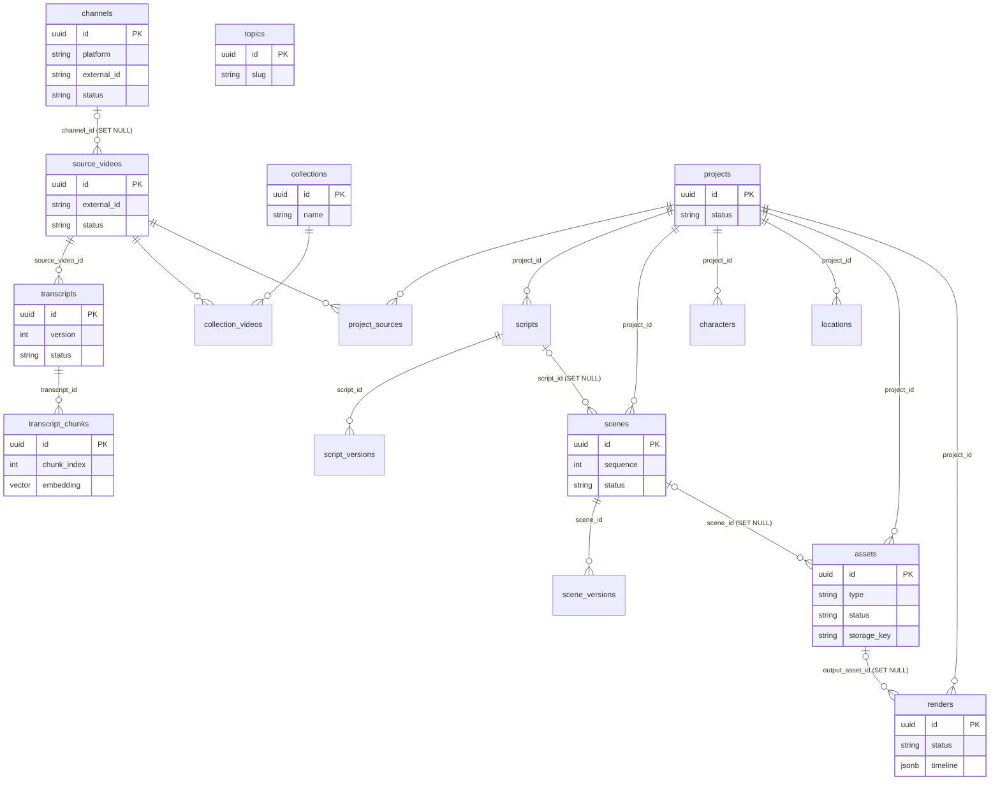

# Entity Relationships

> How the 17 tables relate; the canonical database/domain diagram.

## Status

**Implemented** (diagram reflects `apps/api/app/models/domain.py`).

## Diagram

Attributes are shown for a subset of tables; the complete columns are in [database-schema](database-schema.md). `channel_id` on `source_videos` is nullable, hence the optional (`|o`) end of the first relationship. `topics` has no relationships yet: a topic ↔ video/chunk link is *Planned — not implemented* (*Decision pending* on shape). `scripts`/`scenes` both hang off `projects`; `scenes.script_id` is optional so a scene can survive deletion of its script.

## Cardinality notes

- **Source reuse**: a `source_video` appears once (unique per platform+external id) and links to many projects through `project_sources` and many collections through `collection_videos`. See [source-data-model](source-data-model.md).
- **Versions**: parent → versions is 1:N, unique per `(parent, version)`; "current" version is not stored (derive as max version; *Decision pending* whether to add a pointer).
- **Deletion**: deleting a project cascades to scripts, scenes, characters, locations, assets, renders and join rows. Deleting a channel keeps its videos (`channel_id` → NULL). See [data-lifecycle](data-lifecycle.md).

## Related

[database-schema](database-schema.md) · [architecture/domain-architecture](../architecture/domain-architecture.md)
