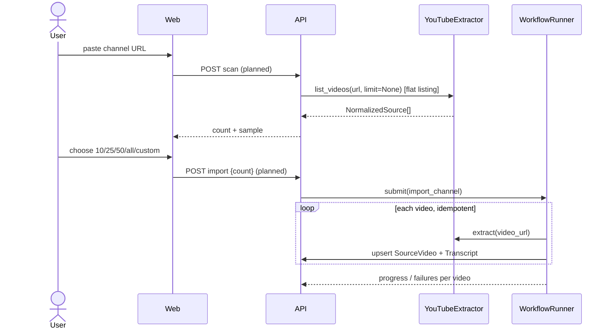

# Channel Ingestion

> Scanning a YouTube channel, letting the user choose how much to import, and importing it as a tracked, resumable job.

## Status

**Partially implemented** — domain models and extractor interface only. The scan/choose/import flow is **Planned — not implemented**.

## Purpose

Let a user paste `https://www.youtube.com/@SomeChannel/videos` and bring a controlled number of that channel's videos (and transcripts) into the [source library](source-library.md).

## Problem being solved

Channels can have thousands of videos. Importing blindly is slow, quota-hungry and wasteful on a laptop; the user must see the size first and choose scope.

## Inputs

Channel or playlist URL; user's chosen count (10 / 25 / 50 / all / custom).

## Outputs

One `Channel` row, N `SourceVideo` rows (`discovered` → `imported`/`failed`), transcripts per video.

## Entities

`Channel`, `SourceVideo`, `Transcript`; workflow state via `WorkflowRunner` ([workflow overview](../workflows/workflow-overview.md)). A dedicated import-job entity is **Decision pending** (progress could live on `Channel` or a new table).

## Workflow (Target Architecture)

The `list_videos` method already uses yt-dlp's `extract_flat` and a `playlistend` limit, so a count can be obtained cheaply without per-video requests (behaviour of yt-dlp itself is unverified here).

## Channel sync ("Sync Channel")

**Planned — not implemented.** Sync discovers *only new videos* since the last import and imports them. The requirements (idempotent, identifier-based diffing, incremental state, partial imports, resumability, retryable per-video failures) and the orchestration are canonical in the [channel sync workflow](../workflows/channel-sync-workflow.md#incremental-sync-target). Domain rules: compare the listing against known `(platform, external_id)` pairs (never titles); each video is its own unit of work; no video files are downloaded merely to populate the library ([source library](source-library.md#what-is-stored--and-what-is-not)).

## Intended user experience

The canonical flow (scan → count → 10/25/50/all/custom → import → transcripts → chunks → topics → embeddings) is in the [channel sync workflow](../workflows/channel-sync-workflow.md#product-intent). Only the URL classification and listing primitives exist; there is no UI for it.

## Business rules

- Scan is read-only and writes nothing until the user confirms.
- Import is **idempotent per video** and resumable; a failure on one video does not stop the rest.
- Newest-first ordering for "N videos" is assumed (Decision pending).
- Respect [content policy](../product/content-policy-and-source-usage.md): only content the user is authorised to use.

## AI responsibilities

None.

## Deterministic responsibilities

Enumeration, counting, dedup against existing `external_id`s, rate limiting/backoff, progress and error persistence.

## Current implementation

- `classify_youtube_url` distinguishes video / channel / playlist (tested).
- `YouTubeExtractor.list_videos` (optional yt-dlp extra, untested live).
- `Channel` table with `video_count`, `status`, `error`; `/api/v1/channels` CRUD; read-only UI list.
- No scan endpoint, no import workflow, no incremental sync.

## Planned implementation

Scan endpoint → confirmation → `LocalRunner` job → later Temporal. Incremental sync: see [source-library](source-library.md#incremental-sync) and [channel sync workflow](../workflows/channel-sync-workflow.md).

## Edge cases

Handle-vs-channel-id URLs; channels with Shorts/live tabs; region-locked or age-gated videos; rate limiting; channel renamed (identity is `external_id`, not title); count changes between scan and import.

**Channel identity risk ([KI-24](../reference/status.md#known-issues-and-limitations)).** `classify_youtube_url` returns the URL fragment for a channel (`@handle`, `channel/UC…`, `c/name`). Handles can change, so storing that string as `Channel.external_id` would create a duplicate row after a rename. The canonical channel id must come from the extractor's output (`NormalizedSource.channel_external_id`). **Unbuilt mapping:** nothing maps `NormalizedSource.channel_external_id` to `SourceVideo.channel_id` (a UUID foreign key) — that upsert logic is part of the future import workflow.

## Open questions

Import-job table vs fields on `Channel`; scheduled sync; how to represent playlists (as `Collection`? Decision pending).
