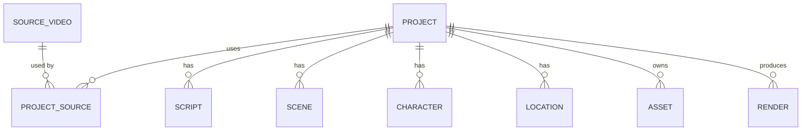

# Project System

> A project is one video-in-progress: it binds sources, script, scenes, assets and renders together and tracks pipeline state.

## Status

**Implemented (CRUD only).** `Project` and `ProjectSource` tables, project CRUD API and a UI list/create/detail page exist. There is no pipeline behind the statuses: the stages a project is supposed to move through are **Planned — not implemented**; the status enum is ready for them. (`ProjectSource` has no API endpoint.)

## Purpose

Be the unit of work and ownership for everything produced for one video.

## Problem being solved

Pipeline outputs (script versions, scenes, images, audio, renders) need a single parent so they can be listed, regenerated selectively and archived together.

## Inputs

Title, description, settings (JSONB), linked source videos.

## Outputs

Scripts/versions, scenes/versions, characters, locations, assets, renders.

## Entities

Full relationships: [entity relationships](../data/entity-relationships.md); [project data model](../data/project-data-model.md).

## Workflow

`ProjectStatus`: `draft → analyzing → scripting → storyboarding → generating → rendering → qa → completed`, with `failed` (and `error` text). Target: each transition is performed by a workflow ([workflow overview](../workflows/workflow-overview.md)); a failure of one scene/asset must **not** set the whole project to `failed` — it is recorded on the scene/asset ([retry and recovery](../workflows/retry-and-recovery.md)). Whether `status` is a single value or derived from child states is **Decision pending**.

## Approval and gate state (Decision pending)

> Canonical description of the approval gates. Planned — not implemented.

The staged-cost design ([AI cost strategy](../ai/ai-cost-strategy.md), [workflow overview](../workflows/workflow-overview.md#staged-generation-cost-control--target)) depends on user approval gates:

| Gate | Accepts | Unlocks |
| --- | --- | --- |
| G1 Candidate chosen | one story candidate | high-quality script generation |
| G2 Script accepted | one script version | storyboard generation |
| G3 Storyboard accepted | a set of scene versions | expensive asset generation (images, voice), then render |

**Candidate selection is a user decision by default.** An automatic ranking/selection heuristic may exist only as an explicit opt-in shortcut, and must record that the system, not the user, accepted.

**Persisted state today: none.** `ProjectStatus` has no "awaiting choice/approval" value and there is no accepted-version field, so a workflow precondition has nothing to check; "enforced by workflow preconditions" in other documents describes the target. Options:

| Option | Mechanism | Trade-off |
| --- | --- | --- |
| A. New `ProjectStatus` values | e.g. `awaiting_story_choice`, `awaiting_script_approval`, `awaiting_storyboard_approval` | Cheap and linear; mixes "waiting" with "working"; cannot record *which* version was accepted or revoke a single gate |
| B. Keys in `Project.settings` | e.g. `{"accepted": {"candidate": …, "script_version": …, "storyboard": …}}` | No migration; unvalidated JSON, no foreign keys |
| C. Gate table | `project_gate(project_id, gate, artifact_type, artifact_id, version, accepted_by, accepted_at)` | Auditable, supports revoke/re-accept, ties into the [dependency model](../workflows/workflow-overview.md#artifact-dependency-and-invalidation-model--target-decision-pending); new table and endpoints |

Whatever is chosen must record the **accepted version**, because a precondition means "an accepted version exists and is still current". No choice has been made.

## Business rules

- A source may serve many projects; a project may use many sources (`project_sources`, `role` default `primary`).
- Deleting a project cascades to its scripts, scenes, characters, locations, assets and renders (FK `ON DELETE CASCADE`); source library data is untouched.
- `settings` holds per-project choices (target length, style, provider overrides) — keys are **not yet defined**.

## AI responsibilities

None directly; stages invoke AI under the project's settings.

## Deterministic responsibilities

State transitions, ownership, cascade rules, listing and filtering.

## Current implementation

`/api/v1/projects` CRUD ([API](../api/resources/projects.md)); the UI (`/projects`, `/projects/[id]`) lists, creates by title, and shows seven stage cards labelled "Not implemented yet". There is no endpoint to attach sources to a project.

## Planned implementation

Source attachment endpoints, settings schema, status driven by workflows, progress view, archive/duplicate project.

## Edge cases

Editing sources after scripting (invalidates script provenance → versioning); project with no sources (idea-only); concurrent edits (no locking; single-user).

## Open questions

Settings schema; duplicate-project semantics; multi-video "series" projects.
