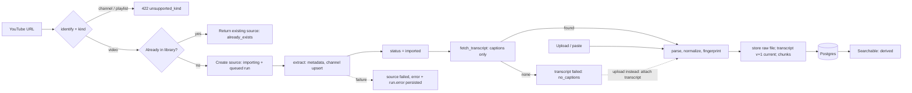

# Source Library

> The reusable store of everything StoryWeaver has ingested — channels, videos, transcripts, chunks and embeddings — from which projects draw material.

## Status

**Source Library V1 is implemented** (P1, 2026-10-01): add a single YouTube video or a transcript, store its metadata and a versioned, normalized transcript once, chunk it, make it keyword-searchable, track which projects use it, and retry failures. **Not implemented (Planned):** channel/playlist scan, import and sync (P11), embeddings and semantic search (P11), topic classification, near-duplicate detection (P12), idea-level reuse, bulk import. See the [status matrix](../reference/status.md).

## Purpose

Make every source ingested once reusable many times: by several projects, by search, and by future analysis, without re-downloading or duplicating records.

## Problem being solved

Story generation needs rich, searchable source knowledge. Without a normalized library, each project would re-fetch, re-transcribe and re-analyse the same video, and the user could not ask "have I already used this source?" ([research-and-intelligence](research-and-intelligence.md)).

## Vision vs. current implementation

**Vision (Target Architecture):** a *research library*, not a list of URLs. Every source — YouTube video/channel/playlist, a pasted transcript, a TXT/SRT/VTT file, later local audio/video or web/document sources — becomes a reusable research asset: metadata → transcript → normalized text → chunks → topics/themes → embeddings → searchable and reusable across projects.

**Current implementation (V1):** a single YouTube **video** URL or a transcript (`.txt`/`.srt`/`.vtt` file or pasted text) becomes a stored source with a normalized, versioned transcript and chunks, searchable by keyword. Channel and playlist URLs are refused with a clear message (`unsupported_kind`).

### Provider-independent ingestion (canonical)

This is the canonical statement of the ingestion chain; other documents link here.

```text
Source → Source Provider → Normalized Source → Transcript → Chunks → Intelligence → Search / Knowledge
```

YouTube/yt-dlp is **one** implementation of `SourceExtractor`; everything right of "Normalized Source" must not know it exists. The service never imports `youtube.py`: it asks `registry.get_extractor(url)` (today only YouTube is registered) and uses the interface — `identify` (pure, no network), `ensure_available`, `extract` (metadata only), `fetch_transcript`. A transcript uploaded with no URL is a **first-class source**: `platform='upload'`, `kind='transcript'`, `url` NULL, and its `external_id` is the content fingerprint (resolved in P1; previously KI-14).

### What is stored — and what is not

The library stores **no video or audio**. Only a small caption/transcript file is fetched and kept (as received), plus text, chunks and metadata. Downloading media remains an optional future capability, only when a workflow needs it ([media pipeline](../architecture/media-pipeline.md)); it is not implemented, and the faster-whisper adapter is not wired.

| Field | Where it lives |
| --- | --- |
| URL, title, description, publication date, duration, language | Columns on `source_videos` (`url` is NULL for uploads) |
| Thumbnail | `source_videos.thumbnail_url` — a remote URL string, never fetched by the server |
| Channel | `channels` row upserted by the **canonical channel id** (`UC…`), linked by `source_videos.channel_id` |
| Raw transcript file | `STORAGE_ROOT/transcripts/<source_id>/v<n>/raw.<ext>` exactly as received; `transcripts.raw_storage_key` + `raw_sha256` |
| Cleaned text, timestamped segments | `transcripts.text`, `transcripts.segments` (segments have null times for plain text) |
| Chunks | `transcript_chunks` (1,200-character groups); `search_vector` is generated by Postgres; `embedding` stays NULL |
| Free-form extras (small whitelist, e.g. view count; upload `reference_url`) | `source_videos.metadata` JSONB |
| Topics | `topics` table exists; no source↔topic link yet (Planned) |

### Reuse and usage tracking

Goal: generate a video from one source, several sources, a topic or a collection; discover related sources; find supporting information; avoid previously used ideas.

**Implemented — project-level usage only.** `project_sources` links projects and sources (`PUT/DELETE/GET /projects/{id}/sources[/{sid}]`, idempotent, only `imported` sources); a source reports its derived `usage_count` and `GET /sources/{id}/usage` lists the projects; the list filter `used` and the search filter `exclude_used` support "avoid sources I already used"; deleting a used source returns 409. **Not implemented:** idea-level reuse ("avoid previously used *ideas*"), fine-grained usage (which chunks/scenes), semantic similarity and near-duplicate detection — they need P3/P4 artifacts and P11/P12 embeddings ([research and intelligence](research-and-intelligence.md), [KI-22](../reference/status.md#known-issues-and-limitations)).

## Inputs

- A YouTube **video** URL (`watch`, `youtu.be`, `shorts`, `embed` forms), validated by `classify_youtube_url` / `identify`.
- A transcript file `.txt`/`.srt`/`.vtt` (≤ `MAX_TRANSCRIPT_BYTES`, default 5 MB, UTF-8) or pasted text (SRT/VTT are recognised by content).
- Not built: channel/playlist URLs (refused), direct audio/video, web/document sources.

## Outputs

- `Channel`, `SourceVideo`, `Transcript`, `TranscriptChunk` rows and a `WorkflowRun` per background import.
- A **searchable** source: derived as *current transcript `ready` and ≥ 1 chunk* (never stored as a flag). Semantic search over embeddings is Planned.

## Entities

| Entity | Table | Key constraints |
| --- | --- | --- |
| Channel | `channels` | unique `(platform, external_id)`, `status`, `video_count` |
| SourceVideo | `source_videos` | unique `(platform, external_id)`, `kind`, indexed `fingerprint`, nullable `url` and `channel_id` (SET NULL), `status`, `error` |
| Transcript | `transcripts` | unique `(source_video_id, version)`, partial unique `uq_transcripts_current` (one `is_current` per source), `status`, `origin`, `raw_storage_key`, `normalizer_version` |
| TranscriptChunk | `transcript_chunks` | unique `(transcript_id, chunk_index)`, generated `search_vector` + GIN, `vector(768)` + HNSW cosine index (unused) |
| WorkflowRun | `workflow_runs` | one active run per `(kind, subject)`; see [workflows](../workflows/ingestion-workflow.md) |
| Collection / Topic | `collections`, `topics` | see [topic-and-collection-system](topic-and-collection-system.md) |
| ProjectSource | `project_sources` | many-to-many project ↔ source (has endpoints; `role` text) |

Schemas: [source data model](../data/source-data-model.md); normalized contract `NormalizedSource` in `apps/api/app/schemas/source.py`; API models in `apps/api/app/schemas/source_api.py`.

## Workflow

Detail: [ingestion workflow](../workflows/ingestion-workflow.md) and [transcript pipeline](transcript-pipeline.md). Shape:



## Business rules

- **Identity** is `(platform, external_id)`; for YouTube `external_id` is the 11-character video id, so `watch`, `youtu.be` and `shorts` URLs of one video are one source. Adding it again returns the existing source (`already_exists: true`, `match: identity`) and starts no new run.
- **Content fingerprint:** `sha256` of the normalized transcript reduced to lower-case NFKC alphanumeric tokens. Identical content dedupes across formats (SRT/VTT/TXT of the same words) **and across platforms** — an upload identical to an existing YouTube source's transcript returns that source (`match: fingerprint`). This is exact matching only; near-duplicates are not detected (P12).
- **Reuse, don't copy:** projects link through `project_sources`; collections through `collection_videos` (no API yet).
- **Status** (`SourceStatus`): `discovered → importing → imported`, or `failed` with `error`. **`imported` means metadata is stored** — nothing more. A failed *transcript* does not fail the source: it stays `imported` with `transcript_status = failed`. Searchable is derived.
- **Transcripts are versioned:** versions are created only by the service; each new one becomes `is_current`, older ones remain as history (with their chunks) but are not searchable; identical content with the same `normalizer_version` is a no-op. A failed attempt never replaces a ready current transcript.
- **Failures are data:** a failed import records its error on the run and the entity and never blocks other sources.
- **Unsafe input is refused before anything is stored:** URL host/kind, file extension, size cap, UTF-8, parse errors (with line number), filenames are never used as paths.

### Duplicate detection

Implemented: unique `(platform, external_id)` with a pre-insert lookup (and a race handler), URL canonicalisation to the video id, and the exact content fingerprint described above. Planned — not implemented: near-duplicate content detection via embeddings/similarity (P12).

### Incremental sync

**Planned — not implemented.** Re-scan a channel, diff against known `external_id`s, import only new videos, record last-sync state (no such field exists — [KI-23](../reference/status.md#known-issues-and-limitations)). Requirements: idempotency, de-duplication by source fingerprint/identifier, incremental discovery, partial imports, resumability, retryable per-item failures. Canonical description: [channel sync workflow](../workflows/channel-sync-workflow.md#incremental-sync-target); domain view in [channel-ingestion](channel-ingestion.md).

### Ingestion failures

Each background import is a persisted run with `error: {code, message, retryable}`. Codes: `video_unavailable` (private/removed/blocked — not retryable; source `failed`), `no_captions` (not retryable via retry; the source stays `imported` and the user attaches a transcript), `provider_timeout` / `provider_error` / `internal_error` (retryable), `transcript_parse_error`, `transcript_too_large`, `provider_not_configured` (yt-dlp missing). `POST /sources/{id}/retry` starts the missing half again (full import if metadata is missing, transcript-only otherwise). Automatic retry/backoff is P2. See [retry and recovery](../workflows/retry-and-recovery.md).

## AI responsibilities

None. V1 makes no model call (language comes from caption metadata or user input). AI enters afterwards (topic classification, analysis) — [research-and-intelligence](research-and-intelligence.md).

## Deterministic responsibilities

URL validation and id extraction, extraction orchestration, parsing, normalization, fingerprinting, dedupe, chunking, persistence, full-text search, usage, run state, retries, file storage.

## Current implementation

- Extractor: `SourceExtractor` + registry; YouTube via the optional `ingestion` extra (`uv sync --extra ingestion`; yt-dlp is imported lazily — tests never need it).
- Captions: manual before automatic, language exact then prefix, `json3` before `vtt`; automatic captions arrive as an HLS playlist that is resolved segment by segment; only the caption file is fetched (https, host must be `youtube.com`/`googlevideo.com` or a subdomain, redirects followed only to allow-listed hosts (each hop re-checked), hard size cap); `skip_download` cannot be switched off by callers.
- Service: `apps/api/app/ingestion/service.py` (add, ingest, retry, reconcile, delete), `queries.py` (derived fields, search), `parsers.py`, `normalize.py`, `chunking.py`.
- API: [`/sources`, `/runs`, `/projects/{id}/sources`](../api/resources/source-videos.md); `/transcripts` is read-only.
- Web: `/sources/videos` (list, search, add dialog), `/sources/videos/[id]` (detail), project page lists linked sources.
- **Live verification:** one real public video was added end to end on 2026-10-01 (metadata + manual English captions, searchable, no media stored). Everything else on the network path is covered by recorded/synthetic fixtures only — see the [verification record](../reference/status.md#verification-record).

## Current limitations

- Usage is **project-level only**; no idea-level reuse ([KI-22](../reference/status.md#known-issues-and-limitations)).
- Fingerprint dedupe is exact; search uses the `'simple'` full-text config — no stemming (`volcano` does not match `volcanoes`), no language-specific handling — and is keyword-only.
- No channel/playlist import, no bulk import, no sync cursor ([KI-23](../reference/status.md#known-issues-and-limitations)).
- The UI has no "replace transcript" button for sources that already have one (the API supports it: `POST /sources/{id}/transcript`).
- yt-dlp can break when YouTube changes; each `fetch_transcript` call repeats yt-dlp's metadata extraction (so an add makes two extractions).
- Automatic-caption-only videos, long videos and other languages were not exercised live.
- A hosted database must be migrated (`make db-migrate`) before running this version of the API.

## Planned implementation

Channel scan/import/sync, embeddings and semantic search, topic classification, collection membership API and UI, near-duplicate detection. Order in [feature roadmap](../product/feature-roadmap.md) and the implementation plan (P11–P12).

## Edge cases

Videos without captions (attach a transcript); auto-generated vs manual captions; multi-language (first accepted language wins); very long videos (captions only — never media); livestream VODs; members-only/private content (`video_unavailable`); a transcript identical to an existing source (returns that source); deleted sources referenced by projects (blocked with 409 until unlinked).

## Open questions

- Store the raw yt-dlp JSON? (Decision pending)
- Is "channel sync" scheduled or user-triggered? (Decision pending)
- Should an upload identical to a YouTube source's transcript dedupe across platforms? (Currently yes; revisit with real use.)
- Source usage policy → [content policy](../product/content-policy-and-source-usage.md).
