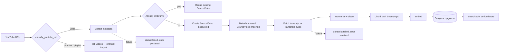

# Source Library

> The reusable store of everything StoryWeaver has ingested — channels, videos, transcripts, chunks and embeddings — from which projects draw material.

## Status

**Partially implemented.** The database schema, basic CRUD endpoints, YouTube URL validation, a lazily-loaded yt-dlp extractor and transcript chunking exist. No ingestion workflow, transcript cleaning, embedding generation, sync or duplicate-merge logic exists (**Planned — not implemented**). See [status matrix](../reference/status.md).

## Purpose

Make every source ingested once reusable many times: by several projects, by search, and by future analysis, without re-downloading or duplicating records.

## Problem being solved

Story generation needs rich, searchable source knowledge. Without a normalized library, each project would re-fetch, re-transcribe and re-analyse the same video, and the user could not ask "have I already used this idea?" ([research-and-intelligence](research-and-intelligence.md)).

## Vision vs. current implementation

**Vision (Target Architecture):** a *research library*, not a list of URLs. Every source — YouTube video/channel/playlist, a pasted transcript, a TXT/SRT/VTT file, later local audio/video or web/document sources — becomes a reusable research asset: metadata → transcript → normalized text → chunks → topics/themes → embeddings → searchable and reusable across projects.

**Current implementation:** schema, CRUD, URL validation, an optional yt-dlp extractor, a chunker and a transcriber interface — no end-to-end ingestion (see Status).

### Provider-independent ingestion (canonical)

This is the canonical statement of the ingestion chain; other documents link here.

```text
Source → Source Provider → Normalized Source → Transcript → Chunks → Intelligence → Search / Knowledge
```

YouTube/yt-dlp is **one** implementation of `SourceExtractor`; everything right of "Normalized Source" must not know it exists (`NormalizedSource` carries `platform`, `kind`, `external_id`, …). A transcript uploaded with no URL is a **first-class source** in the design: it needs a source identity without a platform id (e.g. platform `upload` + content fingerprint — Decision pending). **Current limitation ([KI-14](../reference/status.md#known-issues-and-limitations)):** `source_videos.url` and `external_id` are NOT NULL and `TranscriptCreate` requires a `source_video_id`, so an upload is not representable without an agreed convention (e.g. a synthetic `upload:<hash>` id and URL).

### What is stored — and what is not

The library stores **no video files**. Downloading media is an optional future capability, only when a workflow needs it (e.g. local transcription from audio — [media pipeline](../architecture/media-pipeline.md)). Intended stored fields:

| Field | Today |
| --- | --- |
| URL, title, description, channel, publication date, duration | Columns on `source_videos` |
| Thumbnail | **No column.** Could be kept in the `metadata` JSONB; a first-class field is Decision pending |
| Transcript, timestamps | `transcripts.text`, `transcripts.segments` |
| Chunks, embeddings | `transcript_chunks` (embeddings: schema only, nothing populates them) |
| Topics | `topics` table exists; no source↔topic link yet |
| Free-form metadata | `source_videos.metadata` JSONB |

### Reuse and usage tracking

Goal: generate a video from one source, several sources, a topic or a collection; discover related sources; find supporting information; avoid previously used ideas. This needs *source identity* (exists: unique `(platform, external_id)`), *project–source relationships* (exists: `project_sources` table, no endpoint) and **source-usage / idea tracking, idea reuse, semantic similarity and near-duplicate detection — none of which exist** (Planned — not implemented; see [research and intelligence](research-and-intelligence.md)).

## Inputs

- YouTube video URL, channel URL (`/@handle`, `/channel/…`), playlist URL — validated by `classify_youtube_url`.
- Target (not built): direct transcripts, TXT/SRT/VTT, local audio/video, web/document sources.

## Outputs

- `Channel`, `SourceVideo`, `Transcript`, `TranscriptChunk` rows. Whether raw transcript files are also kept under `data/transcripts/` is **Decision pending** (the `transcripts` table has no storage-key column; see [transcript pipeline](transcript-pipeline.md)).
- A searchable source (target: chunk embeddings in pgvector — [embeddings](../data/embeddings-and-vector-search.md)).

## Entities

| Entity | Table | Key constraints |
| --- | --- | --- |
| Channel | `channels` | unique `(platform, external_id)`, `status`, `video_count` |
| SourceVideo | `source_videos` | unique `(platform, external_id)`, nullable `channel_id` (SET NULL), `status`, `error` |
| Transcript | `transcripts` | unique `(source_video_id, version)`, `status`, `origin`, `segments` JSONB |
| TranscriptChunk | `transcript_chunks` | unique `(transcript_id, chunk_index)`, `vector(768)` + HNSW cosine index |
| Collection / Topic | `collections`, `topics` | see [topic-and-collection-system](topic-and-collection-system.md) |
| ProjectSource | `project_sources` | many-to-many project ↔ video (no API endpoint yet) |

Schemas: [source data model](../data/source-data-model.md), normalized contract `NormalizedSource` in `apps/api/app/schemas/source.py`.

## Workflow

Target flow (Mermaid below; per-stage detail in [ingestion workflow](../workflows/ingestion-workflow.md) and [transcript pipeline](transcript-pipeline.md)):



Only `classify_youtube_url`, the metadata part of the extractor (yt-dlp) and `chunk_segments` exist today; nothing wires them together. **Current limitation ([KI-15](../reference/status.md#known-issues-and-limitations)):** `YouTubeExtractor.extract()` returns metadata only (downloading is hard-disabled and `NormalizedSource.segments` is never populated), so fetching captions or audio and transcribing is new code, not wiring.

## Business rules

- **Identity** is `(platform, external_id)`; one row per real-world video regardless of how many projects use it.
- **Reuse, don't copy:** projects link through `project_sources`; collections through `collection_videos`.
- **Status** (`SourceStatus`): `discovered → importing → imported`, or `failed` with `error` text. **`imported` means metadata is stored** — nothing more. A source is **searchable** only as a *derived* state: its transcript is `ready`, chunks exist and (for semantic search) chunk embeddings are populated. No separate enum value is planned for it.
- **Failures are data:** a failed import records its error on the entity and never blocks other videos.
- **Transcripts are versioned (Target):** `version` should increment when re-extracted/re-cleaned so downstream provenance stays valid. **Current limitation ([KI-13](../reference/status.md#known-issues-and-limitations)):** the API cannot set `version`; a second transcript for the same video returns 409.

### Duplicate detection

Implemented: the DB unique constraint on `(platform, external_id)`; the API returns **409** on a duplicate create. Planned — not implemented: pre-insert lookup so ingestion is idempotent (`import_video` returns the existing record), URL canonicalisation (youtu.be / shorts / watch → same id — the id extraction already exists in `classify_youtube_url`), and near-duplicate content detection via embeddings (Decision pending).

### Incremental sync

**Planned — not implemented.** Re-scan a channel, diff against known `external_id`s, import only new videos, record last-sync state (no such field exists — [KI-23](../reference/status.md#known-issues-and-limitations)). Requirements: idempotency, de-duplication by source fingerprint/identifier, incremental discovery, partial imports, resumability, retryable per-item failures. The canonical description is [channel sync workflow](../workflows/channel-sync-workflow.md#incremental-sync-target); domain view in [channel-ingestion](channel-ingestion.md).

### Ingestion failures

Target: classify (private/removed video, no captions, network, rate limit, extractor breakage), persist on the entity, allow retry; see [retry and recovery](../workflows/retry-and-recovery.md).

## AI responsibilities

None in ingestion itself. AI enters afterwards (topic classification, analysis) — [research-and-intelligence](research-and-intelligence.md).

## Deterministic responsibilities

URL validation, id extraction, metadata normalization, transcript cleaning rules, chunking, storage, dedup, status transitions.

## Current implementation

- `YouTubeExtractor.supports/extract/list_videos` (yt-dlp is an optional extra, imported lazily; **not tested against the live service**).
- URL allow-listing (host allow-list, id regex) — unit-tested.
- `chunk_segments(segments, max_chars=1200)` — unit-tested.
- CRUD: `/api/v1/channels`, `/sources`, `/transcripts`.
- Web: read-only lists at `/sources/channels` and `/sources/videos`.

## Current limitations

See the canonical list in [status](../reference/status.md#known-issues-and-limitations): KI-13 (transcript version), KI-14 (uploads not representable), KI-15 (extractor is metadata-only), KI-22 (no used-idea/source-usage storage), KI-23 (no thumbnail column, no sync cursor), KI-24 (channel identity from URL fragment). API-created sources and channels are URL-validated on create (previously KI-12, resolved in P0).

## Planned implementation

Importer workflow, persistence of extractor output, transcript origin handling, embedding job, sync, collections UI. Order in [feature roadmap](../product/feature-roadmap.md).

## Edge cases

Videos without captions; auto-generated vs manual captions; multi-language; very long videos (stream, never load whole media in RAM); livestream VODs; members-only content; deleted videos still referenced by projects (FKs on projects must not cascade-delete source data — currently `project_sources` cascades the *link*, not the video).

## Open questions

- Store raw yt-dlp JSON? (Decision pending)
- Is "channel sync" scheduled or user-triggered? (Decision pending)
- Source usage policy → [content policy](../product/content-policy-and-source-usage.md).
