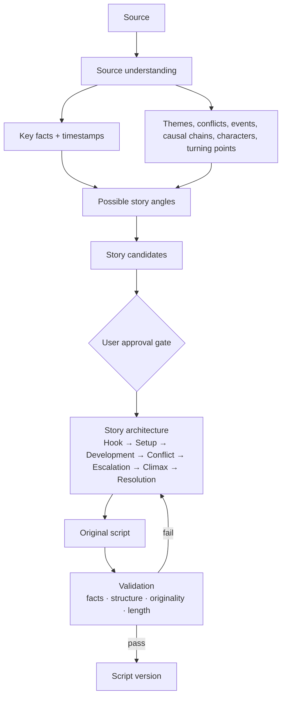

# Story Generation

> Creating original stories inspired by — not paraphrased from — source material.

## Status

**Planned — not implemented.** No story, analysis or prompt code exists; `apps/api/app/story/` is a docstring-only placeholder. The LLM provider layer it will use is **partially implemented** — adapters exist but are mock-tested only (Ollama) or untested, and it has never run against a real model ([provider architecture](../architecture/provider-architecture.md)).

## Purpose

Turn understood source knowledge into one or more original narrative concepts and architectures that scripts can be written from.

## Problem being solved

A transcript is information, not narrative. Paraphrasing it yields a lecture that stays too close to its source. StoryWeaver should extract *facts, themes and dramatic potential*, then build a new story with its own arc (see [content policy](../product/content-policy-and-source-usage.md) for source-use discipline).

## Inputs

Source analysis ([research-and-intelligence](research-and-intelligence.md)), retrieved chunks, user intent (genre, tone, target length), existing library (to avoid repeating ideas).

## Outputs

Story candidates, a chosen story architecture, then handoff to [script generation](script-generation.md).

## Entities

Planned: story candidate and architecture records. Storage shape is **Decision pending**; the options (JSONB on an existing row, new tables, per-stage artifacts) are compared in the [story data model](../data/story-data-model.md). Nothing exists in the schema today ([KI-22](../reference/status.md#known-issues-and-limitations)).

## Workflow (Target Architecture)



Detailed prompts/stages: [story generation pipeline](../ai/story-generation-pipeline.md).

## Not paraphrasing — rules

1. The unit of reuse is **facts and ideas**, never sentences. The script prompt receives structured facts, not the raw transcript text, wherever possible.
2. The story needs its own **protagonist/question/conflict** even if the source has none (documentary-style framing is allowed, but still structured as an arc).
3. Originality/similarity check (Planned): see [Originality and similarity](#originality-and-similarity) below.
4. Facts remain accurate: invented dramatisation must be distinguishable from sourced facts (policy: [content policy](../product/content-policy-and-source-usage.md)).

## Long sources → multiple independent stories

A 30-minute source may yield several 10–15 minute stories. **This is not time slicing.** The analysis identifies *independent narrative opportunities*: a self-contained theme/conflict, the events and causal chain behind it, who/what is involved, turning points and a possible hook. Candidates may draw on non-contiguous parts of the source, overlap on shared background facts, and differ in length. Example (illustrative only): one source on the Ice Age could yield "how a band survived one winter", "how fire changed a community" and "the first long migration" — each with its own arc. The candidate list is ranked by narrative strength and distinctness, and each candidate records which chunks support it. Details: [story generation pipeline](../ai/story-generation-pipeline.md).

## Multi-stage intelligence pipeline

Never "write a script from this transcript". Each stage produces an **intermediate representation** that is stored, so the pipeline is debuggable, regeneratable, testable, editable by the user, provider-independent, reusable and evaluable ([AI quality evaluation](../ai/ai-quality-evaluation.md)).

`SOURCE → SOURCE UNDERSTANDING → FACTS / EVENTS / ENTITIES → THEMES / TOPICS → NARRATIVE OPPORTUNITIES → STORY CANDIDATES → STORY ARCHITECTURE → SCRIPT → SCRIPT VALIDATION → STORYBOARD`

**Source analysis outputs (target):** people, locations, events, dates, causes, consequences, conflicts, discoveries, mysteries, surprising facts, turning points, themes.

**Story candidate fields (target):** title, premise, hook, central question, protagonist/subject, conflict, stakes, major beats, climax, resolution, source grounding, estimated duration, target audience, tone, originality/similarity signals. None of these are in the schema today (Decision pending).

### Cheap first, expensive after acceptance

```text
cheap/fast analysis → candidates → USER CHOICE → high-quality script → storyboard → expensive asset generation
```

Images, TTS and other costly generation must **never** start before the user has accepted a story (and, ideally, a script). **Candidate selection is a user approval gate by default**; an automatic heuristic may exist only as an opt-in shortcut. Gate state is not persisted yet ([project system](project-system.md#approval-and-gate-state-decision-pending)). The cost rationale is canonical in [AI cost strategy](../ai/ai-cost-strategy.md).

### Factual grounding vs. narrative originality

Two separate goals. *Factual grounding*: the facts stay accurate and traceable to the source. *Narrative originality*: the same facts may be reused, but structure, hook, pacing, framing, narration wording, scene order and emphasis should be substantially different from the source. Terms are defined in the [glossary](../reference/glossary.md).

## Originality and similarity

> Planned — not implemented. An engineering and product goal around originality and source-use discipline. This documentation makes **no legal or copyright-safety claim or guarantee**, and a similarity score is never a legal conclusion.

**Question answered:** how close is a generated script (or a story idea) to (a) its source, (b) previously generated projects, (c) previously used ideas?

| Compare | Against | Signal (candidates, none chosen) |
| --- | --- | --- |
| Script text | Source transcript chunks | n-gram / sentence overlap; embedding distance to nearest source chunks |
| Story candidate / idea | Previous projects' stories and used ideas | embedding similarity of premise/hook/central question |
| Structure | Source structure | beat-order and framing comparison (LLM-assisted, advisory) |

**Where it fits:** at candidate time (cheap, idea-level — warn about repeating a used idea *before* a script is paid for) and again at script validation. Results are advisory signals shown to the user at the approval gates, not automatic rejections, unless the user configures a threshold. Thresholds and metrics are **Decision pending**.

**Inputs/outputs:** reads chunk embeddings (exist as schema, no population) and script text; produces similarity signals attached to the candidate/script version. **Storage** of those signals and of "used ideas" is not modelled ([KI-22](../reference/status.md#known-issues-and-limitations); direction in [embeddings and vector search](../data/embeddings-and-vector-search.md)). Deterministic code computes the measures; an LLM may add an explanatory critique but does not decide pass/fail.

### Long sources — outcomes beyond "N stories"

Semantic analysis may conclude: one story; several independent stories; a main story plus supporting stories; or independent events each worthy of a short piece. Never decided by timestamps.

## Story structure

Hook → Setup → Development → Conflict/Tension → Escalation → Climax → Resolution. Scenes later serve these beats — see [storyboard system](storyboard-system.md). Beat allocation is proportional to target length; exact ratios are **Decision pending**.

## Business rules

- Every story candidate lists supporting source chunks.
- A script must declare which candidate/architecture it came from (provenance, `prompt_version`/`provider`/`model` on `ScriptVersion`).
- Duplicate-idea warning against previously generated projects (needs [research](research-and-intelligence.md)).

## AI responsibilities

Understanding, angle discovery, candidate writing, architecture, critique.

## Deterministic responsibilities

Schema validation, length/beat accounting, provenance links, similarity thresholds, version numbering, retries.

## Current implementation

None beyond `LLMProvider.generate_structured` (validates JSON against a Pydantic model, one retry on unusable or invalid output; tested with fakes and mocked HTTP only) and the `scripts`/`script_versions` tables.

## Planned implementation

Roadmap phase 3 — [feature roadmap](../product/feature-roadmap.md).

## Edge cases

Sources with no narrative content (lists, tutorials); single-theme sources producing one candidate; sensitive/biographical content; conflicting facts.

## Open questions

Candidate scoring rubric; human-in-the-loop points; whether several candidates become several projects automatically.
