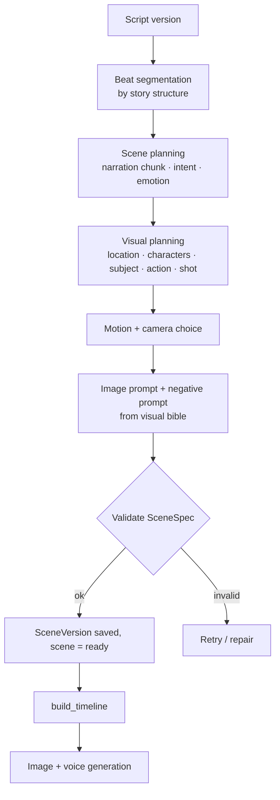

# Storyboard System

> Converting a script into an ordered set of scenes, each with a visual plan, that serve the story's beats.

## Status

**Partially implemented.** The scene schema (`SceneSpec`), `scenes`/`scene_versions` tables, `/api/v1/scenes` CRUD and the deterministic timeline builder exist. Generating a storyboard from a script is **Planned — not implemented**.

## Purpose

Decide, for each moment of the narration, *what the viewer sees* and how the camera behaves.

## Problem being solved

Illustrating transcript sentences one-by-one produces a slideshow. Scenes should serve story rhythm: emphasise the hook, build tension, vary shots, reuse imagery deliberately.

## Inputs

Script version, character and visual bibles ([character](character-system.md), [visual](visual-system.md)), target pacing.

## Outputs

`Scene` + `SceneVersion` rows whose `data` validates as a scene spec.

## Entities

`Scene` (`project_id`, optional `script_id`, `sequence`, `status` draft/ready/generating/failed, `error`; index on `(project_id, sequence)` — deliberately not unique so reordering is easy) and `SceneVersion` (`version`, `data` JSONB; unique `(scene_id, version)`). Ordering/uniqueness policy is documented in [scene data model](../data/scene-data-model.md).

## Workflow (Target Architecture)



## Canonical scene representation

### Implemented: `SceneSpec` (`apps/api/app/schemas/scene.py`)

Flat fields: `scene_id` (str), `sequence`, `narration`, optional `duration` (set by code), `visual_intent`, `characters[]`, `locations[]`, `objects[]`, `action`, `emotion`, `camera {shot, movement}`, `image_prompt`, `negative_prompt`, `voice`, `music`, `sfx[]`, `subtitle`. `shot` ∈ wide / medium / close_up / extreme_close_up / over_shoulder / aerial; `movement` ∈ static / slow_zoom_in / slow_zoom_out / pan_left / pan_right / tilt_up / tilt_down. Reference: [scene data model](../data/scene-data-model.md).

### Target Architecture: richer nested form

```json
{
  "scene_id": 17,
  "duration": 5.4,
  "narration": "...",
  "visual": {
    "location": "...", "characters": [], "subject": "...",
    "action": "...", "camera": "...", "emotion": "...", "time": "..."
  },
  "image": { "style": "...", "prompt": "...", "negative_prompt": "..." },
  "motion": { "type": "slow_zoom", "direction": "in", "intensity": 0.15 },
  "audio": {},
  "subtitle": {}
}
```

This is a **design target, not the current schema**. Differences from `SceneSpec`: nested `visual`/`image`/`motion` groups; numeric `scene_id`; motion `intensity`; structured `audio`/`subtitle`; a `time` field. Migration between them is **Decision pending**; because `SceneVersion.data` is JSONB, no DB migration is needed to change the shape, only the Pydantic model and a data-upgrade step.

## Separate concepts: intent ≠ prompt ≠ asset ≠ shot

> Canonical statement of this distinction; other documents link here.

| Concept | Meaning | In the repo today |
| --- | --- | --- |
| **Scene intent** | What the viewer needs to see/feel at this point in the story (`visual_intent`, `action`, `emotion`) | `SceneSpec` fields |
| **Image prompt** | A rendering of the intent for one specific image model | `SceneSpec.image_prompt` / `negative_prompt` (one per scene) |
| **Generated asset** | A produced image file, versioned | `Asset` row (type `image`), `scene_id` link |
| **Timeline shot** | How an asset is shown for a span of time with camera motion | `TimelineScene` (one per scene) |

A scene may have **several shots**; a shot may **reuse** an image (zoom/pan/crop/reframe); an image may have **versions**; a scene can be regenerated without changing its narrative meaning. **There is no `Shot` entity today:** `SceneSpec` has one `image_prompt` and one `camera`, and `Timeline` has one `TimelineScene` per scene. Introducing shots is **Decision pending** ([timeline system](timeline-system.md)).

**Terminology warning.** `CameraSpec.shot` in the code is the *framing type* (wide, medium, close_up, …), a property of how a scene is framed. A future *Shot* entity would be a timed use of an asset within a scene. They are unrelated; see the [glossary](../reference/glossary.md).

`SceneSpec.objects` is a list of free strings; there is no objects table, and `characters`/`locations` are also free-string lists. That scenes refer to characters/locations **by name**, resolving against `characters`/`locations` rows unique on `(project_id, name)`, is a convention to be enforced by the workflow (validation planned), not by the schema.

## Identifier mapping

Several identifiers exist for "a scene". They are not currently reconciled (**Decision pending**):

| Identifier | Type | Role | Where |
| --- | --- | --- | --- |
| `scenes.id` | UUID | **Canonical key** (foreign keys, assets, versions) | `Scene` row |
| `scenes.sequence` | int | **Ordering key**; indexed with `project_id`, deliberately *not* unique | `Scene` row |
| `SceneSpec.scene_id` | string, e.g. `"scene_001"` | **Display/spec key** inside the scene document; may disagree with the row | `SceneVersion.data` JSONB |
| `TimelineScene.scene_id` | string | Copied from `SceneSpec.scene_id` for the renderer | `Timeline` JSON |
| `scene_id` in the target JSON | integer (`17`) | Design target only | [canonical scene](#canonical-scene-representation) |

Nothing validates that `SceneSpec.scene_id` or `sequence` inside `data` match the `Scene` row, and the `data` is not validated at write at all: no API exposes `scene_versions`, and no other code enforces `SceneSpec` ([KI-22](../reference/status.md#known-issues-and-limitations) for the wider storage gaps). Until decided, workflow code must treat `scenes.id` as the identity and derive display ids from `sequence`.

A visual must answer: *"what does the viewer need to see at this point in the story?"* — which is why scenes are planned from story beats, not sentences. Visual style (2D illustration, simple drawings, cinematic illustration, …) is configuration of the [visual bible](visual-system.md), not hard-coded.

## Business rules

- Scenes serve **story beats**, not transcript sentences; one narration passage may have several shots, and one image may cover several narration lines.
- Duration is determined by narration/pacing, not a fixed number, and is **assigned by code** — never by the LLM — see [timeline system](timeline-system.md). The 2–7 s fallback estimate is not a rule and truncates long narration ([KI-16](../reference/status.md#known-issues-and-limitations)).
- Each scene is independently versioned and regenerable; editing scene N never changes scene M. What becomes *stale* downstream when a scene or script changes is governed by the [artifact dependency and invalidation model](../workflows/workflow-overview.md#artifact-dependency-and-invalidation-model--target-decision-pending) (Planned — nothing tracks it today).
- A scene's character/location names must resolve to entries in the character/visual bibles (validation planned).

## AI responsibilities

Beat segmentation, shot choice, visual description, emotion, prompt writing ([visual prompting](../ai/visual-prompting.md)).

## Deterministic responsibilities

Schema validation, sequence numbering, duration/timing, referential checks, version bookkeeping.

## Current implementation

`SceneSpec`/`TimelineScene`/`Timeline`, `build_timeline`, scenes CRUD (status, sequence only — the scene content is not exposed through the API yet), `SceneStatus`. `Scene.status` describes storyboard-content state only; per-asset generation state lives on `Asset.status` ([storyboard workflow](../workflows/storyboard-workflow.md#state-transitions)).

## Planned implementation

[Storyboard workflow](../workflows/storyboard-workflow.md); scene editor in [Studio](../frontend/studio.md).

## Edge cases

Very short narration lines; abstract concepts without obvious visuals; scenes needing several characters; sequence gaps after deletion.

## Open questions

Final scene schema; whether motion is chosen by AI or a deterministic rhythm rule; handling of montage sequences.
