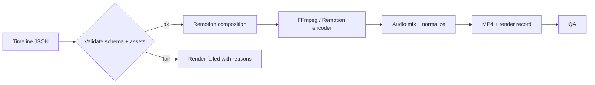

# Video Rendering

> Turning a validated timeline plus assets into an MP4 deterministically.

## Status

**Partially implemented.** A Remotion `Basic` composition renders the sample timeline to MP4 via `make render-sample` (verified: 6.5 s, 1280×720, H.264). There is no render API, no render workflow, no use of the `renders` table, no FFmpeg post-processing step of our own, and no QA.

## Purpose

Produce the final video file reproducibly from Timeline JSON.

## Problem being solved

Rendering must be repeatable and debuggable: same timeline + same assets → same video; failures must be attributable.

## Inputs

`Timeline` JSON, image/audio/subtitle assets.

## Outputs

MP4 under `data/renders/`, a `Render` row (`status` queued → rendering → completed/failed, `timeline` snapshot, `output_asset_id`, `started_at`, `finished_at`, `error`) and a `render` asset.

## Entities

`Render`, `Asset` (type `render`).

## Workflow

Current (manual): `pnpm --filter @storyweaver/video render` → Remotion renders `sample/timeline.json`, using its bundled headless Chrome and FFmpeg-based encoding.

Target:

Details: [rendering architecture](../architecture/rendering-architecture.md), [media rendering](../media/rendering.md), [Remotion](../media/remotion.md), [FFmpeg](../media/ffmpeg.md), [render workflow](../workflows/render-workflow.md).

## Business rules

- Deterministic *by design*: no network access or randomness during render; all assets resolved to local files first. Timeline JSON determinism is tested; **byte-level render reproducibility has not been verified** (a single sample render was produced and inspected, two renders were never compared).
- Timing, transitions, subtitles and audio synchronisation derive from the timeline only.
- Large media is processed as files (never loaded into RAM); renders written to `data/renders/` (git-ignored).
- Render artefacts (logs, timeline snapshot, output) are kept for debugging.

## AI responsibilities

None.

## Deterministic responsibilities

All of it.

## Current implementation

`packages/video/src` (`BasicComposition`, `Root`, `camera.ts`, `types.ts`). Camera motions implemented: static, slow zoom in/out, pan left/right, tilt up/down. Placeholder image box if `image_src` is null. `Audio` rendered only if `audio_src`. Preview in the web Studio via `@remotion/player`.

## Planned implementation

Render API/workflow, asset resolution, transitions, audio mixing, progress reporting, hardware-appropriate concurrency for a 16 GB CPU-only machine.

## Edge cases

Asset resolution (**Decision pending, [KI-17](../reference/status.md#known-issues-and-limitations)**): nothing serves `data/` over HTTP and `BasicComposition` uses `` directly, so how local files reach the renderer (served URL vs Remotion public directory) is undecided; the sample render works only because it has no images. Missing image/audio files; huge frame counts; Chrome download offline (first render needs network); Remotion licence considerations (see README).

## Open questions

Remotion vs direct FFmpeg for final encode (both permitted by [ADR-007](../decisions/ADR-007-media-rendering-strategy.md)); render concurrency; output presets.
