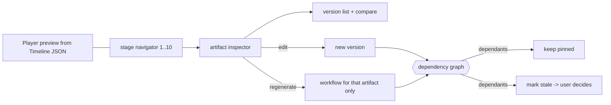

# Studio

> The `/studio` page: current placeholder and the intended production workspace.

## Status

**Partially implemented — placeholder only.** There is no editor. The page proves that timeline JSON can be previewed in the browser with the same Remotion composition used for rendering.

## Current implementation (`src/app/studio/page.tsx`)

- Imports `BasicComposition`, `timelineSchema`, `timelineDurationInFrames`, `sampleTimeline` from `@storyweaver/video`.
- Parses the bundled `sample/timeline.json` (3 scenes, 6.5 s, 1280×720, 30 fps) with zod and renders `<Player controls>` from `@remotion/player`.
- A side card lists the render path: Project → Timeline JSON → Remotion composition → FFmpeg / Remotion renderer → MP4. This describes the *intended* path; only the manual `make render-sample` step exists ([../workflows/render-workflow.md](../workflows/render-workflow.md)).
- Images are placeholders (dashed box with scene id); there is no audio. Subtitles come from each scene's `subtitle`.
- The Player logs a Remotion licence reminder; `acknowledgeRemotionLicense` is intentionally unset (owner's decision, see README).
- Current Studio = placeholder with the Remotion Player on a sample timeline. It does not load project data from the API: no connection between a `Project` and this timeline.

## Target: a production workspace, not a "Generate Video" button (Planned — not implemented)

The eventual Studio makes the pipeline understandable instead of a black box. It is organised by ten stages:

1. **Source** · 2. **Research** · 3. **Story** · 4. **Script** · 5. **Storyboard** · 6. **Visuals** · 7. **Audio** · 8. **Timeline** · 9. **QA** · 10. **Render**

Users can inspect and modify intermediate outputs: source, transcript, facts, themes, story candidates, selected story, script versions, scenes, character definitions, visual bible, image versions, narration, subtitles, timeline, QA results.

**Granular regeneration** of source analysis, a story candidate, the script, one scene, one image, one voice line, subtitles or the render — without regenerating unrelated downstream artifacts. **Versioning is visible**: Script v1/v2/v3, Scene 12 v1/v2, Image for Scene 12 v1/v2.

**Dependencies must be explicit** so an upstream change can invalidate *or* preserve downstream artifacts intelligently. That artifact dependency graph is a *Decision pending* target documented in [../workflows/workflow-overview.md](../workflows/workflow-overview.md#artifact-dependency-graph--target-decision-pending); today only `script_versions` and `scene_versions` exist and nothing tracks dependencies or staleness. Staged cost control (no images/TTS before the story is accepted) is a **Planned** server-side precondition, not implemented: [../ai/ai-cost-strategy.md](../ai/ai-cost-strategy.md#stage-gating-spend-late-after-human-approval), [../workflows/asset-generation-workflow.md](../workflows/asset-generation-workflow.md).

### Regeneration granularity (Planned — not implemented)

| Regenerate | Re-runs | Must not re-run (unless the user chooses) |
| --- | --- | --- |
| Source analysis | Facts/themes extraction for that source version | Existing candidates and scripts (marked stale, not deleted) |
| Story candidate | Candidate generation/selection inputs | Source analysis |
| Script | New script version from the approved architecture | Source analysis, candidates |
| Scene | One scene's content as a new scene version | Other scenes, voice of other scenes |
| Image | One image asset version for one scene | Narration, other images |
| Voice | One scene's narration audio | Images; timeline is re-timed by code only |
| Subtitles | Subtitle cues for the affected scenes | Images, voice |
| Render | A new render of the current timeline | Every upstream artifact |

Which downstream artifacts become stale versus stay pinned is governed by the dependency model in [workflow-overview](../workflows/workflow-overview.md#artifact-dependency-graph--target-decision-pending) (Decision pending).

### Version history view (Planned — not implemented)

Each artifact shows its versions side by side with the active one marked, for example:

| Artifact | Versions shown | Backed today by |
| --- | --- | --- |
| Script | v1, v2, v3 | `script_versions` table (no API route or UI) |
| Scene 12 | v1, v2 | `scene_versions` table (no API route or UI) |
| Image for Scene 12 | v1, v2 | Nothing: asset versioning is not modelled ([KI-22](../reference/status.md#known-issues-and-limitations)) |

### What the Player can and cannot show today

| Shows | Does not show |
| --- | --- |
| The bundled 3-scene sample timeline: gradient background, "Image placeholder · scene_id" box, camera moves, subtitle box | Any project's timeline, generated images (no route serves `data/`, `build_timeline` leaves `image_src` empty — [KI-17](../reference/status.md#known-issues-and-limitations)), audio, transitions, music/SFX, word-level subtitles |
| Preview with the same composition used for rendering | Anything that survives a reload as an edit: there are no mutations in Studio |

A full timeline editor remains *Deferred until required by the production workflow*.

## Constraints

Preview must use the same composition as render so preview ≈ output. Timing comes from the server/timeline, never computed by the UI as truth. See [../media/remotion.md](../media/remotion.md), [../media/timeline-specification.md](../media/timeline-specification.md), [../domains/timeline-system.md](../domains/timeline-system.md).
