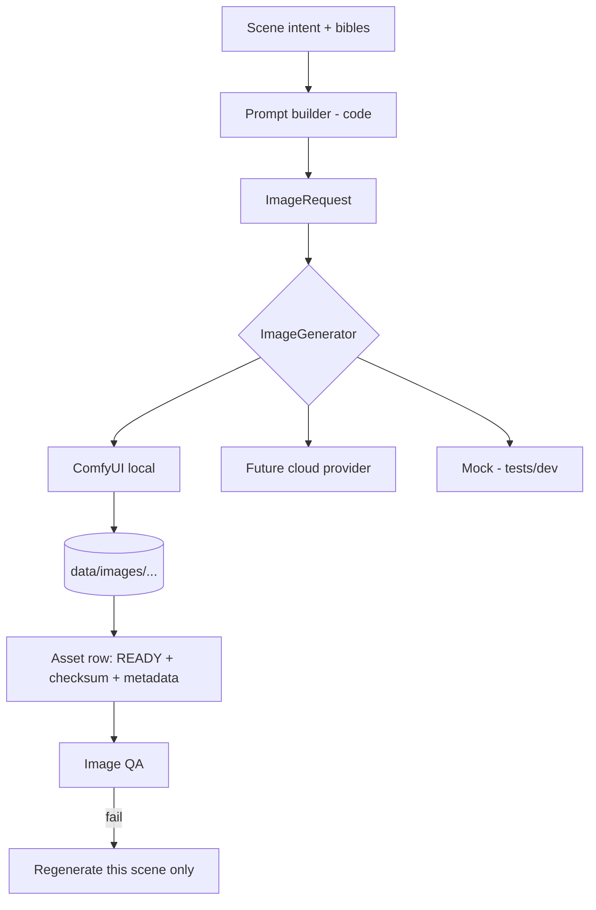

# Image Pipeline

> How scene illustrations are requested, produced, stored and regenerated.

## Status

**Partially implemented** — `ImageGenerator` interface, `MockImageGenerator`, and a `ComfyUIProvider` **stub** (health check only). Real image generation is **Planned — not implemented**.

## Current implementation ([`visual/base.py`](../../apps/api/app/visual/base.py))

- `ImageRequest`: `prompt`, `negative_prompt`, `width` (1344), `height` (768), `seed`, `reference_asset_ids`.
- `ImageResult`: `data` bytes, `mime_type`, `metadata`.
- `MockImageGenerator`: returns a 64×36 solid-colour PNG with `metadata {"mock": True}` — a placeholder, never presented as real output.
- `ComfyUIProvider`: `is_configured()` (needs `COMFYUI_BASE_URL`), `is_reachable()` (`GET /system_stats`, 2 s timeout), and `generate()` which raises `ProviderNotConfiguredError` when unset or `ProviderError("not implemented")` when set.
- `get_image_generator()` returns ComfyUI if configured, else the mock. **Caveat:** setting `COMFYUI_BASE_URL` today makes generation fail rather than fall back; this is a known stub behaviour ([KI-18](../reference/status.md#known-issues-and-limitations)).
- `GET /api/v1/health/providers` reports ComfyUI configured/reachable ([provider-endpoints](../api/provider-endpoints.md)).
- Nothing creates `assets` rows from generator output yet; the `assets` table and `AssetType.IMAGE`/`REFERENCE`/`THUMBNAIL` exist.

## Target Architecture

Planned steps: build prompt ([visual-prompting](../ai/visual-prompting.md)) → check for an existing READY asset with identical prompt/seed/model (skip if unchanged) → mark asset `GENERATING` → call generator → stream result to `data/images/<project>/<scene>/<version>.png` via `LocalStorage` → compute sha256/size → set `READY` or persist `error` + `FAILED`. Operation `generate_scene_image(scene_id)` is designed to be **idempotent and retryable** ([asset-generation-workflow](../workflows/asset-generation-workflow.md)).

Image-model features the interface must eventually carry: reference images, character consistency, style consistency, image-to-image, LoRA, ControlNet, per-scene generation, seeds ([image-consistency](image-consistency.md)).

## Resolution and composition

Default 1344×768 (≈16:9) leaves headroom for zoom/pan. Aspect ratio and size are visual-bible settings (Target). Compose with safe margins for subtitles ([camera-motion](camera-motion.md)).

## Reuse and cost

One image may feed several shots (different crops/moves). Reuse avoids generation cost ([ai-cost-strategy](../ai/ai-cost-strategy.md)). AI video generation is out of scope by design.

## Failure modes

Backend offline (reachability check fails → asset `FAILED` with error, project unaffected); OOM on a CPU-only machine (large models are not assumed available); artifacts/anatomy errors (image QA, Planned); half-written files (storage writes to `.part` then renames).

## Current limitations

No real generation, no prompt builder, no asset persistence, no QA, no queue. CPU-only dev hardware makes local diffusion impractical without a GPU; the backend is expected to be a separate ComfyUI instance.

## Related

[image-generation](../domains/image-generation.md) · [storage-layout](../data/storage-layout.md) · [ffmpeg](ffmpeg.md)
