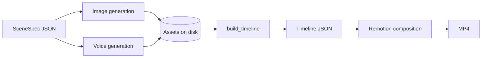

# Media Overview

> The media side of StoryWeaver: illustrations, narration, motion and rendering — and which parts exist.

## Status

**Partially implemented** — timeline schema, deterministic duration estimate, a Remotion composition with camera motion and subtitle box, and a working sample render. Image generation, voice, music/SFX, transitions, audio mixing, and the production render workflow are not implemented.

## Approach

StoryWeaver does **not** generate AI video per scene. Each scene is a generated illustration plus code-driven camera movement, transitions, narration, music, SFX and subtitles — the result should feel like an edited documentary rather than a static slideshow. The AI decides content; deterministic code decides timing, asset management and rendering ([ADR-004](../decisions/ADR-004-ai-vs-deterministic-responsibilities.md), [ADR-007](../decisions/ADR-007-media-rendering-strategy.md)).

## Component status

| Component | State | Doc |
| --- | --- | --- |
| Scene/timeline schema | Implemented | [timeline-specification](timeline-specification.md) |
| Duration estimate | Implemented (fallback only) | [timeline-specification](timeline-specification.md) |
| Remotion composition `Basic` | Implemented (placeholder visuals) | [remotion](remotion.md) |
| Camera motion (6 moves + static) | Implemented | [camera-motion](camera-motion.md) |
| Image generation | Interface + mock; ComfyUI is a stub | [image-pipeline](image-pipeline.md) |
| Voice / TTS | Interface; no engine | [voice-pipeline](voice-pipeline.md) |
| Subtitles | Per-scene caption box; no alignment | [subtitle-pipeline](subtitle-pipeline.md) |
| Transitions | Not implemented | [transitions](transitions.md) |
| Music, SFX, mixing, ducking, loudness | Not implemented | [music-and-sfx](music-and-sfx.md) |
| FFmpeg pipeline | None of our own; only Remotion's bundled encoder (no system FFmpeg needed to render) | [ffmpeg](ffmpeg.md) |
| Render workflow, artifacts, QA | Not implemented | [rendering](rendering.md) |

## Principles

- Timing is data, computed by code from measured audio when available ([timeline-specification](timeline-specification.md)).
- Scene intent, image prompt, generated asset and timeline shot are separate concepts (canonical: [storyboard-system](../domains/storyboard-system.md#separate-concepts-intent--prompt--asset--shot)).
- Files live on disk, not in Postgres ([storage-architecture](../architecture/storage-architecture.md)); large media is streamed, never loaded wholesale into RAM.
- Every asset and render is independently identified and retryable ([asset-data-model](../data/asset-data-model.md)).
- Nothing media-related is required to boot the app (no GPU, TTS model or ComfyUI).

## Related

[media-pipeline](../architecture/media-pipeline.md) · [rendering-architecture](../architecture/rendering-architecture.md) · [timeline-system](../domains/timeline-system.md) · [video-rendering](../domains/video-rendering.md)
