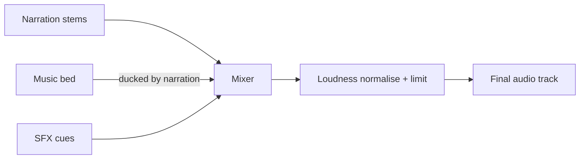

# Music and SFX

> Background music, sound effects, mixing, ducking and loudness.

## Status

**Planned** — no music, SFX, mixing, ducking or loudness code exists. Only storage buckets (`data/music/`, `data/sfx/`), asset types `MUSIC`/`SFX`/`AUDIO`, and `SceneSpec.music` / `SceneSpec.sfx` (free-text fields) exist. The sample composition renders no audio unless a timeline scene supplies `audio_src` (an `<Audio>` tag is rendered then; there is no volume, fade or mixing logic).

## Target Architecture

- **Sources:** user-provided or licensed libraries stored under `data/music` / `data/sfx` with metadata (title, mood, duration, license). Generation of music/SFX by AI is **Future**. Licensing rules matter for publication ([content policy](../product/content-policy-and-source-usage.md)).
- **Selection:** the LLM chooses mood/intent per scene or act (`music`, `sfx` intent strings); code maps intent → library asset (tags/embedding search) deterministically and records the choice.
- **Mix model (code):** tracks = narration, music bed, SFX hits. Rules: music ducks under narration (attenuate by a fixed dB while narration is active, with attack/release), crossfades between cues at act boundaries, SFX placed at scene-relative offsets, hard limit on peaks.
- **Loudness:** normalise the final mix to a target integrated loudness (e.g. EBU R128 / −14…−16 LUFS class — value **Decision pending**) and true-peak ceiling. Implemented either as FFmpeg `loudnorm` in a post-pass or per-stem in the composition ([ffmpeg](ffmpeg.md)).
- **Determinism:** the same timeline and assets yield the same mix.

## Failure modes

Clipping; music masking speech; abrupt cuts at scene boundaries; license violations; sample-rate mismatches between stems.

## QA hooks (Future)

Clipping detection, loudness measurement, silence detection ([quality-assurance](../domains/quality-assurance.md)).

## Open questions

Where mixing happens (Remotion audio props vs FFmpeg filter graph); music licensing source; how intent maps to assets.

## Related

[voice-pipeline](voice-pipeline.md) · [rendering](rendering.md) · [voice-and-audio](../domains/voice-and-audio.md)
