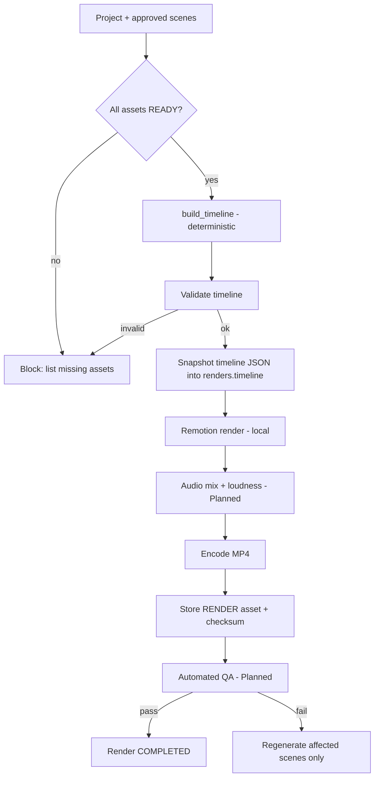

# Rendering

> From Timeline JSON to final MP4: what runs today, and the production render workflow.

## Status

**Partially implemented** — manual CLI render of the sample timeline works. The production render workflow (assets → validated timeline → render → artifact → QA) is **Planned — not implemented**; `renders` table and API CRUD exist but nothing performs a render.

## Rendering pipeline

Everything left of "Remotion render" is deterministic code; no step asks an LLM to do media work.

## Current implementation

- `renders` rows have `status` (queued/rendering/completed/failed), `timeline` JSONB snapshot, `output_asset_id`, `started_at`, `finished_at`, `error`; CRUD at `/api/v1/renders` ([API overview](../api/README.md)). No worker consumes `queued` renders.
- Manual: `make render-sample` → `packages/video/out/sample.mp4` ([remotion](remotion.md)).
- No render progress, cancellation, resumability or artifact registration.

## Target Architecture

1. **Preconditions** checked in code (assets, durations, timeline validity).
2. **Snapshot** the timeline into the render row: reproducibility and audit.
3. **Render** locally with Remotion programmatic API from a workflow task; write to `data/renders/<project>/<render>.mp4` through storage; report progress to the row.
4. **Post-process** audio/packaging with FFmpeg only if Remotion's bundled encoder is insufficient (role Decision pending; [ffmpeg](ffmpeg.md)).
5. **Register** the file as a `RENDER` asset with size and sha256; set `output_asset_id`.
6. **QA** ([quality-assurance](../domains/quality-assurance.md)): duration vs timeline, black frames, audio clipping/loudness, missing media. Failures name scenes so only those regenerate.
7. **Retry:** `render_project(project_id)` is idempotent per timeline hash; failed renders keep their error and can be re-run ([retry-and-recovery](../workflows/retry-and-recovery.md)).

Render artifacts: final MP4, optional preview (low-res), thumbnail, subtitle sidecars, the timeline snapshot, and logs. **Thumbnail:** `AssetType.THUMBNAIL` exists but no production path is documented or implemented — how a thumbnail is chosen or generated (frame extraction vs dedicated image) is Planned — Decision pending; note `assets.project_id` is required, so it is a project artifact ([KI-23](../reference/status.md#known-issues-and-limitations)).

## Determinism

**Target (unverified):** same timeline + same asset checksums + same renderer version ⇒ same visual output. Today only the timeline JSON is tested as deterministic (`build_timeline`); no test or check compares two renders, so render reproducibility, and especially byte-identical H.264 output, has not been verified. Record renderer/Remotion version and settings (fps, size, codec, CRF) on the render row (Planned).

## Performance (16 GB, no GPU)

Prefer 720p/1080p at 30 fps, one render at a time, previews at reduced scale, disk-based intermediates. Full-length render times are unmeasured; only the 6.5 s sample has been rendered.

## Failure modes

Missing asset (the file-staging step that would put assets in the per-render public dir is Planned — [ADR-009](../decisions/ADR-009-render-asset-resolution.md), [KI-17](../reference/status.md#known-issues-and-limitations)); Chrome (or Remotion's bundled ffmpeg) unavailable; OOM; disk full; partial output file (write to temp then rename); render timeout. Each leaves the project and other assets untouched.

## Related

[render-workflow](../workflows/render-workflow.md) · [rendering-architecture](../architecture/rendering-architecture.md) · [video-rendering](../domains/video-rendering.md) · [media-testing](../testing/media-testing.md)
