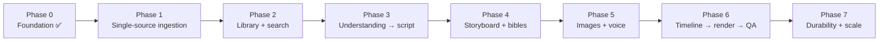

# Feature Roadmap

> Ordered phases from the current foundation to the full source-to-video pipeline.

## Status

**Planned.** Phase 0 is complete; all later phases are **Planned — not implemented**. Ordering reflects dependencies, not dates. No dates are committed (**Decision pending**).

## Phase 0 — Foundation (done)

FastAPI + Postgres/pgvector + Alembic; 10 CRUD resource groups; health/readiness/providers; provider interfaces and thin adapters; local storage with traversal protection; `build_timeline`; Remotion `Basic` composition with verified sample render; Next.js shell; pytest/Vitest/Playwright; docs. Evidence in [reference/status.md](../reference/status.md).

## Phase 1 — Single-source ingestion

- Ingestion workflow for one YouTube video: metadata → subtitles/Whisper → normalise → store transcript with timed segments (whether raw and cleaned copies are stored separately is **Decision pending**). The extractor currently returns metadata only ([KI-15](../reference/status.md#known-issues-and-limitations)).
- TXT/SRT/VTT upload (with the file-security rules in [file-security](../security/file-security.md)).
- Persisted workflow/job status and errors (needed by everything after).
- Docs: [ingestion-workflow](../workflows/ingestion-workflow.md), [transcript-pipeline](../domains/transcript-pipeline.md).

## Phase 2 — Library, channels and search

- Channel/playlist scan → count → choose N → import workflow; incremental sync ([channel-sync-workflow](../workflows/channel-sync-workflow.md)).
- Chunk + embed + store; semantic search endpoints; collection/project-source membership endpoints; topics.
- Duplicate detection beyond `(platform, external_id)`; source usage tracking ([FR-S12](requirements.md)).

## Phase 3 — Understanding → story → script

- Source understanding (facts, themes, events, causal chains), story candidates, story architecture, original script with validation and versions.
- Originality/similarity checks (against source, previous projects, used ideas); long-source multi-candidate handling; user approval of a candidate before expensive generation ([FR-G6](requirements.md)).
- Docs: [story-generation](../domains/story-generation.md), [script-generation](../domains/script-generation.md), [story-generation-pipeline](../ai/story-generation-pipeline.md).

## Phase 4 — Storyboard and bibles

- `SceneSpec` generation from the script; character bible; visual bible; endpoints for characters/locations/scene versions.
- `CharacterVersion` and style entities **Deferred until required by the production workflow**.

## Phase 5 — Images and voice

- ComfyUI provider (real workflow submission), reference-image consistency, per-scene regeneration; image QA hooks.
- Local TTS provider (Piper/Kokoro-class), measured audio durations feeding the timeline; subtitle alignment.
- Music/SFX library, ducking, loudness normalisation.

## Phase 6 — Production render and QA

- Project-level render workflow (timeline → Remotion → MP4 asset; FFmpeg only if audio/encoding needs it — **Decision pending**), asset resolution for render ([KI-17](../reference/status.md#known-issues-and-limitations)), transitions, subtitle styling, audio mix.
- Automated QA (assets, timing, audio clipping, subtitle/narration match; later visual checks) and QA-driven scene regeneration.

## Phase 7 — Durability and scale

- Temporal-backed workflows behind the existing `WorkflowRunner` abstraction.
- MinIO/S3 storage behind the `Storage` protocol.
- Authentication/multi-user only if the product leaves single-user local use.
- Full timeline editor: **Future**, not scheduled.

## Cross-cutting (every phase)

Migrations for every schema change ([migrations](../development/migrations.md)); tests per [testing-strategy](../testing/testing-strategy.md); doc updates per [docs/README](../README.md); prompt versioning; cost tracking ([ai-cost-strategy](../ai/ai-cost-strategy.md)).

## Open questions

- Quality metrics for "good story" and "consistent character" — **Decision pending** ([ai-quality-evaluation](../ai/ai-quality-evaluation.md)).
- Whether semantic search precedes or follows story generation in priority — **Decision pending**.
