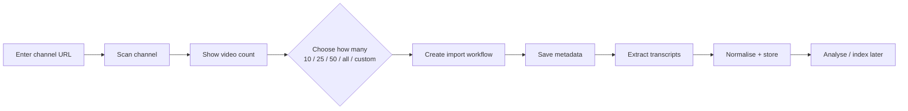

# User Flows

> Step-by-step journeys through the product, marking which steps exist today.

## Status

**Partially implemented.** Flow F0 (developer setup) and parts of F1/F5 exist. All other flows are **Planned — not implemented**. Steps are tagged ✅ implemented, 🟡 partial, ⬜ planned.

## F0 — Boot the stack (developer)

1. ✅ `make setup`, start Postgres, `make db-migrate`, `make dev` ([setup](../development/setup.md)).
2. ✅ Open `http://localhost:3100` → redirected to Dashboard; header badge shows API readiness.
3. ✅ Settings page shows which providers are configured (no keys exposed) ([provider-endpoints](../api/provider-endpoints.md)).

## F1 — Add a single YouTube video

1. ⬜ User pastes a URL in Sources.
2. 🟡 System validates and classifies it (video / channel / playlist) — `classify_youtube_url`.
3. ⬜ Metadata fetched via yt-dlp (optional extra; not exercised live).
4. ⬜ Transcript obtained (platform subtitles or Whisper). Not wired: the extractor returns metadata only ([KI-15](../reference/status.md#known-issues-and-limitations)).
5. ⬜ Normalise → chunk → embed → store. Whether a *raw* and a *cleaned* transcript are stored separately, and where the raw file lives, is **Decision pending** (the model has a single `text` + `segments`). The video is `imported` once metadata is stored; it is *searchable* when its transcript is ready and its chunks are embedded (derived, not a status value).
6. ✅ (API only) A `SourceVideo` row can be created manually via `POST /api/v1/sources`.

Detail: [ingestion-workflow](../workflows/ingestion-workflow.md), [transcript-pipeline](../domains/transcript-pipeline.md).

## F2 — Import a channel

All steps ⬜ planned. The canonical description of this flow (and of incremental "Sync Channel") is [channel-sync-workflow](../workflows/channel-sync-workflow.md); domain detail in [channel-ingestion](../domains/channel-ingestion.md). The library is built from metadata and transcripts — media files are not downloaded ([FR-S11](requirements.md)).

## F3 — Explore the library

1. 🟡 Browse Channels / Videos / Topics / Collections lists (read-only tables with empty states). The UI has **no create/edit/delete** for these; only Projects can be created from the UI (records can be created through the API).
2. ⬜ Semantic search, "similar to this idea", "unused ideas in History", "already made a video on this?" ([rag-strategy](../ai/rag-strategy.md)).
3. ⬜ Add videos to a collection (table exists; no endpoint/UI).

## F4 — Create a story project

1. ✅ Create a project by title (Projects page → `POST /api/v1/projects`).
2. ⬜ Attach one or more sources (join table exists; no endpoint).
3. ⬜ Run cheap analysis → review story candidates → **user picks one** (approval gate; no images, voice or render before this — [ai-cost-strategy](../ai/ai-cost-strategy.md)) ([story-generation-workflow](../workflows/story-generation-workflow.md)).
4. ⬜ Generate and review script versions ([script-generation](../domains/script-generation.md)).
5. ⬜ Generate storyboard; review scenes ([storyboard-workflow](../workflows/storyboard-workflow.md)).

## F5 — Produce the video

1. ⬜ Define character + visual bible.
2. ⬜ Generate images and narration per scene ([asset-generation-workflow](../workflows/asset-generation-workflow.md)).
3. ✅ Build the timeline deterministically from scene specs (`build_timeline`).
4. 🟡 Preview in Studio (sample data only) · render the sample via `make render-sample`.
5. ⬜ Render project, run QA, regenerate failed scenes, deliver MP4 ([render-workflow](../workflows/render-workflow.md), [qa-workflow](../workflows/qa-workflow.md)).

## F6 — Fix one bad scene

1. ⬜ QA or the user flags scene 32.
2. ⬜ Regenerate only that scene's image/voice with an adjusted prompt; previous attempt retained as a version/asset.
3. ⬜ Re-run timeline + render (cached unchanged scenes). See [retry-and-recovery](../workflows/retry-and-recovery.md).

## Failure paths (design intent)

Every flow must end in a persisted status + error rather than a crash; a failed scene must not fail the project ([retry-and-recovery](../workflows/retry-and-recovery.md)).

## F7 — Work through the ten-stage Studio (Planned)

The eventual Studio is a production workspace rather than a "Generate Video" button. All of it is **Planned — not implemented**; today `/studio` is a placeholder with a Remotion Player on sample data. Canonical design: [studio](../frontend/studio.md).

| # | Stage | The user can inspect / modify |
| --- | --- | --- |
| 1 | Source | the source, extracted transcript |
| 2 | Research | key facts, themes |
| 3 | Story | story candidates, the selected story (approval gate) |
| 4 | Script | script versions |
| 5 | Storyboard | scenes, scene versions |
| 6 | Visuals | character definitions, visual bible, image versions |
| 7 | Audio | narration, subtitles, music/SFX |
| 8 | Timeline | the timeline |
| 9 | QA | QA results |
| 10 | Render | renders |

### Regeneration granularity (Planned)

A user can regenerate **source analysis, a story candidate, the script, a scene, an image, a voice track, subtitles, or a render** without regenerating unrelated downstream artifacts. Which downstream artifacts become stale and which are preserved is the artifact dependency model — **Decision pending** ([workflow-overview](../workflows/workflow-overview.md)).

### Version history (Planned)

Versions are kept side by side — *Script v1 / v2 / v3*, *Scene 12 v1 / v2*, *Image Scene 12 v1 / v2* — and the user can compare and choose. Today only `script_versions` and `scene_versions` tables exist (no API); asset versions are not modelled ([KI-22](../reference/status.md#known-issues-and-limitations)).
