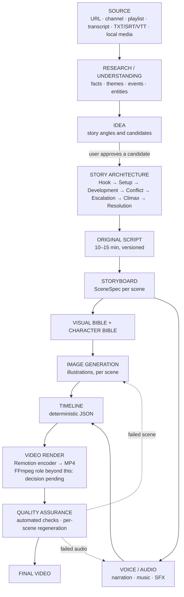

# Vision

> The long-term product vision and the end-to-end pipeline it implies.

## Status

**Future / Target.** This document describes the destination. Today only the foundation exists; per-stage status is in the table below and in [reference/status.md](../reference/status.md).

## Vision statement

*From source to story to video.* A creator points StoryWeaver at knowledge — videos, channels, transcripts, documents — and the system turns that knowledge into a growing, searchable library, then into **original, emotionally structured, illustrated and narrated videos**, produced largely on the creator's own hardware, with every scene individually inspectable and regenerable.

## What StoryWeaver is not

StoryWeaver is **not a generic AI video generator**. Its core loop is **source → understand → find story → write original story → visualise → narrate → edit → render**, and the **story is the most important part**. The system must not:

- paraphrase or summarise the source, or swap synonyms;
- mechanically divide a transcript into scenes, or generate one image per paragraph;
- produce a slideshow with narration laid on top.

It must understand the source first, then decide what story (if any) it can yield. A 30-minute source is **not** automatically cut into 0–10 / 10–20 / 20–30 minute videos: the system may find one strong story, several independent stories, several candidates to choose from, or **no suitable story at all**, and is allowed to say so. The source is research and input, not the final story: factual grounding is preserved while narrative structure and presentation are original. Detail: [story-generation](../domains/story-generation.md).

## Responsibility split

**AI decides content** — source understanding, topic extraction, story-opportunity discovery, story architecture, script, scene intent, visual descriptions, emotional beats, visual prompts, creative decisions.
**Deterministic software decides execution** — validation, schemas, persistence, IDs, asset relationships, timestamps, durations, subtitle timing, audio sync, timeline construction, rendering, encoding, retries, file management, reproducibility.
Rationale and consequences: [ADR-004](../decisions/ADR-004-ai-vs-deterministic-responsibilities.md).

## Vision vs. current implementation

This page is **product vision** (Target). What the repository does today is in [reference/status.md](../reference/status.md) and the table below. Developers and AI coding agents should also read [ai-agent-guide](../development/ai-agent-guide.md).

## End-to-end pipeline (Target Architecture)

Colour legend is intentionally omitted; use the table for status.

| Stage | Domain doc | Current state |
| --- | --- | --- |
| Source | [source-library](../domains/source-library.md) | Partial: tables, `NormalizedSource` schema, YouTube URL validation, optional yt-dlp extractor (not run live) |
| Research / understanding | [research-and-intelligence](../domains/research-and-intelligence.md) | Planned — not implemented (embedding column + HNSW index exist) |
| Idea / story architecture | [story-generation](../domains/story-generation.md) | Planned — not implemented |
| Script | [script-generation](../domains/script-generation.md) | Tables (`scripts`, `script_versions`) + basic script CRUD only |
| Storyboard | [storyboard-system](../domains/storyboard-system.md) | `SceneSpec` schema + scene tables; generation Planned |
| Visual / character bible | [visual-system](../domains/visual-system.md), [character-system](../domains/character-system.md) | `characters`/`locations` tables only (no API); versions Deferred |
| Image generation | [image-generation](../domains/image-generation.md) | Interface + mock; ComfyUI is a stub |
| Voice / audio | [voice-and-audio](../domains/voice-and-audio.md) | Interface only; no engine |
| Timeline | [timeline-system](../domains/timeline-system.md) | Implemented (`build_timeline`) |
| Render | [video-rendering](../domains/video-rendering.md) | Remotion `Basic` + sample render verified (Remotion's bundled encoder; system FFmpeg not required); no project render workflow |
| QA | [quality-assurance](../domains/quality-assurance.md) | Planned — not implemented |

## Product qualities we optimise for

- **Maximum content quality for minimum monetary cost** — not minimum cost at any cost. A stronger (possibly paid) model is justified for important creative decisions; cheap or local models handle routine work. Local-first, not local-only, and never coupled to one provider. See [ai-cost-strategy](../ai/ai-cost-strategy.md), [ADR-002](../decisions/ADR-002-local-first.md), [ADR-003](../decisions/ADR-003-provider-abstraction.md).
- **Originality** — stories are built from facts and ideas, not rewritten sentences ([content policy](content-policy-and-source-usage.md)).
- **Control** — every scene, asset and script has identity, status and version so a single bad scene never forces a full rebuild ([retry-and-recovery](../workflows/retry-and-recovery.md)).
- **Reproducibility** — the timeline JSON is deterministic (implemented, tested); that the same timeline renders the same video is the goal, not yet verified ([ADR-007](../decisions/ADR-007-media-rendering-strategy.md)).
- **Modest hardware** — no GPU required to boot; heavy models load lazily ([scalability](../architecture/scalability.md)).

## Inputs the system should eventually accept

YouTube video / channel / playlist; direct transcript; TXT, SRT, VTT; local audio and video; later web pages and documents. Each reduces to a `NormalizedSource` so platform logic does not leak ([source-data-model](../data/source-data-model.md)).

## Outcomes it should eventually deliver

Understand sources · extract topics and ideas · store reusable knowledge · generate original story concepts · write story-driven 10–15 minute scripts · find several independent story opportunities in one long source (not by splitting on time — see [story-generation](../domains/story-generation.md)) · plan scenes · keep characters/style consistent · generate illustrations instead of AI video · animate stills with camera movement · narrate · subtitle · add music/SFX · assemble a deterministic timeline · render MP4 · run automated QA · regenerate individual scenes/assets.

None of the production outcomes above are implemented yet; see [feature-roadmap.md](feature-roadmap.md).
