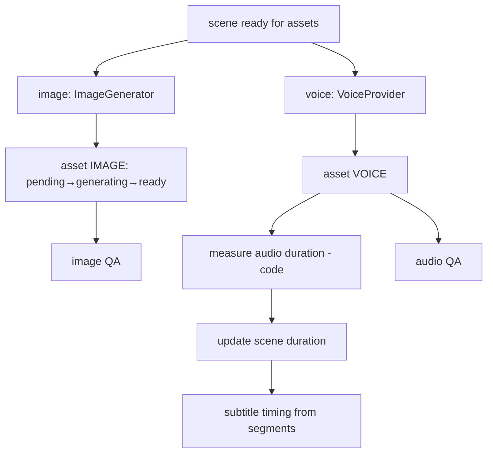

# Asset Generation Workflow

> Producing per-scene images, narration and audio as independently tracked, regenerable assets.

## Status

**Planned — not implemented.** Interfaces exist: `ImageGenerator` (`MockImageGenerator` returns a tiny placeholder PNG and is the default; `ComfyUIProvider` is a **stub** — `generate()` raises `ProviderNotConfiguredError` when `COMFYUI_BASE_URL` is unset and `ProviderError` ("not implemented") when it is set; because `get_image_generator()` returns the stub whenever the URL is set, configuring it disables the working mock — [KI-18](../reference/status.md#known-issues-and-limitations)), `VoiceProvider` (only `UnconfiguredVoiceProvider`, which raises), `LocalStorage`, and the `assets` table (type, status, storage_key, mime, size, sha256). No music/SFX handling, no subtitle alignment, no endpoint that triggers generation.

## Precondition: accepted story

Image and TTS generation must not start until the user has accepted the story (and storyboard). This is the main cost control: ComfyUI/TTS time and any cloud spend are incurred only for accepted work. Individual assets are regenerable (scene image, scene voice, subtitle) without regenerating unrelated downstream artifacts; what becomes stale is governed by the artifact dependency graph in [workflow-overview.md](workflow-overview.md#artifact-dependency-graph--target-decision-pending) (Decision pending).

## Inputs and outputs

- In: `SceneSpec` (image prompt, negative prompt, narration, voice), visual/character bible (Planned).
- Out: `assets` rows (`IMAGE`, `VOICE`, `SUBTITLE`, `MUSIC`, `SFX`) with files under `data/images`, `data/audio`, etc.

## Steps (Target)

1. Create `assets` row `pending` (stable identity), set `generating`.
2. Call provider; stream bytes through `Storage.put` (returns size + sha256; size-capped, atomic rename).
3. Fill `storage_key`, `mime_type`, `size_bytes`, `checksum`; set `ready`.
4. **Voice duration is measured by code**, then fed to the timeline ([../media/voice-pipeline.md](../media/voice-pipeline.md)).
5. Music/SFX selection and mixing: Planned ([../media/music-and-sfx.md](../media/music-and-sfx.md)).

## State transitions

`AssetStatus`: `pending → generating → ready | failed`; regeneration is intended to produce a new asset version and make it current — old files retained until cleanup (policy *Decision pending*, see [../data/data-lifecycle.md](../data/data-lifecycle.md)). **Not modelled today:** `Scene` has no "current asset" pointer and `Asset` has no version/supersedes column, so "swap the scene's reference" has no schema. Options: fields in `Asset.metadata`, new columns on `assets`, or a scene↔asset join table (Decision pending; see [data model](../data/asset-data-model.md) and the [artifact model](workflow-overview.md#artifact-dependency-and-invalidation-model--target-decision-pending)).

## Failure modes

ComfyUI unreachable/slow on CPU (very slow or infeasible without a GPU on the target laptop — which means the staged-cost design may in practice require a cloud image adapter; Decision pending, see [image generation](../domains/image-generation.md)), TTS model missing, disk full, partial write (handled by `.part` + rename), identical prompt regenerated needlessly (use prompt hash + seed as a cache key to save cost).

## Retry and idempotency

Keys (including `seed`): [idempotency-key table](retry-and-recovery.md#idempotency-keys) — `prompt_hash`, `provider`, `model` and `seed` have no columns today. A `ready` asset with the same key is reused. A `failed` asset is retried independently; scene 42 failing never blocks scenes 1–41. See [../media/image-pipeline.md](../media/image-pipeline.md), [../media/image-consistency.md](../media/image-consistency.md).
