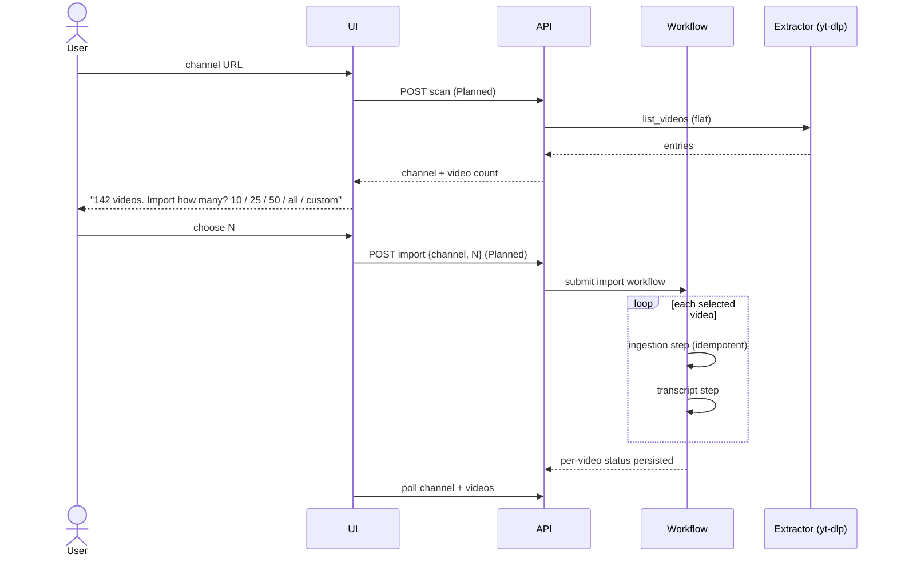

# Channel Sync Workflow

> Scanning a YouTube channel, letting the user choose how many videos to import, and keeping the library up to date.

## Status

**Planned — not implemented.** `channels` and `source_videos` tables, `YouTubeExtractor.list_videos` (flat listing, optional `limit`) and the channel URL classifier exist. There is no scan endpoint, no count/preview step, no import workflow and no UI beyond a read-only channels list.

## Trigger

User enters a channel URL such as `https://www.youtube.com/@SomeChannel/videos`; later, a scheduled or manual re-sync.

## Flow (Target)

## Product intent

*This section is the canonical description of the channel import experience; other documents link here.*

Enter URL → scan → "Found N videos" → choose 10 / 25 / 50 / all / custom → import selected → store metadata → extract transcript/subtitles where available → normalise and store → chunk → topics → embeddings → searchable. **No video file download is needed to build the library** (downloading media is an optional future capability, *Deferred until required by the production workflow*). "Sync Channel" discovers **only new** videos. The channel is one *Source Provider* in the provider-independent chain described in [source library](../domains/source-library.md#provider-independent-ingestion-canonical); a plain transcript upload is a first-class source that skips scanning ([ingestion-workflow.md](ingestion-workflow.md)).

Requirements for the workflow: idempotency, deduplication, stable source identifiers/fingerprints (today `(platform, external_id)`; content fingerprints are *Decision pending*), incremental sync, retryable failures, **partial imports** (some videos fail, the rest are kept), resumability after restart. Remembering which sources/ideas have been used by which projects is a goal; today only `project_sources` links exist and idea-level usage is not modelled.

## Steps

1. **Scan** (cheap, synchronous-ish): classify URL, upsert `channels` row (`discovered`, `video_count`).
2. **Choose**: UI presents count and options; the selection is a parameter, not state. Ordering (newest first) is *Decision pending*.
3. **Import workflow**: for each selected id, run [ingestion-workflow.md](ingestion-workflow.md) then [transcript-workflow.md](transcript-workflow.md). Videos are independent: one failure does not stop the batch.
4. **Roll-up (derived, no new enum value)**: channel `status` is `importing` while any child is in flight and `imported` once **all children are terminal** — terminal includes `failed`, so `imported` on its own overstates a partial import. Callers must read the children: *partially imported* = channel `imported` with ≥1 child `failed`. `failed` on the channel means only that the scan failed. Per-video errors stay on videos.

**Progress is not stored.** `Channel` has `video_count` but no field for the user's selected count, the number imported or failed, or a cursor; progress would have to be derived by counting child rows, or a job/progress record added (Decision pending, see [channel-ingestion](../domains/channel-ingestion.md)).

## Incremental sync (Target)

Re-scan, diff listing ids against existing `(platform, external_id)`, import only new ones. No `last_synced_at` column exists; adding one is *Decision pending* (could live in `channels.metadata` JSONB).

## Failure modes

Channel removed or private, listing truncated by the extractor, rate limiting on large channels, user cancels midway (cancellation not supported by `LocalRunner`).

## Retry and idempotency

Re-submitting the same import is safe: existing videos are skipped by the unique constraint; `failed` ones are retried. Keys: [idempotency-key table](retry-and-recovery.md#idempotency-keys). Channel identity caveat: [KI-24](../reference/status.md#known-issues-and-limitations).

## Limits

Large imports should be throttled (concurrency 2 today) and prefer transcript/subtitle download over media download. Related: [../domains/channel-ingestion.md](../domains/channel-ingestion.md).
