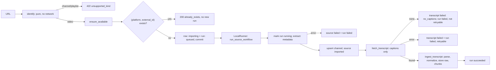

# Ingestion Workflow

> Turning a single source reference (a YouTube video URL or a transcript) into a stored, normalised, searchable source record.

## Status

**Implemented for single sources (P1, 2026-10-01).** Adding a YouTube video runs as a persisted background workflow (`source.add`, with `source.fetch_transcript` for transcript-only retries) on the in-process `LocalRunner`; adding a transcript upload/paste is processed synchronously in the request and shares the same ingestion step. **Not implemented (Planned):** channel and playlist ingestion (P11), automatic retry/backoff and cancel (P2), embedding and analysis hand-off, local audio/video sources. See the [status matrix](../reference/status.md).

## Provider-independent shape

The chain is defined once in [source library](../domains/source-library.md#provider-independent-ingestion-canonical). YouTube specifics stop at `NormalizedSource`/`ExtractedTranscript`; the workflow reaches the platform only through `registry.get_extractor(url)`. A **plain transcript upload (TXT/SRT/VTT or pasted text) is a first-class source**: it creates a source record with no remote fetch and goes straight to the transcript step. Platform and `kind` for uploads are `upload` / `transcript`, with the content fingerprint as `external_id` and `url` NULL (previously KI-14).

## Trigger

- `POST /api/v1/sources/from-url` `{url}` → `202` with `{source, run, already_exists, match}`; the client polls `GET /api/v1/runs/{id}`. An existing source is returned with `200 already_exists: true` and starts no run.
- `POST /api/v1/sources/from-transcript` (multipart file or text) → `201`/`200`; runs inline.
- `POST /api/v1/sources/{id}/retry` → `202 {run}`; `POST /api/v1/sources/{id}/transcript` attaches a transcript to an existing source.

Related: [channel-sync-workflow.md](channel-sync-workflow.md) for many videos (Planned), [../domains/source-library.md](../domains/source-library.md).

## Inputs and outputs

- In: a YouTube **video** URL (validated and classified; channel/playlist → `422 unsupported_kind`; foreign hosts/schemes → `422 invalid_source`; yt-dlp not installed → `409 provider_not_configured` with the `uv sync --extra ingestion` hint, before anything is created) or an uploaded file (rules in [../security/file-security.md](../security/file-security.md)).
- Out: a `source_videos` row (status `imported` — i.e. **metadata stored**), an upserted `channels` row, a current `transcripts` row with chunks, the raw caption/transcript file, and a `workflow_runs` row. A source is **searchable** when its current transcript is `ready` with ≥ 1 chunk (derived, not a status).

## Steps

1. **Identify** the URL without network access; refuse other kinds; check the extractor's optional dependency.
2. **Dedupe** by `(platform, external_id)` (the unique constraint is the database guarantee; the service also handles the race by re-reading).
3. **Create** the source `importing` (placeholder title = video id) and a `queued` run in one commit, **then** hand the run to the runner — the worker never starts before the rows are durable.
4. **Worker** (`ingestion.service.run_source_workflow`, own session, never raises): marks the run `running`, fetches metadata, upserts the channel, marks the source `imported`, then fetches and ingests the transcript. Progress is written to `workflow_runs.progress` (`step`: `metadata` → `transcript` → `done`, plus `segment_count`, `chunk_count`).
5. **Failure** is classified into a stable `error.code` with `retryable`; unknown exceptions never leak their text.

## State transitions

`SourceStatus`: `importing → imported | failed`; a retry moves `failed → importing`. (`discovered` exists for the future channel scan.) A transcript failure does **not** fail the source. `RunStatus`: `queued → running → succeeded | failed | interrupted`.

## Failure modes

| Failure | Result | Retryable |
| --- | --- | --- |
| Invalid / unsupported URL | `422` immediately; nothing created | n/a |
| yt-dlp not installed | `409 provider_not_configured` + hint; nothing created | after install |
| Video unavailable / private / region-blocked | source `failed`; run `video_unavailable` | no |
| Network / timeout / extractor error | run `provider_timeout`/`provider_error`/`internal_error`; source `failed` (metadata step) or transcript `failed` (transcript step) | yes (`/retry`) |
| No captions | source `imported`; transcript `failed (no_captions)`; run `no_captions` | no — attach a transcript |
| Caption file too large / unparsable | transcript `failed` with `transcript_too_large`/`transcript_parse_error`; raw file removed | after fix |
| Process stopped mid-run | startup reconciliation: active runs → `interrupted` (retryable), `importing` sources → `failed`, `processing` transcripts → `failed` | yes |
| Double click / concurrent identical add | the existing source/run is returned (partial unique index: one active run per `(kind, subject)`) | — |

## Retry and idempotency

Keys are listed in the [idempotency-key table](retry-and-recovery.md#idempotency-keys). Re-adding the same video is a no-op; re-ingesting identical transcript content is a no-op; chunk replacement is transactional; `retry` returns the already-active run if there is one. Retry is **manual** in V1 — automatic retry/backoff arrives with the generic runtime (P2).

## Current vs target

Current: everything above for single sources, verified by service and API tests with a fake extractor plus **one recorded live run** (see the [verification record](../reference/status.md#verification-record)). Target: channel/playlist ingestion, embedding hand-off, automatic retry, cancel. Authorisation and usage rules: [../product/content-policy-and-source-usage.md](../product/content-policy-and-source-usage.md).

## Open questions

Download media or metadata/transcript only? *Resolved for V1:* metadata and captions only; local audio would be needed solely for a Whisper fallback and is not implemented.
