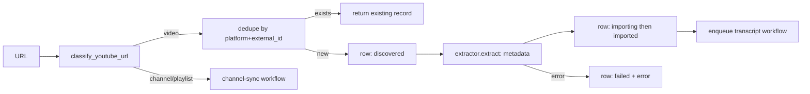

# Ingestion Workflow

> Turning a single source reference (YouTube URL, later files) into a stored, normalised source record.

## Status

**Planned — not implemented.** Building blocks exist: `classify_youtube_url` (URL validation), `YouTubeExtractor` (lazy `yt-dlp`, optional extra, untested against the real service), `NormalizedSource`, and the `source_videos` / `transcripts` tables. No workflow ties them together and no API endpoint triggers ingestion — `POST /api/v1/sources` only inserts a row.

## Provider-independent shape

The chain is defined once in [source library](../domains/source-library.md#provider-independent-ingestion-canonical). YouTube specifics stop at `NormalizedSource`. A **plain transcript upload (TXT/SRT/VTT or pasted text) is a first-class source in the design**: it creates a source record with no remote fetch and enters the transcript workflow directly (parsers and endpoint: Planned — not implemented). **Current limitation ([KI-14](../reference/status.md#known-issues-and-limitations)):** `source_videos.url`/`external_id` are NOT NULL, so such a record is not representable without an agreed convention. Source fingerprints for dedup beyond `(platform, external_id)` (e.g. a normalised-text hash for uploads) are *Decision pending*. Also [KI-15](../reference/status.md#known-issues-and-limitations): `extract()` returns metadata only; nothing here fetches captions or audio.

## Trigger

User submits a URL or file (UI/API endpoint Planned). Related: [channel-sync-workflow.md](channel-sync-workflow.md) for many videos, [../domains/source-library.md](../domains/source-library.md).

## Inputs and outputs

- In: URL (validated and classified as video / channel / playlist) or uploaded file (validation rules in [../security/file-security.md](../security/file-security.md)).
- Out: a `source_videos` row (status `imported` — i.e. **metadata stored**; the source becomes *searchable* only later, when its transcript is `ready` and chunks/embeddings exist), optionally a `transcripts` row in `pending`, and handoff to [transcript-workflow.md](transcript-workflow.md).

## Steps (Target)

1. Validate and classify URL (implemented as a pure function; rejects non-YouTube hosts, lookalike domains, bad ids).
2. Look up `(platform, external_id)`; the unique constraint `uq_source_videos_platform` makes duplicate detection a database guarantee.
3. Insert `discovered`, move to `importing`, call `SourceExtractor.extract`.
4. Persist metadata; set `imported`; start transcript workflow.

## State transitions

`SourceStatus`: `discovered → importing → imported | failed`. `failed → importing` on retry.

## Failure modes

yt-dlp not installed (`ProviderNotConfiguredError` with install hint), network error, private/removed video, rate limiting, invalid URL (`InvalidSourceError`). All set `status=failed` and `error` text; none should delete the row.

## Retry and idempotency

Keyed by `(platform, external_id)` ([idempotency-key table](retry-and-recovery.md#idempotency-keys)); re-running on an `imported` row is a no-op, on a `failed` row resumes at `importing`.

## Current vs target

Current: validation + extractor class + tables. Target: everything in the diagram above. Authorisation and usage rules: [../product/content-policy-and-source-usage.md](../product/content-policy-and-source-usage.md).

## Open questions

Download media or metadata/transcript only? (*Decision pending* — current design needs only text; local audio is needed solely for Whisper fallback.)
