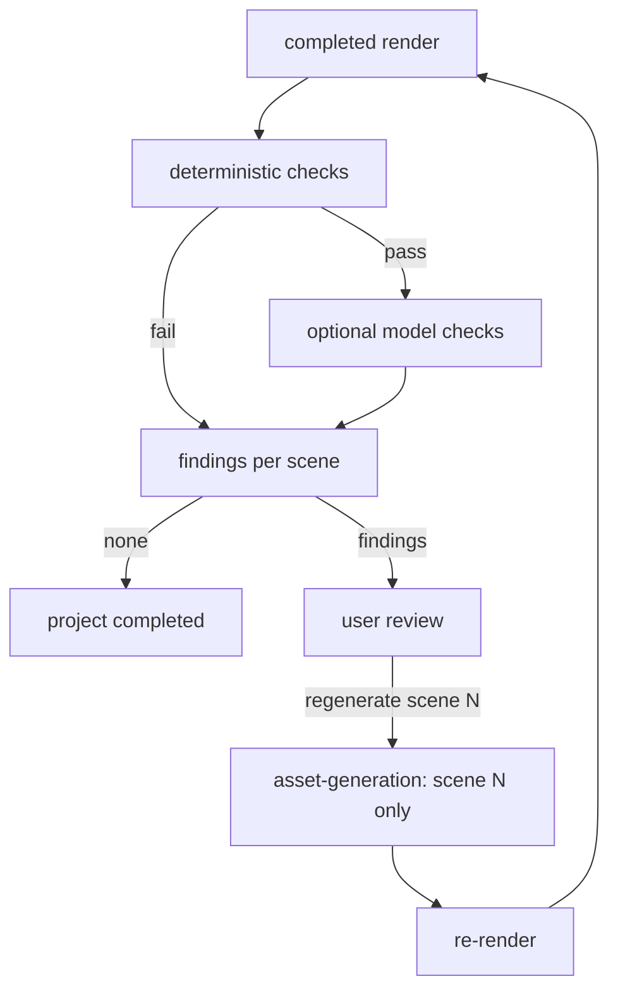

# QA Workflow

> Automated checks on assets and renders, feeding targeted per-scene regeneration.

## Status

**Planned — not implemented.** `ProjectStatus.QA` exists as a state; `app/quality/` is a docstring-only placeholder. No checks run.

## Checks (Target)

| Layer | Check | Kind |
| --- | --- | --- |
| Structural | Every scene has `ready` image + voice; files exist; checksums match | Deterministic |
| Timing | Durations > 0; no overlaps/gaps; subtitle within scene; total length in expected range | Deterministic |
| Audio | Clipping, silence, loudness (LUFS) | Deterministic (FFmpeg analysis) |
| Render | Probe: codec, resolution, fps, duration vs timeline, no black frames | Deterministic (ffprobe) |
| Visual | Wrong character/object/action, artefacts, style drift | Model-assisted (vision model) — *Decision pending* |
| Narrative | Subtitle/narration mismatch, continuity | Model-assisted |

Deterministic checks come first; model checks are costly and advisory unless proven reliable. See [../domains/quality-assurance.md](../domains/quality-assurance.md), [../ai/ai-quality-evaluation.md](../ai/ai-quality-evaluation.md).

## Flow (Target)

## Findings model

Decision pending (no table). Minimum: `{render_id, scene_id?, check, severity, message, evidence_path}` so a finding maps to a scene and a regeneration action.

## State transitions

`rendering → qa → completed` when no blocking findings; blocking findings return to `generating` for only the affected scenes.

## Failure modes

False positives from vision models (hence advisory), QA tooling failure must not fail the render (record `qa_error`, allow manual accept), unbounded regenerate loops (cap attempts).

## Retry and idempotency

QA is a pure function of (render, assets); re-running overwrites findings for that render ([idempotency-key table](retry-and-recovery.md#idempotency-keys)). See [retry-and-recovery.md](retry-and-recovery.md), [../testing/media-testing.md](../testing/media-testing.md).
