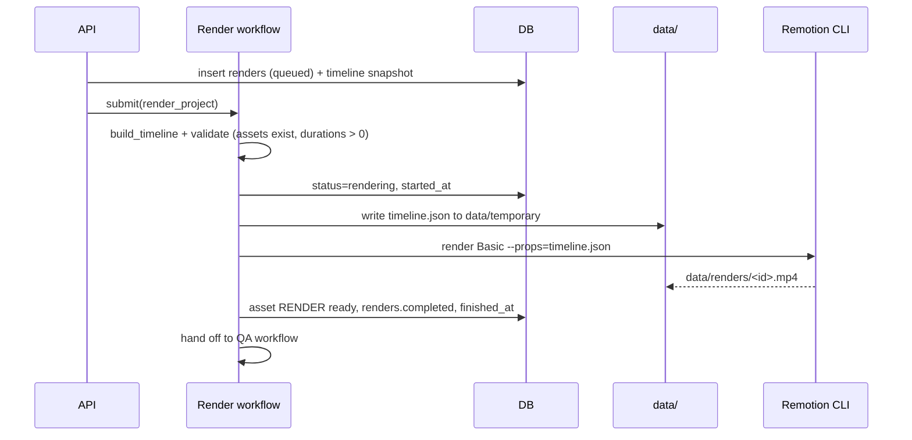

# Render Workflow

> Turning a validated timeline into an MP4, and recording the result.

## Status

**Partially implemented.** The *render itself* works manually: `make render-sample` runs `remotion render` on `packages/video/sample/timeline.json` (verified: 6.5 s, 1280×720 H.264). The **workflow** — a `renders` row, background execution, asset registration — is **Planned — not implemented**. `renders` table and `/api/v1/renders` CRUD exist but starting a render does nothing.

## Position in staged generation

Render is the last expensive stage and runs only on a timeline whose upstream artifacts are accepted ([workflow-overview.md](workflow-overview.md)). Re-rendering after regenerating one scene reuses all unchanged assets; only the render step repeats.

## Trigger

User requests a render for a project (Planned).

## Steps (Target)

1. **Snapshot**: `renders.timeline` stores the exact JSON rendered, so a render is reproducible.
2. **Validate (code)**: all referenced assets `ready`, files exist, no scene without duration, `Timeline.duration_seconds` sane. **Asset resolution is decided ([ADR-009](../decisions/ADR-009-render-asset-resolution.md), [KI-17](../reference/status.md#known-issues-and-limitations)) but not implemented:** assets are referenced by project-relative keys, staged into a per-render directory and resolved with `staticFile()` against `--public-dir` (proven by a fixture render). Today `build_timeline` leaves `image_src`/`audio_src` empty and nothing stages files, so the steps below remain target design.
3. **Render**: invoke the Remotion CLI/renderer with argument lists only (no shell strings built from user input). Chrome headless is downloaded by Remotion on first use.
4. **Post-process (optional)**: FFmpeg for loudness normalisation/encoding where Remotion output is not final ([../media/ffmpeg.md](../media/ffmpeg.md)). Decision pending.
5. **Register**: output as `RENDER` asset; set `renders.output_asset_id`.

## State transitions

`RenderStatus`: `queued → rendering → completed | failed`; project status `rendering → qa`.

## Failure modes

Missing asset file, Chrome download failure (offline), out-of-memory on high resolution/long videos on 16 GB (render in segments — Planned), disk space, Remotion licence acknowledgement (see README).

## Retry and idempotency

A render is immutable once `completed`; a retry of `failed` re-runs from the stored snapshot; a new request makes a new row ([idempotency-key table](retry-and-recovery.md#idempotency-keys)). Intermediate files go in `data/temporary` and are safe to delete. See [retry-and-recovery.md](retry-and-recovery.md), [../media/rendering.md](../media/rendering.md), [../architecture/rendering-architecture.md](../architecture/rendering-architecture.md).
