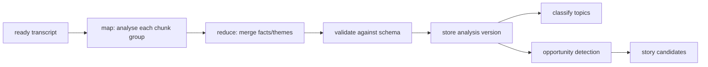

# Research Workflow

> Turning transcripts into structured understanding (facts, themes, topics) and making the library searchable.

## Status

**Planned — not implemented.** Only the storage substrate exists (`topics`, `collections`, `transcript_chunks` with pgvector). No analysis prompts, no semantic search endpoint, no RAG.

## Trigger

Transcript reaches `ready`; or a user asks a library question; or a project requests source understanding.

## Inputs and outputs

- In: transcript chunks (+ embeddings), project context.
- Out: structured analysis (key facts, entities, events, themes, causal chains, candidate hooks) and topic assignments. The analysis schema is *Decision pending* (no table yet; likely a versioned JSONB document linked to the transcript).

## Steps (Target)

1. **Map**: LLM extracts structured facts per chunk window (model chosen from `ANALYSIS_LLM_MODEL`/`CLASSIFICATION_LLM_MODEL` settings, which exist).
2. **Reduce**: merge duplicates, build event/causal graph.
3. **Validate** with `generate_structured` (exists: JSON-schema prompt, parse, one retry).
4. **Topic classification** into `topics` (cheap model).
5. **Opportunity detection**: hand off to [story-generation-workflow.md](story-generation-workflow.md). Where analysis results, candidates and similarity records are persisted is **Decision pending** — see [story data model](../data/story-data-model.md) and the artifact model in [workflow-overview.md](workflow-overview.md#artifact-dependency-and-invalidation-model--target-decision-pending).

## Semantic search (Target)

Embed the query, `ORDER BY embedding <=> :q` (cosine; a nearest-neighbour query is covered by a DB test), filter by collection/topic, optional rerank. Questions the library should answer: related sources, similar ideas, unused ideas in a collection, "have I already made a video around this?". Needs project-to-source usage tracking beyond `project_sources`.

## Failure modes

Invalid JSON from the model (retry once, then fail the step), context overflow on long sources (map-reduce is the mitigation), embedding model change (vectors not comparable; must re-embed).

## Retry and idempotency

Keys: [idempotency-key table](retry-and-recovery.md#idempotency-keys). Re-running creates a new analysis version, never mutates. There is currently no table to hold analysis versions ([KI-22](../reference/status.md#known-issues-and-limitations)); storage options are in the [story data model](../data/story-data-model.md).

## Related

[../domains/research-and-intelligence.md](../domains/research-and-intelligence.md), [../ai/rag-strategy.md](../ai/rag-strategy.md), [../ai/context-management.md](../ai/context-management.md).
