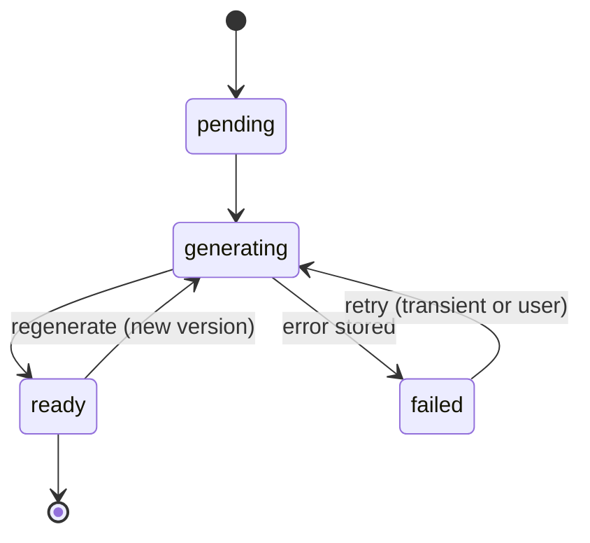

# Retry and Recovery

> Rules every workflow step must follow so failures are contained, visible and safely repeatable.

## Status

**Partially implemented (P1, 2026-10-01).** For the Source Library ingestion workflows these rules are real: persisted `workflow_runs` (one active run per `(kind, subject)`), idempotent steps, typed errors with a `retryable` flag, a manual retry endpoint (`POST /sources/{id}/retry`), transactional writes with cleanup, and startup reconciliation of work left by a dead process. **Not implemented:** automatic retry/backoff, cancellation, timeouts per run, a dead-letter queue, and any of this for the later pipeline stages (P2+).

## Design rules (Target)

1. **Idempotent by entity id.** Steps take ids, read current state and skip finished work. Examples: `import_video(video_id)`, `generate_transcript(video_id)`, `generate_scene_image(scene_id)`, `generate_voice(scene_id)`, `render_project(project_id)`.
2. **Errors are data.** Catch at the step boundary, set `status=failed`, store a short `error` (no secrets, no stack dumps with credentials — logging redacts keys by name), and continue with unrelated entities. A failed scene never destroys the project.
3. **Transient vs permanent.** Retry network timeouts/5xx/rate limits with exponential backoff and jitter (3–5 attempts); do not retry validation errors, `InvalidSourceError`, or `ProviderNotConfiguredError` — surface them.
4. **Atomic writes.** Files go to `*.part` then rename (`LocalStorage.put` does this); DB state changes in one transaction. A crash leaves either old or new, not half.
5. **Deduplicate work.** Generic cache key = hash of (operation, inputs, provider, model, prompt_version, seed). A `ready` result with the same key is reused (saves cost, see [../ai/ai-cost-strategy.md](../ai/ai-cost-strategy.md)). The per-operation keys are in the [idempotency-key table](#idempotency-keys).
6. **Single flight.** Only one running job per entity. Mechanism *Decision pending*: status compare-and-set (`UPDATE … WHERE status <> 'generating'`) or Postgres advisory lock.

## Idempotency keys

> Canonical table. Other workflow documents link here instead of defining their own keys. Rows for the Source Library (first four) are **implemented**; the rest are **Target design** with no workflow code yet — the "Stored today" column says what the schema can actually record.

| Operation (entity-keyed step) | Idempotency key | Stored today | Gap / note |
| --- | --- | --- | --- |
| `source.add` (YouTube video) | `(platform, external_id)` (11-char video id); run key `source.add:<source_id>:<attempt>`; at most one active run per `(kind, subject)` | Unique constraint on `source_videos`; `workflow_runs.idempotency_key` + partial unique index | Implemented. A second add returns the existing source and starts no run |
| Transcript upload / paste | `(platform='upload', external_id = sha256 fingerprint)`; also any existing source with the same `fingerprint` | Unique constraint; `source_videos.fingerprint` (indexed) | Implemented. Identical content dedupes across SRT/VTT/TXT and across platforms; near-duplicates not detected (P12) |
| Transcript version (`ingest_transcript`) | `(source_video_id, fingerprint, normalizer_version)` — same triple → return the current transcript | `transcripts.version`, `is_current` (partial unique), `normalizer_version`; `source_videos.fingerprint` | Implemented; created only by the service (resolved KI-13) |
| `source.fetch_transcript` (retry of the transcript half) | `source.fetch_transcript:<source_id>:<attempt>`; one active run per `(kind, subject)` | `workflow_runs` | Implemented. Automatic retry/backoff: P2 |
| `import_channel(channel)` | channel `(platform, external_id)` + per-video keys above | Unique constraint on `channels` | Channel `external_id` must be the canonical channel id, not the URL fragment ([KI-24](../reference/status.md#known-issues-and-limitations)); selected count/progress not stored |
| chunk transcript | `(transcript_id, chunk_index)` | Unique constraint on `transcript_chunks` | Implemented: written in the same transaction as the transcript version |
| embed chunks | `(chunk, embedding_model)`; only rows with `embedding IS NULL` | `embedding`, `embedding_model` columns | Dimension fixed at 768 ([KI-6](../reference/status.md#known-issues-and-limitations)) |
| analyse source | `(transcript_id, analysis_version, prompt_version, provider, model)` | **No table** | Storage Decision pending ([story data model](../data/story-data-model.md)); `prompt_version`/`provider`/`model` columns exist only on `script_versions` |
| story candidates | `(analysis ref, prompt_version, provider, model, seed)` | **No storage** | Decision pending |
| generate script | `(script_id, version)` | Unique constraint; `prompt_version`, `provider`, `model` columns | No `seed` column; previous version is an explicit input |
| save scene content | `(scene_id, version)` | Unique constraint on `scene_versions`; JSON in `data` | `data` is not validated at write ([storyboard system](../domains/storyboard-system.md)) |
| `generate_scene_image(scene_id)` | `(scene_id, scene_version, asset_type, prompt_hash, provider, model, seed)` | `scene_id`, `type`, `status`, `checksum` columns | `prompt_hash`, `provider`, `model`, `seed` have **no columns** → `Asset.metadata` JSONB or new columns (Decision pending) |
| `generate_voice(scene_id)` | `(scene_id, scene_version, asset_type, text_hash, voice, provider, model, seed where supported)` | As above | Same gap |
| `render_project(project_id)` | `render.id`; a retry of `failed` re-runs the stored snapshot; a new request is a new row | `renders.timeline` JSONB snapshot, `status` | Hash of snapshot + composition version for reuse is Decision pending |
| QA | `render_id` (pure function of render + assets) | — | Findings storage Decision pending |

Rules: a key component that matters for the output **must** be recorded with the result (otherwise a "same key → reuse" decision cannot be verified); `seed` is part of every generative key where the provider supports seeds; a different `provider`/`model` is a different key (outputs are not interchangeable).

## Recovery scenarios

| Scenario | Target behaviour |
| --- | --- |
| Process restarts mid-job (`LocalRunner` is in-memory) | **Implemented for ingestion** (`reconcile_stale` in the app startup hook, never blocks boot): active runs → `interrupted` (`error.code = interrupted`, retryable), sources stuck `importing` → `failed`, transcripts stuck `processing` → `failed`; then `POST /sources/{id}/retry`. Target for the later stages (`generating`/`rendering`) |
| Provider down | Fail fast with clear error; optionally fall back per [../ai/model-routing.md](../ai/model-routing.md) |
| One scene fails | Mark that scene/asset `failed`; render blocked until resolved or the user excludes it; others continue |
| Bad output accepted by mistake | Version tables allow rollback: select an older `script_versions`/`scene_versions` row |
| Disk full / missing file | Asset `ready` but file missing → QA structural check flags it → regenerate that asset |
| Migration/embedding model change | Re-embed job; vectors from different models never mixed (`embedding_model` column) |

## Observability needed

Per attempt: `workflow_id`, entity id, provider, model, duration, status, error (the runner already logs `workflow_id`, status, error). A persisted attempt history is *Decision pending*.

## Current limitations

No dead-letter queue, no automatic retry/backoff, no per-run timeouts, no cancellation. A manual retry exists only for the Source Library (`POST /sources/{id}/retry`, with a Retry button in the UI). Temporal would provide retries/timeouts natively ([workflow-overview.md](workflow-overview.md)); until then these rules are implemented in step code.

See also [../architecture/workflow-architecture.md](../architecture/workflow-architecture.md), [../operations/recovery.md](../operations/recovery.md).
