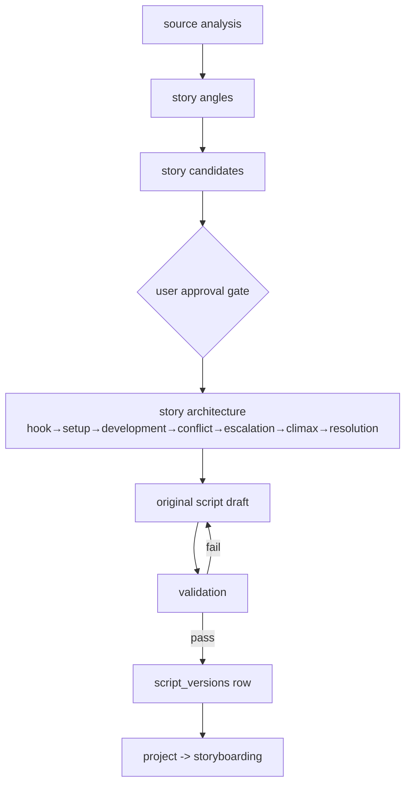

# Story Generation Workflow

> From analysed source to an original, validated, versioned script.

## Status

**Planned — not implemented.** Tables exist (`projects`, `scripts`, `script_versions` with `prompt_version`/`provider`/`model`). No prompts (`packages/prompts` is empty), no generation code.

## Core rule

The output must be an **original narrative**, not a paraphrase of the transcript. The source supplies facts and ideas; the story architecture supplies structure. Design detail: [../domains/story-generation.md](../domains/story-generation.md), [../ai/story-generation-pipeline.md](../ai/story-generation-pipeline.md).

## Staged generation

Cheap/fast analysis → story candidates → **user choice (approval gate)** → high-quality script → storyboard → (only then) expensive asset generation. Candidate generation uses inexpensive models; the creative script uses the strongest available; nothing downstream of the choice runs before the user accepts. Overview and dependency handling: [workflow-overview.md](workflow-overview.md). Cost rationale is canonical in [AI cost strategy](../ai/ai-cost-strategy.md). **Candidate selection is a user approval gate by default**; an automatic ranking/selection heuristic may exist only as an explicit opt-in shortcut. The persisted gate state is Decision pending ([project system](../domains/project-system.md#approval-and-gate-state-decision-pending)).

## Steps (Target)

1. **Candidates**: for a long source, identify independent narrative opportunities (themes, conflicts, turning points) — explicitly *not* time-based splitting. See [../domains/story-generation.md](../domains/story-generation.md).
2. **Architecture**: beat outline per candidate, target 10–15 minutes (a target, not a hard limit).
3. **Script**: stronger model for the creative step; cheaper model for revisions ([../ai/model-routing.md](../ai/model-routing.md)).
4. **Validation (code + model)**: schema validity, duration estimate from word count (deterministic; the 2–7 s per-scene clamp must not be applied to whole-script length — [KI-16](../reference/status.md#known-issues-and-limitations)), presence of all beats, originality/similarity check against the source, previous projects and used ideas (method and thresholds *Decision pending*; see [story generation](../domains/story-generation.md#originality-and-similarity)). No legal conclusion is drawn from a similarity score.
5. **Persist** a new `script_versions` row (`version` unique per script). Project status `scripting`.

## State transitions

`ProjectStatus`: `draft → analyzing → scripting → storyboarding …`; `failed` records `projects.error`. Scripts are immutable per version; a human edit is a new version.

## Failure modes

Malformed output, script too short/long, derivative text, provider unavailable (fall back per routing policy), user rejects candidate (re-run from candidates, keep old versions).

## Retry and idempotency

Keys: [idempotency-key table](retry-and-recovery.md#idempotency-keys). The generation step takes the previous version as an explicit input so retries are reproducible given the same prompt/model/seed where supported (no `seed` column exists on `script_versions` today).

## Related

[../domains/script-generation.md](../domains/script-generation.md), [storyboard-workflow.md](storyboard-workflow.md).
