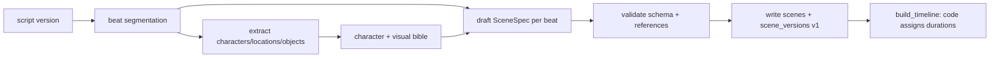

# Storyboard Workflow

> Converting a script version into scene-by-scene visual plans with independent identity.

## Status

**Planned — not implemented.** Implemented pieces: `scenes` / `scene_versions` tables, `SceneSpec` Pydantic schema (+ exported JSON Schema), and the deterministic `build_timeline`. No generation, no scene endpoints beyond basic CRUD (`/api/v1/scenes`; there is no scene-versions endpoint), no character/visual bible logic (`characters`, `locations` tables have no API).

## Principle

Scenes serve the story; they do not simply illustrate each transcript sentence. See [../domains/storyboard-system.md](../domains/storyboard-system.md) and [../data/scene-data-model.md](../data/scene-data-model.md).

## Steps (Target)

1. **Segment** narration into beats (AI decides content: narration, visual intent, emotion, camera intent).
2. **Resolve references**: `characters`/`locations` names in a scene must exist for the project (unique `(project_id, name)`).
3. **Draft** `SceneSpec` per beat; `duration` stays `None` from the model.
4. **Validate**: Pydantic schema; names resolve; sequence is contiguous.
5. **Persist**: one `scenes` row per scene (stable id), `scene_versions` row `version=1` with the JSON in `data`. `SceneVersion.data` is plain JSONB and is **not validated at write**: no API exposes scene versions and nothing else enforces `SceneSpec`, so validation must be performed by the workflow step before persisting. The relationship between `scenes.id`, `sequence` and `SceneSpec.scene_id` is in the [identifier mapping](../domains/storyboard-system.md#identifier-mapping).
6. **Timing is code**: `estimate_duration` (≈2.5 words/s, clamped 2–7 s) is a **fallback estimate only** until real narration audio length is known; measured audio length overrides. Because of the 7 s cap, narration needing longer is silently truncated in the estimate and the fallback must not drive a final render ([KI-16](../reference/status.md#known-issues-and-limitations)). Pacing guidance in [../media/timeline-specification.md](../media/timeline-specification.md).

## State transitions

`SceneStatus`: `draft → generating → ready | failed`. Editing creates a new `scene_versions` row; regenerating one scene never touches others. `Scene.status` describes **storyboard-content state only**; per-asset generation state lives on `Asset.status`, so a scene whose images are generating is not `Scene.generating`. (If this proves ambiguous, splitting the enum is Decision pending.)

## Failure modes

Unknown character reference, empty narration, scene count wildly off script length, model returns durations (Target: code overwrites them and owns timing; today `SceneSpec.duration` accepts any positive value and `build_timeline` uses it when set — see [KI-16](../reference/status.md#known-issues-and-limitations)).

## Retry and idempotency

Keys: [idempotency-key table](retry-and-recovery.md#idempotency-keys). Whole-storyboard retry replaces only scenes in `draft`/`failed` unless the user forces it. Next: [asset-generation-workflow.md](asset-generation-workflow.md).
