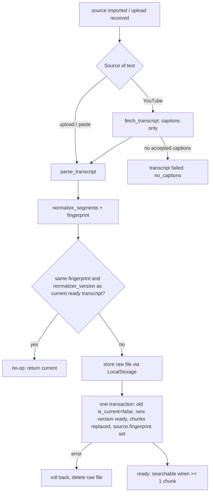

# Transcript Workflow

> Obtaining, normalising, chunking and (later) embedding a transcript for a source.

## Status

**Implemented for captions and uploads (P1, 2026-10-01); embedding and speech-to-text are Planned — not implemented.** The caption/upload → parse → normalise → store raw → chunk → persist → keyword-search path runs inside the ingestion workflow ([ingestion workflow](ingestion-workflow.md)) and behind `POST /sources/{id}/transcript`. Still only building blocks: `Transcriber`/`FasterWhisperTranscriber` (lazy, optional extra, untested against real audio, **unwired**), and `EmbeddingProvider` adapters (mock-tested only) — nothing calls them and no chunk has an embedding.

## Trigger

- The transcript half of `source.add` (after metadata), or `source.fetch_transcript` (retry when metadata is fine).
- A transcript upload/paste (`POST /sources/from-transcript`) — creates the source and runs the same ingestion step inline.
- `POST /sources/{id}/transcript` — attach or replace the transcript of an existing source (the fallback when a video has no captions).

## Steps

1. **Acquire.** Captions through the extractor (manual before automatic, language exact then prefix, `json3` before `vtt`), or the uploaded bytes. Speech-to-text from audio is not implemented — a video with no captions ends as `transcript failed (no_captions)` and the user attaches a transcript instead.
2. **Parse and normalise** into `TranscriptSegment {start, end, text, speaker?}` (times are `null` for plain text). Details and rules: [transcript pipeline](../domains/transcript-pipeline.md#workflow).
3. **Store.** The raw file is kept exactly as received at `transcripts/<source_id>/v<n>/raw.<ext>` (hash recorded); the database holds the cleaned `text` and `segments`. Raw-vs-cleaned storage is therefore decided and implemented (it was *Decision pending*).
4. **Chunk.** `chunk_segments(max_chars=1200)` preserves start/end times (and tolerates untimed text).
5. **Embed — Planned (P11).** Batch through `EmbeddingProvider`, write `embedding` and `embedding_model`; the column dimension (768) is fixed by migration. Until then `embedding` stays NULL.

## State transitions

`TranscriptStatus`: `pending → processing → ready | failed`. Each new version increments `version` (unique `(source_video_id, version)`) and becomes the only `is_current` row (partial unique index), so reprocessing never overwrites; history rows keep their chunks but are not searchable. Versions are created only by the service (resolved KI-13). A failed placeholder row records `no_captions` etc. and never replaces a ready current transcript.

## Failure modes

| Failure | Result |
| --- | --- |
| No accepted captions | transcript `failed` (`no_captions`), source stays `imported`; attach a transcript |
| Caption file larger than `MAX_TRANSCRIPT_BYTES` | `transcript_too_large` (upload: `413 file_too_large`); nothing stored |
| Unparsable / empty / non-UTF-8 transcript | `transcript_parse_error` (upload: `422`, with the line number); nothing stored |
| Database error while persisting | transaction rolled back; raw file deleted; no orphan chunks |
| Network / extractor error | run `provider_timeout`/`provider_error`/`internal_error`, retryable |

Planned failure modes (not applicable yet): Whisper out of memory on long audio; embedding provider unconfigured or dimension mismatch (must fail before writing partial vectors).

## Retry and idempotency

Keys: [idempotency-key table](retry-and-recovery.md#idempotency-keys). Re-ingesting identical content with the same `normalizer_version` is a no-op; chunk replacement is transactional. `POST /sources/{id}/retry` runs only the transcript half when the source's metadata is fine. **Planned interaction (P11):** the embedding step will fill only rows where `embedding IS NULL`; replacing chunks creates new rows with `embedding = NULL`, so a chunk rewrite forces a full re-embed of that transcript.

## Related

[../domains/transcript-pipeline.md](../domains/transcript-pipeline.md), [../data/embeddings-and-vector-search.md](../data/embeddings-and-vector-search.md), [research-workflow.md](research-workflow.md).
