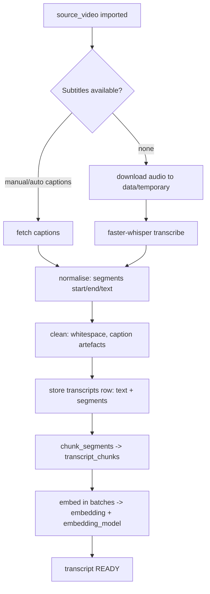

# Transcript Workflow

> Obtaining, normalising, chunking and (later) embedding a transcript for a source video.

## Status

**Planned — not implemented**, with partial building blocks: `transcripts` and `transcript_chunks` tables (`vector(768)` + HNSW cosine index), `chunk_segments` (implemented, unit-tested), `Transcriber`/`FasterWhisperTranscriber` (lazy, optional extra, untested against real audio), `EmbeddingProvider` adapters (Ollama, Google; mock-tested only). No endpoint or workflow runs these.

## Trigger

Successful ingestion of a video, or a manual transcript upload (TXT/SRT/VTT — parsers Planned).

## Steps (Target)

1. **Acquire** (new code — [KI-15](../reference/status.md#known-issues-and-limitations): the extractor returns metadata only): prefer provided captions; fall back to local Whisper (CPU, `int8`, loaded lazily; no GPU assumed). `origin` records `manual|auto|whisper|upload`.
2. **Normalise** into `TranscriptSegment {start, end, text, speaker?}`.
3. **Clean**: whitespace/caption-artefact clean-up. **Raw-vs-cleaned storage is Decision pending** — the `transcripts` table has one `text` column plus `segments` JSONB and no storage-key column, so a raw copy has nowhere to be recorded today. This agrees with [transcript pipeline](../domains/transcript-pipeline.md#outputs).
4. **Chunk**: `chunk_segments(max_chars=1200)` preserves start/end times.
5. **Embed**: batch through `EmbeddingProvider`; write `embedding` and `embedding_model`. The column dimension (768) is fixed by migration.

## State transitions

`TranscriptStatus`: `pending → processing → ready | failed`. **Target:** new versions increment `version` (unique `(source_video_id, version)`), so reprocessing never overwrites. **Current limitation ([KI-13](../reference/status.md#known-issues-and-limitations)):** the API cannot set `version`; a second transcript for a video returns 409.

## Failure modes

No captions and Whisper extra missing; audio download fails; Whisper out of memory on long audio (stream and chunk by time); embedding provider unconfigured or dimension mismatch (must fail before writing partial vectors).

## Retry and idempotency

Keys: [idempotency-key table](retry-and-recovery.md#idempotency-keys). Chunk write is replace-by-transcript in one DB transaction; the embedding step only fills rows where `embedding IS NULL`. **Interaction:** replacing chunks creates fresh rows with `embedding = NULL`, so a chunk rewrite always forces a full re-embed of that transcript; re-running only the embedding step after a successful chunk write embeds only what is missing. Uploaded transcripts with no URL: [KI-14](../reference/status.md#known-issues-and-limitations).

## Related

[../domains/transcript-pipeline.md](../domains/transcript-pipeline.md), [../data/embeddings-and-vector-search.md](../data/embeddings-and-vector-search.md), [research-workflow.md](research-workflow.md).
