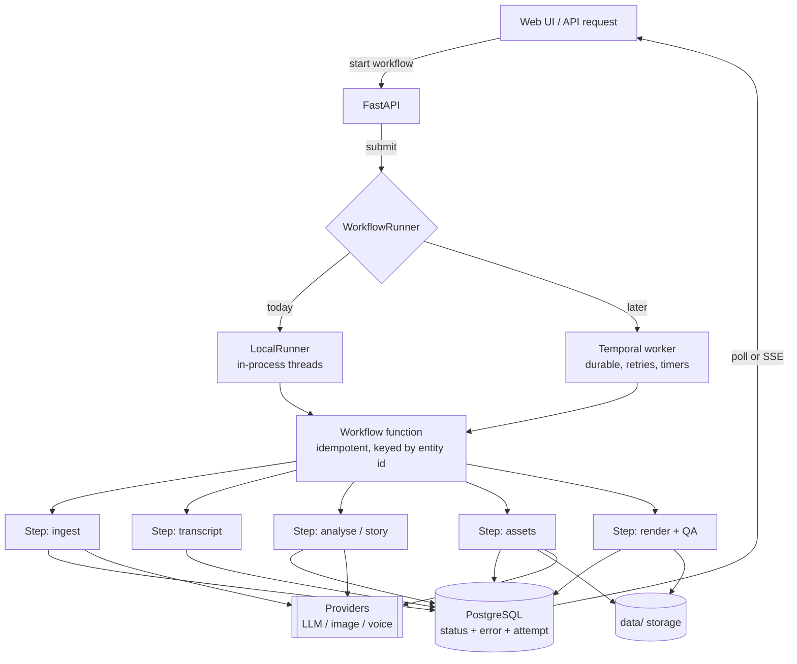
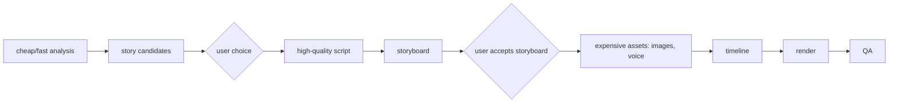
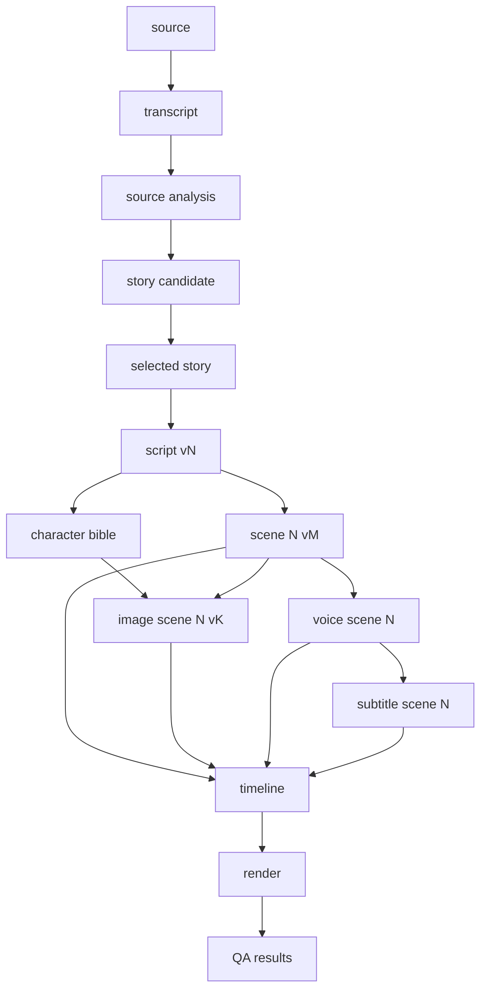

# Workflow Overview

> How long-running StoryWeaver operations are meant to be modelled, executed and recovered, and what exists today.

## Status

**Partially implemented.** The execution abstraction (`WorkflowRunner`, `LocalRunner`) exists. **No concrete workflow function exists**, nothing in the API calls the runner, and Temporal is not wired. Every workflow doc in this folder describes **Target Architecture** unless it says otherwise.

## Purpose

AI and media operations are slow and unreliable. Workflows give each one an identity, a log trail, persisted state and a safe retry path, without making the whole project fail when one step fails. See [../architecture/workflow-architecture.md](../architecture/workflow-architecture.md) for the architectural view.

## Current implementation

Source: `apps/api/app/workflows/runner.py`.

| Piece | Behaviour |
| --- | --- |
| `WorkflowRunner` (Protocol) | `submit(name, fn, *args, **kwargs) -> workflow_id` |
| `LocalRunner` | `ThreadPoolExecutor(max_workers=2)`; `workflow_id = "<name>-<12 hex>"`; logs `workflow.started`, `workflow.finished` or `workflow.failed` (with `workflow_id`, `workflow`, `status`, `error`) via structlog |
| Error boundary | Exceptions are logged and swallowed by the future callback; the app never crashes because a job failed |
| `get_runner()` | Lazy module-level singleton |

Not present: job table, progress reporting, cancellation, retries, result retrieval, persistence across process restarts (a restart loses queued jobs), API endpoints to start or inspect workflows.

## Target architecture

Principles:

1. **Workflows orchestrate; steps do work.** A workflow only sequences steps and records state. Steps are plain functions that can run under either runner.
2. **Entity-keyed and idempotent.** `import_video(video_id)`, `generate_transcript(video_id)`, `generate_scene_image(scene_id)`, `generate_voice(scene_id)`, `render_project(project_id)`. See [retry-and-recovery.md](retry-and-recovery.md).
3. **State lives on the entity.** `status` and `error` columns already exist on `channels`, `source_videos`, `transcripts`, `projects`, `scenes`, `assets` and `renders`. Workflow-run history (attempts, timings, provider, model, tokens) needs a table that does not exist yet — *Decision pending*.
4. **Temporal is optional.** The abstraction must keep first boot dependency-free ([ADR-001](../decisions/ADR-001-stack.md)). Temporal adds durability when jobs outlive a process.

## Workflow catalogue

| Workflow | Doc | State |
| --- | --- | --- |
| Source/video ingestion | [ingestion-workflow.md](ingestion-workflow.md) | Planned — not implemented |
| Channel scan/import/sync | [channel-sync-workflow.md](channel-sync-workflow.md) | Planned — not implemented |
| Transcript acquisition/processing | [transcript-workflow.md](transcript-workflow.md) | Planned (chunking helper exists) |
| Research / understanding | [research-workflow.md](research-workflow.md) | Planned — not implemented |
| Story and script generation | [story-generation-workflow.md](story-generation-workflow.md) | Planned — not implemented |
| Storyboard | [storyboard-workflow.md](storyboard-workflow.md) | Planned (schema exists) |
| Image/voice/audio assets | [asset-generation-workflow.md](asset-generation-workflow.md) | Planned (interfaces only) |
| Render | [render-workflow.md](render-workflow.md) | Partially implemented (manual sample render) |
| QA | [qa-workflow.md](qa-workflow.md) | Planned — not implemented |

## Failure modes

- Process restart loses `LocalRunner` jobs and leaves entities stuck in `importing`/`generating`; requires a startup reconciliation sweep (Planned).
- Two submissions for the same entity race; needs the idempotency/locking rules in [retry-and-recovery.md](retry-and-recovery.md).
- Thread pool size 2 bounds concurrency, which protects a 16 GB laptop but serialises long jobs.

## Extension points

Implement `WorkflowRunner` for Temporal; add workflow functions that take only ids; add a run-history table.

## Current limitations

See "Not present" above. There is no way for a user to start or observe a workflow today.

## Future evolution

Temporal workers (possibly a separate GPU worker process), progress streaming to the UI, scheduled channel sync. See [../architecture/scalability.md](../architecture/scalability.md).

## Staged generation (cost control) — Target

Expensive work happens only after cheaper stages are accepted. **Images and TTS are never generated before the user accepts a story** (enforced by workflow preconditions, not by UI alone — which requires persisted gate state that does not exist yet: [approval and gate state](../domains/project-system.md#approval-and-gate-state-decision-pending)). Cost rationale is canonical in [AI cost strategy](../ai/ai-cost-strategy.md).

Provider calls inside any stage must be: observable (logged with provider/model/duration), timeout-controlled, schema-validated, retryable, and isolated — a provider failure sets the *step's* entity to `failed` and never corrupts project state. Provider failures already surface as typed `ProviderError` subclasses (`ProviderTimeoutError`, `ProviderResponseError`; previously KI-3, resolved in P0), so each step can decide per class whether to retry; persisting that state is part of the workflow phases. Routing: [../ai/model-routing.md](../ai/model-routing.md).

## Artifact dependency graph — Target (Decision pending)

The user will inspect and modify intermediate artifacts, and regenerate any one without redoing unrelated work. That needs explicit dependencies so an upstream change can **invalidate or preserve** downstream artifacts deliberately.

The semantics, storage options and open questions are in the next section. **Today** only `script_versions` and `scene_versions` exist; nothing records which upstream version produced a downstream asset, and no `stale` state exists. Retry semantics: [retry-and-recovery.md](retry-and-recovery.md).

## Artifact dependency and invalidation model — Target (Decision pending)

> Canonical description. Planned — not implemented: no code tracks artifact dependencies ([KI-22](../reference/status.md#known-issues-and-limitations)).

**Goal.** A user changes or regenerates one artifact; StoryWeaver recomputes only what truly depends on the change, keeps what does not, and never silently throws away accepted work.

### Artifact types and versioning

| Artifact | Version identity (target) | Exists today |
| --- | --- | --- |
| Source / transcript | transcript `version` | `transcripts.version` (API cannot set it — KI-13) |
| Source analysis, story candidate, selected story | analysis/candidate version | **No storage** ([story data model](../data/story-data-model.md)) |
| Script | **Script v1 / v2 / v3** | `script_versions` (no API) |
| Scene | **Scene 12 v1 / v2** | `scene_versions` (no API) |
| Character bible / visual bible | bible version | `characters`/`locations` rows only; no versions; visual bible not modelled |
| Image / voice / subtitle | **Image Scene 12 v1 / v2** | `assets` rows; no version or "current" pointer |
| Timeline | snapshot per render | `renders.timeline` JSONB |
| Render, QA results | render id | `renders`; QA findings have no storage |

Versions are immutable; "current" per artifact is a pointer or a flag (Decision pending). Accepting an artifact at an approval gate ([gate state](../domains/project-system.md#approval-and-gate-state-decision-pending)) pins that version as the input of everything downstream.

### Change semantics

1. **Each consumer declares the inputs it reads.** A scene image depends on `visual_intent`, `image_prompt`, `negative_prompt`, referenced character/location definitions and the visual-bible version — **not** on narration text. A voice asset depends on narration text and voice id — not on the image prompt. The timeline depends on measured durations, asset ids, camera and subtitle text.
2. **Staleness is derived, not guessed.** An artifact records the (upstream id, version) and a hash of the declared inputs it was built from. It is **stale** when the current hash differs. Deterministic code computes this; an LLM never decides it.
3. **Stale ≠ deleted ≠ invalid.** Stale artifacts remain usable. The user chooses per artifact: *regenerate*, or *keep* (pin the stale version as accepted). Regenerating creates a new version (Image Scene 12 v2) and never overwrites v1.
4. **Cascade rules (default):** new Script version → scenes become stale; edit to a Scene's narration → its voice, subtitle, timeline and render are stale, its image is not; edit to a Scene's visual fields → its image, timeline and render are stale, its voice is not; bible change → only scenes that reference the changed entity; new image or voice → timeline and render stale; new render → QA results stale.
5. **Regeneration granularity** (smallest unit that can be redone alone): source analysis, story candidate, script, one scene, one image, one voice, one subtitle track, the timeline, a render. Costly assets are never regenerated implicitly — only on explicit user action or an approved batch.

### Storage options (Decision pending)

| Option | Idea | Trade-off |
| --- | --- | --- |
| A. Input hash in metadata | Each artifact stores `inputs: {upstream_id, version, hash}` (e.g. in `Asset.metadata`, `ScriptVersion.content` envelope); staleness computed at read time | Cheapest, no new tables; no global graph view |
| B. Edge table | `artifact_edge(artifact_id, depends_on_id, depends_on_version)` | Enables a graph UI and bulk queries; more write paths to keep consistent |
| C. Foreign keys only | e.g. `scene_versions.script_version_id` | Simple but covers only some edges |

Evaluating A first, adding B only if the Studio needs the whole graph, is the lowest-cost path; no choice has been made.

### Interaction with workflows

Retry/idempotency keys: [retry-and-recovery.md](retry-and-recovery.md#idempotency-keys). Studio presentation (version history, regeneration controls): [studio](../frontend/studio.md). Asset versioning gaps: [asset-generation-workflow.md](asset-generation-workflow.md).
